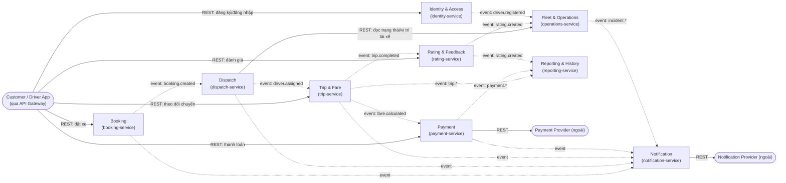

# THIẾT KẾ MICROSERVICE CHO CAB SYSTEM
### Tách một Domain lớn thành các Domain nhỏ vẫn hoạt động độc lập
*Áp dụng khung phân tích Domain-Driven Design (DDD) trên bộ yêu cầu SRS (B1–B14) của dự án CAB System MVP*

Tài liệu này áp dụng phương pháp trong file demo "Thiết kế Micro-Service" (8 bước: Bounded Context → Ubiquitous Language → Context Map → Aggregate → Domain Event → Service Mapping → Service Description → Data Model) vào toàn bộ 14 Functional Requirement (FR01–FR14) và 20 Use Case (UC01–UC20) đã xác định trong srs.md của dự án CAB System.

---

## 1. Phân tách Use Case theo miền nghiệp vụ (Bounded Context)

9 Bounded Context được xác định dựa trên năng lực nghiệp vụ (business capability) và ranh giới dữ liệu, gom nhóm từ 14 FR / 20 UC trong SRS:

| Bounded Context | Use Case liên quan | Năng lực nghiệp vụ | Khái niệm chính |
|---|---|---|---|
| Identity & Access | UC01, UC02, UC03, UC19 | Đăng ký, đăng nhập, đăng xuất, xác thực, quản lý thông tin cá nhân, quản lý tài khoản nhân viên & phân quyền | Account, Credential, Role, Permission, AuditLog |
| Booking | UC04 | Nhập điểm đón/đến, chọn loại xe, xem cước dự kiến, tạo yêu cầu đặt xe | Booking, VehicleType, FareEstimate |
| Dispatch | UC05, UC06 | Tìm tài xế phù hợp, gửi yêu cầu chuyến, xử lý chấp nhận/từ chối/timeout, phân công chính thức | CandidateDriver, TripRequest, Assignment |
| Trip & Fare | UC07, UC08, UC09, UC14 | Cập nhật trạng thái chuyến, theo dõi vị trí/ETA, tính cước sau khi hoàn thành | Trip, TripStatus, Location, Fare |
| Payment | UC10 | Thanh toán tiền mặt/điện tử, xử lý kết quả, cho phép thanh toán lại khi thất bại | Payment, Transaction, PaymentMethod |
| Rating & Feedback | UC12 | Đánh giá tài xế sau chuyến, tổng hợp điểm đánh giá | Rating, Feedback, RatingSummary |
| Fleet & Operations | UC13, UC15, UC16, UC17, UC18 | Quản lý hồ sơ tài xế/phương tiện, quản lý khách hàng, giám sát chuyến đang chạy, xử lý sự cố | DriverProfile, Vehicle, Incident |
| Notification | — (kích hoạt bởi sự kiện của context khác) | Gửi thông báo theo sự kiện tới khách hàng/tài xế | Notification, Channel |
| Reporting & History | UC11, UC20 | Lưu & tra cứu lịch sử chuyến/giao dịch, tổng hợp báo cáo doanh thu & hiệu quả | TripHistorySnapshot, TransactionSnapshot, Report |

---

## 2. Ubiquitous Language

Từ điển thuật ngữ dùng chung, thống nhất giữa BA – Dev – QA cho từng Bounded Context, tránh mỗi service hiểu một nghĩa khác nhau về cùng một khái niệm:

| Thuật ngữ | Ý nghĩa | Context |
|---|---|---|
| Booking | Yêu cầu đặt xe của khách hàng, tạo trước khi hệ thống điều phối tài xế | Booking |
| Trip | Một chuyến đi cụ thể, phát sinh từ Booking sau khi có tài xế được phân công chính thức | Trip & Fare |
| CandidateDriver | Tài xế đủ điều kiện (đang "Sẵn sàng", gần điểm đón) được đề xuất cho một Booking | Dispatch |
| TripRequest | Lời mời nhận chuyến gửi tới một tài xế cụ thể; có thể Accept/Reject/Expire | Dispatch |
| Fare | Số tiền khách hàng phải trả; chỉ được tính khi Trip ở trạng thái "Hoàn thành" | Trip & Fare |
| Rating | Điểm và nhận xét khách hàng dành cho tài xế sau khi Trip hoàn thành | Rating & Feedback |
| DriverProfile | Hồ sơ vận hành của tài xế (trạng thái sẵn sàng, phương tiện gắn kèm) — khác với tài khoản đăng nhập | Fleet & Operations |
| AuditLog | Bản ghi không thể sửa/xoá bởi user thường, lưu vết một thao tác quan trọng | Identity & Access |
| ReadModel | Bản sao dữ liệu chỉ-đọc, được xây dựng từ domain event của các context khác để phục vụ Reporting/History | Reporting & History |

---

## 3. Bounded Context Map

Nét liền = giao tiếp đồng bộ REST (qua API Gateway); nét đứt = giao tiếp bất đồng bộ qua Domain Event (message broker). Đây là cơ chế chính giúp các context KHÔNG phụ thuộc cứng vào nhau.

---

## 4. Aggregate và Invariant nghiệp vụ

Mỗi Aggregate là ranh giới nhất quán (consistency boundary) bên trong một Bounded Context; các Invariant bên dưới bám sát Business Rule (BRule) đã định nghĩa ở B12 của SRS:

| Aggregate | Aggregate Root | Thành phần chính | Invariant | UC liên quan |
|---|---|---|---|---|
| Booking Aggregate | Booking | PickupLocation, Destination, VehicleType, BookingTime | Chỉ tạo được khi điểm đón/đến hợp lệ và VehicleType tồn tại (AC07) | UC04 |
| TripRequest Aggregate | TripRequest | DriverId, BookingId, Status, SentAt, ExpiresAt | Không gửi lại yêu cầu cho tài xế đã từ chối cùng Booking (BRule04); 1 Booking chỉ có tối đa 1 TripRequest "Pending" tại một thời điểm | UC05, UC06 |
| Trip Aggregate | Trip | DriverId, VehicleId, PickupLocation, Destination, Status, Fare | Trạng thái đổi đúng trình tự B12.2, không nhảy cóc (BRule05); 1 Trip chỉ có duy nhất 1 tài xế tại 1 thời điểm (BRule03); Fare chỉ gán khi Status = Hoàn thành (BRule06) | UC07, UC08, UC09 |
| Payment Aggregate | Payment | TripId, Method, Amount, Status, TransactionCode | Không lưu trực tiếp dữ liệu thẻ nhạy cảm, chỉ lưu TransactionCode (BRule09); giao dịch thất bại lưu trạng thái "Thất bại", cho phép retry (BRule10) | UC10 |
| Rating Aggregate | Rating | TripId, CustomerId, DriverId, Score, Comment | Không đánh giá Trip chưa Hoàn thành (BRule07); mỗi Trip chỉ được đánh giá tối đa 1 lần (BRule08) | UC12 |
| DriverProfile Aggregate | DriverProfile | VehicleId, Status(Ready/Busy/Offline), CurrentLocation | Chỉ tài xế "Sẵn sàng" mới được đưa vào danh sách tìm kiếm phân công (BRule02) | UC13, UC14, UC16 |
| StaffAccount Aggregate | StaffAccount | Role, Permissions, Status | Nhân viên chỉ thao tác trong phạm vi quyền được cấp (BRule11) | UC19 |

---

## 5. Domain Event phát sinh từ Use Case

Domain Event là cơ chế duy nhất để một context phản ứng với thay đổi ở context khác — không context nào đọc/ghi trực tiếp CSDL của context khác:

| Domain Event | UC nguồn | Producer | Consumer | Mục đích |
|---|---|---|---|---|
| booking.created | UC04 | Booking | Dispatch | Kích hoạt tìm & xếp hạng tài xế ứng viên |
| trip_request.rejected / .expired | UC06 | Dispatch | Dispatch (tự xử lý tiếp) | Loại tài xế đã từ chối, tìm tài xế kế tiếp (BRule04) |
| driver.assigned | UC05, UC06 | Dispatch | Trip & Fare, Notification | Tạo Trip trạng thái "Đã phân công"; báo khách hàng |
| trip.status_changed | UC07 | Trip & Fare | Notification, Fleet & Operations, Reporting | Báo theo mốc trạng thái; cập nhật giám sát vận hành/báo cáo |
| trip.completed | UC07 | Trip & Fare | Rating & Feedback, Payment, Notification, Reporting | Mở đánh giá; kích hoạt tính cước; lưu lịch sử |
| fare.calculated | UC09 | Trip & Fare | Payment | Cung cấp số tiền cần thanh toán |
| payment.completed / .failed | UC10 | Payment | Notification, Reporting & History | Báo kết quả thanh toán; cập nhật báo cáo doanh thu |
| rating.created | UC12 | Rating & Feedback | Fleet & Operations, Reporting & History | Cập nhật điểm hiệu quả tài xế |
| driver.registered | UC02 | Identity & Access | Fleet & Operations | Khởi tạo DriverProfile vận hành cho tài khoản tài xế mới |
| incident.reported / .resolved | UC18 | Fleet & Operations | Notification, Reporting & History | Báo liên quan; ghi nhận lịch sử xử lý sự cố |

---

## 6. Ánh xạ Context sang Microservice

| Bounded Context | Service triển khai | Dữ liệu sở hữu | Giao tiếp chính |
|---|---|---|---|
| Identity & Access | identity-service | identity_db: Customer, DriverCredential, StaffAccount, Role, Permission, AuditLog | REST qua Gateway (đồng bộ); phát event driver.registered |
| Booking | booking-service | booking_db: Booking, VehicleType | REST đồng bộ từ App khách hàng; phát event booking.created |
| Dispatch | dispatch-service | dispatch_db: TripRequest | Subscribe booking.created; REST đọc dữ liệu tài xế; phát event driver.assigned |
| Trip & Fare | trip-service | trip_db: Trip, DriverLocation, Fare | Subscribe driver.assigned; REST theo dõi; phát trip.status_changed, trip.completed, fare.calculated |
| Payment | payment-service | payment_db: Payment/Transaction | Subscribe fare.calculated; REST tới Payment Provider ngoài; phát payment.completed/.failed |
| Notification | notification-service | notification_db: Notification, Channel | Subscribe hầu hết event (bất đồng bộ, fire-and-forget – BR42); REST tới Notification Provider ngoài |
| Rating & Feedback | rating-service | rating_db: Rating | Subscribe trip.completed; REST nhận đánh giá; phát rating.created |
| Fleet & Operations | operations-service | operations_db: DriverProfile, Vehicle, Incident | Subscribe driver.registered, rating.created; REST CRUD cho nhân viên vận hành |
| Reporting & History | reporting-service | reporting_db: read-model tổng hợp (không sở hữu dữ liệu gốc) | Chỉ subscribe event để xây read-model; REST chỉ phục vụ truy vấn (không ghi) |

---

## 7. Mô tả Service

| Service | Trách nhiệm chính | Dữ liệu sở hữu |
|---|---|---|
| identity-service | Đăng ký, đăng nhập/đăng xuất, xác thực (JWT), quản lý hồ sơ cá nhân, quản lý tài khoản/nhân viên, phân quyền và audit log cho toàn hệ thống. | identity_db |
| booking-service | Tiếp nhận yêu cầu đặt xe: điểm đón/đến, loại xe, xem cước dự kiến (preview); khởi tạo Booking ở trạng thái "Đang tìm tài xế". | booking_db |
| dispatch-service | Tìm và xếp hạng tài xế ứng viên; gửi lời mời nhận chuyến; xử lý accept/reject/timeout; xác nhận phân công chính thức. | dispatch_db |
| trip-service | Sở hữu vòng đời Trip từ khi có tài xế đến khi hoàn thành/hủy; theo dõi vị trí & ETA; tính cước khi Trip hoàn thành. | trip_db |
| payment-service | Xử lý thanh toán tiền mặt/điện tử, tích hợp Payment Provider ngoài, xử lý thất bại & cho phép thanh toán lại; không lưu dữ liệu thẻ nhạy cảm. | payment_db |
| notification-service | Gửi thông báo sự kiện tới khách hàng/tài xế qua các kênh (SMS/Email...), tích hợp Notification Provider ngoài; luôn bất đồng bộ, không chặn luồng chính. | notification_db |
| rating-service | Nhận đánh giá của khách hàng sau chuyến hoàn thành; lưu và tổng hợp điểm đánh giá theo tài xế. | rating_db |
| operations-service | Chức năng back-office cho nhân viên vận hành: quản lý khách hàng/tài xế/phương tiện, giám sát chuyến đang chạy, tiếp nhận & xử lý sự cố. | operations_db |
| reporting-service | Tổng hợp báo cáo hoạt động (số chuyến, doanh thu, tỷ lệ hoàn thành/hủy, hiệu quả tài xế) và cung cấp tra cứu lịch sử chuyến/giao dịch — chỉ đọc, không sở hữu dữ liệu gốc. | reporting_db (read-model) |

---

## 8. Mô hình dữ liệu cho từng Service

Nguyên tắc "Database per Service": mỗi service có schema/CSDL riêng, không service nào truy cập trực tiếp bảng của service khác — mọi trao đổi đi qua API hoặc Domain Event ở mục 5–6.

**identity_db (identity-service)**
Customer { CustomerID PK, FullName, Email, Phone, Password, Address, Status }
DriverCredential { DriverID PK, FullName, Email, Phone, Password, LicenseNumber }
StaffAccount { StaffID PK, Role, Permissions, Status }
AuditLog { LogID PK, UserID, Action, CreatedAt, IPAddress }

**booking_db (booking-service)**

Booking { BookingID PK, CustomerID, PickupLocation, Destination, VehicleType, Status }

**dispatch_db (dispatch-service)**

TripRequest { RequestID PK, BookingID, DriverID, Status, SentAt, ExpiresAt }

**trip_db (trip-service)**

Trip { TripID PK, BookingID, CustomerID, DriverID, VehicleID, Status, Fare, Distance }
DriverLocation { DriverID PK, Latitude, Longitude, UpdatedAt }

**payment_db (payment-service)**

Payment { PaymentID PK, TripID, Method, Amount, Status, TransactionCode }

**notification_db (notification-service)**

Notification { NotificationID PK, UserID, Title, Content, Type, Status }

**rating_db (rating-service)**

Rating { RatingID PK, TripID, CustomerID, DriverID, Score, Comment }

**operations_db (operations-service)**

DriverProfile { DriverID PK, Status, CurrentLocation, RatingScoreCache }
Vehicle { VehicleID PK, DriverID, VehicleType, LicensePlate, Status }
Incident { IncidentID PK, TripID, Description, Status, ResolvedAt }

**reporting_db (reporting-service) — read model**

TripHistorySnapshot { TripID PK, ... (sao chép chỉ đọc) }
TransactionSnapshot { PaymentID PK, ... (sao chép chỉ đọc) }
ReportAggregate { Period PK, TotalTrips, Revenue, CompletionRate }

---

## 9. Nguyên tắc đảm bảo các Service hoạt động độc lập

Đây là phần trả lời trực tiếp câu hỏi "tách domain lớn thành domain nhỏ nhưng vẫn hoạt động độc lập", ánh xạ vào các BR/NFR kiến trúc (BR41–BR43, NFR03, NFR05, NFR14, NFR15) đã có trong SRS:

- **Database per Service**: mỗi service sở hữu CSDL riêng (identity_db, booking_db, trip_db...); không có bảng dùng chung, không JOIN xuyên service.
- **Giao tiếp bất đồng bộ qua Event** (message broker) cho các luồng nghiệp vụ nối tiếp (booking → dispatch → trip → payment), tránh transaction phân tán; dùng mô hình Saga/Choreography thay vì 2-phase commit.
- **Giao tiếp đồng bộ REST** chỉ dùng cho truy vấn thời gian thực bắt buộc (VD: Dispatch đọc trạng thái tài xế từ Operations) và luôn có timeout.
- **Cách ly lỗi (Fault Isolation – BR42/NFR05)**: Payment/Notification gọi bất đồng bộ (fire-and-forget, try-catch), lỗi hoặc chậm ở 2 service này không làm dừng luồng đặt xe/Trip chính.
- **Triển khai độc lập (BR43/NFR15)**: mỗi service là 1 đơn vị deploy riêng (container/pipeline riêng); cập nhật 1 service không đòi hỏi build lại toàn hệ thống.
- **Mở rộng độc lập (BR41/NFR03)**: service tải cao (VD: trip-service, dispatch-service giờ cao điểm) có thể scale-out riêng mà không ảnh hưởng các service còn lại.
- **Hợp đồng ổn định (API/Event Contract)**: mỗi service công bố API/Event schema rõ ràng (đã có ở `api_specication/*.yaml`); thay đổi nội bộ 1 service không phá vỡ service gọi nó, miễn giữ nguyên contract.
