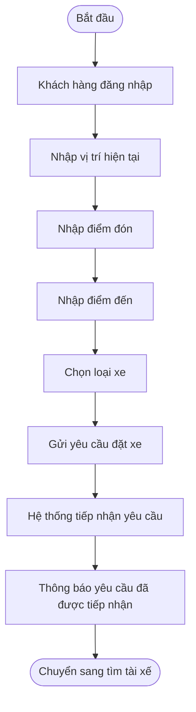
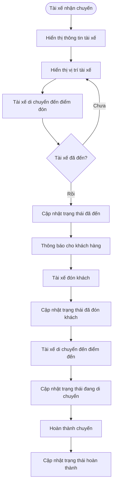

# B1. Xác định Business Context và Business Problem

## 1. Business Context – Bối cảnh nghiệp vụ

Công ty ABC đang cung cấp dịch vụ đặt xe trực tuyến thông qua tổng đài và một ứng dụng đơn giản. Tuy nhiên, doanh nghiệp đang có nhu cầu xây dựng **CAB System** mới để tự động hóa và quản lý tập trung toàn bộ quy trình đặt xe, từ khi khách hàng yêu cầu xe, tìm và phân công tài xế, thực hiện chuyến, thanh toán đến đánh giá sau chuyến.

**Đối tượng sử dụng chính:**
- Khách hàng
- Tài xế
- Nhân viên vận hành

Hệ thống cũng cần tích hợp với **cổng thanh toán điện tử và dịch vụ thông báo** bên ngoài.

## 2. Business Problem – Vấn đề nghiệp vụ

Hệ thống hiện tại tồn tại các vấn đề:

- Phân công tài xế còn **thủ công**, mất thời gian và khó tối ưu.
- Khách hàng **khó theo dõi trạng thái chuyến đi**.
- Thanh toán và giao dịch **chưa được quản lý tập trung**.
- Nhân viên vận hành gặp khó khăn trong việc **quản lý khách hàng, tài xế, chuyến đi và xử lý sự cố**.
- Khó tổng hợp dữ liệu để theo dõi **doanh thu, số chuyến, tỷ lệ hoàn thành và tỷ lệ hủy**.
- Hệ thống **khó mở rộng** khi số lượng khách hàng và tài xế tăng.

## 3. Mục tiêu kinh doanh

- Tự động hóa quy trình đặt xe và phân công tài xế.
- Nâng cao trải nghiệm và khả năng theo dõi chuyến của khách hàng.
- Quản lý tập trung chuyến đi, thanh toán và dữ liệu vận hành.
- Giảm thao tác thủ công và nâng cao hiệu quả của nhân viên.
- Xây dựng hệ thống **ổn định, bảo mật và có khả năng mở rộng**.

## 4. Giá trị của hệ thống mới

So với hệ thống cũ, CAB System giúp **tự động hóa việc tìm tài xế, theo dõi chuyến, thanh toán và thông báo**, đồng thời cung cấp dữ liệu phục vụ quản lý và báo cáo.

Hệ thống giúp **giảm thời gian xử lý, nâng cao chất lượng dịch vụ, tăng hiệu quả vận hành và tạo nền tảng để doanh nghiệp mở rộng trong tương lai**.


# B2. Xác định các bên liên quan (Stakeholders)
1.	Những stalkholder - 	Vai trò là gì 
2.	Vẽ ma trận stalkholder matrick
## 1. Những stalkholder - 	Vai trò là gì 

| Stakeholder | Vai trò |
|---|---|
| Khách hàng | Đăng ký, đặt xe, theo dõi chuyến, thanh toán và đánh giá tài xế. |
| Tài xế | Nhận chuyến, chấp nhận/từ chối chuyến, thực hiện chuyến và cập nhật trạng thái. |
| Nhân viên vận hành | Quản lý khách hàng, tài xế, phương tiện, chuyến đi và xử lý sự cố. |
| Ban giám đốc | Xác định mục tiêu kinh doanh, theo dõi doanh thu và hiệu quả hoạt động. |
| Bộ phận kế toán/tài chính | Theo dõi giao dịch, thanh toán và doanh thu. |
| Nhà cung cấp thanh toán | Xử lý các giao dịch thanh toán điện tử. |
| Nhà cung cấp thông báo | Cung cấp dịch vụ gửi thông báo như SMS, Email hoặc các kênh khác. |
| Business Analyst (BA) | Thu thập, phân tích và làm rõ yêu cầu của các bên liên quan. |
| Đội phát triển hệ thống | Thiết kế, xây dựng, kiểm thử và triển khai hệ thống. |

2.	Vẽ ma trận stalkholder matrick
## 3. Stakeholder Matrix

Ma trận Stakeholder được phân tích dựa trên hai tiêu chí:

- **Mức độ ảnh hưởng (Power):** Khả năng tác động đến quyết định, phạm vi, tiến độ và kết quả dự án.
- **Mức độ quan tâm (Interest):** Mức độ quan tâm của stakeholder đối với kết quả và hoạt động của hệ thống.

| MỨC ĐỘ ẢNH HƯỞNG | MỨC ĐỘ QUAN TÂM THẤP | MỨC ĐỘ QUAN TÂM CAO |
|---|---|---|
| **CAO** | Bộ phận tài chính<br>Nhà cung cấp thanh toán<br>Nhà cung cấp thông báo | Ban lãnh đạo<br>Nhân viên vận hành<br>System Admin<br>Business Analyst |
| **THẤP** | Stakeholder gián tiếp | Khách hàng<br>Tài xế<br>Đội phát triển<br>QA/Test |

### Sơ đồ Stakeholder Matrix

```text
                    MỨC ĐỘ ẢNH HƯỞNG (POWER)
                              CAO
                               │
                               │
          KEEP SATISFIED      │        MANAGE CLOSELY
                               │
          Bộ phận tài chính   │        Ban lãnh đạo
          Payment Provider    │        Nhân viên vận hành
          Notification        │        System Admin
          Provider            │        Business Analyst
                               │
───────────────────────────────┼──────────────────────────────
                               │
          MONITOR              │        KEEP INFORMED
                               │
          Stakeholder          │        Khách hàng
          gián tiếp            │        Tài xế
                               │        Đội phát triển
                               │        QA / Test
                               │
                               │
                              THẤP
                    MỨC ĐỘ QUAN TÂM (INTEREST)
                         THẤP       →       CAO
```
# B3. Xác định Business Goals

## BG01. Tự động hóa quy trình đặt xe

- Hệ thống tự động tiếp nhận và xử lý yêu cầu đặt xe.
- Giảm thao tác thủ công của nhân viên vận hành.
- Đảm bảo quy trình từ đặt xe đến hoàn thành chuyến được xử lý xuyên suốt.

## BG02. Tự động tìm và phân công tài xế

- Hệ thống tự động tìm tài xế phù hợp.
- Ưu tiên tài xế gần khách hàng và đang sẵn sàng.
- Tự động tìm tài xế khác khi tài xế từ chối hoặc không phản hồi.
- Thông báo cho khách hàng khi tìm được hoặc không tìm được tài xế.

## BG03. Nâng cao trải nghiệm khách hàng

- Cho phép khách hàng đặt xe nhanh chóng.
- Cho phép khách hàng theo dõi trạng thái chuyến.
- Cung cấp thông tin tài xế và thời gian dự kiến đến.
- Cho phép khách hàng xem lịch sử chuyến và đánh giá tài xế.

## BG04. Nâng cao hiệu quả vận hành

- Cho phép nhân viên quản lý khách hàng, tài xế, phương tiện và chuyến đi.
- Cho phép theo dõi các chuyến đang diễn ra.
- Hỗ trợ xử lý các trường hợp chuyến bị lỗi.
- Hỗ trợ tra cứu lịch sử giao dịch.

## BG05. Quản lý tính cước và thanh toán

- Tự động xác định số tiền khách hàng phải thanh toán.
- Hỗ trợ thanh toán tiền mặt.
- Hỗ trợ thanh toán điện tử thông qua Payment Provider.
- Xử lý trường hợp thanh toán thất bại.
- Không lưu trực tiếp thông tin thanh toán nhạy cảm.

## BG06. Xây dựng hệ thống thông báo

- Thông báo cho khách hàng về các sự kiện quan trọng của chuyến.
- Thông báo cho tài xế khi có chuyến mới hoặc thay đổi chuyến.
- Cho phép mở rộng thêm các kênh thông báo trong tương lai.

## BG07. Quản lý và khai thác dữ liệu

- Lưu trữ lịch sử chuyến đi.
- Lưu trữ lịch sử giao dịch.
- Lưu trữ dữ liệu vị trí tài xế.
- Lưu vết các thao tác quan trọng.
- Hỗ trợ tra cứu và kiểm tra dữ liệu khi xảy ra sự cố.

## BG08. Hỗ trợ báo cáo và quản lý hiệu quả

- Theo dõi số lượng chuyến.
- Theo dõi doanh thu.
- Theo dõi tỷ lệ chuyến hoàn thành.
- Theo dõi tỷ lệ chuyến hủy.
- Theo dõi hiệu quả hoạt động của tài xế.

## BG09. Đảm bảo bảo mật và phân quyền

- Xác thực khách hàng, tài xế và nhân viên.
- Phân quyền chức năng quản trị.
- Bảo vệ thông tin cá nhân.
- Bảo vệ dữ liệu phương tiện, vị trí và giao dịch.
- Lưu audit log đối với các thao tác quan trọng.

## BG10. Đảm bảo tính ổn định và khả năng mở rộng

- Hệ thống hoạt động ổn định khi nhu cầu tăng cao.
- Các thành phần có khả năng mở rộng độc lập.
- Lỗi ở Payment hoặc Notification không làm toàn bộ hệ thống đặt xe ngừng hoạt động.
- Cho phép triển khai từng phần mà hạn chế ảnh hưởng đến chức năng đang hoạt động.

## BG11. Hỗ trợ phát triển hệ thống trong tương lai

- Cho phép bổ sung loại dịch vụ mới.
- Cho phép bổ sung phương thức thanh toán mới.
- Cho phép tích hợp thêm Payment Provider.
- Cho phép tích hợp thêm Notification Provider.
- Cho phép thay đổi thành phần kỹ thuật mà không phải xây dựng lại toàn bộ hệ thống.

## BG12. Hoàn thành MVP trong 7 tuần

- Xác định và ưu tiên các chức năng cốt lõi.
- Hoàn thành phiên bản MVP trong thời gian 7 tuần.
- Ưu tiên quy trình:

```text
Đặt xe
  ↓
Tìm tài xế
  ↓
Phân công tài xế
  ↓
Thực hiện chuyến
  ↓
Hoàn thành chuyến
  ↓
Tính cước
  ↓
Thanh toán
  ↓
Thông báo
  ↓
Đánh giá
```
## B4: Xác định PHẠM VI SCOPE: 
1. Quản lý tài khoản người dùng
- Đăng ký và đăng nhập tài khoản khách hàng.
- Quản lý thông tin cá nhân khách hàng.
- Quản lý tài khoản và hồ sơ tài xế.
- Quản lý quyền truy cập của nhân viên vận hành và quản trị viên.
2. Quản lý tài xế và phương tiện
- Quản lý thông tin tài xế.
- Quản lý thông tin phương tiện.
- Theo dõi trạng thái hoạt động của tài xế.
- Theo dõi vị trí của tài xế.
- Quản lý khả năng nhận chuyến của tài xế.
3. Đặt xe và phân công tài xế
- Nhập điểm đón và điểm đến.
- Lựa chọn loại xe.
- Tiếp nhận yêu cầu đặt xe.
- Tìm kiếm tài xế phù hợp.
- Ưu tiên tài xế dựa trên vị trí, trạng thái và tiêu chí vận hành.
- Tiếp tục tìm tài xế khác khi tài xế từ chối hoặc không phản hồi.
- Thông báo khi không tìm được tài xế.
4. Quản lý chuyến đi
- Theo dõi trạng thái chuyến đi.
- Cập nhật trạng thái chuyến.
- Theo dõi thời gian dự kiến tài xế đến.
- Quản lý quá trình thực hiện chuyến.
- Xử lý các trường hợp chuyến bị hủy hoặc gặp sự cố.
- Lưu lịch sử chuyến đi.
5. Tính cước và thanh toán
- Xác định số tiền khách hàng phải trả.
- Hỗ trợ thanh toán bằng tiền mặt.
- Hỗ trợ thanh toán điện tử/chuyển khoản.
- Tích hợp với nhà cung cấp thanh toán bên ngoài.
- Xử lý kết quả thanh toán.
- Xử lý trường hợp thanh toán thất bại.
- Lưu lịch sử giao dịch.
- Không lưu trực tiếp thông tin nhạy cảm của thẻ hoặc tài khoản thanh toán.
6. Thông báo
- Thông báo cho khách hàng về trạng thái đặt xe.
- Thông báo khi tài xế nhận chuyến.
- Thông báo khi tài xế đến điểm đón.
- Thông báo khi chuyến hoàn thành.
- Thông báo kết quả thanh toán.
- Thông báo cho tài xế về chuyến mới và các thay đổi liên quan đến chuyến đi.
- Hỗ trợ mở rộng thêm các kênh thông báo trong tương lai.
7. Đánh giá và phản hồi
- Khách hàng đánh giá tài xế sau khi hoàn thành chuyến.
- Lưu thông tin đánh giá.
- Theo dõi chất lượng phục vụ của tài xế.
8. Quản trị và vận hành
- Quản lý khách hàng.
- Quản lý tài xế.
- Quản lý phương tiện.
- Theo dõi các chuyến đang diễn ra.
- Kiểm tra trạng thái tài xế.
- Hỗ trợ xử lý các chuyến bị lỗi.
- Tra cứu lịch sử giao dịch.
- Phân quyền các thao tác quản trị.
9. Báo cáo
- Báo cáo số lượng chuyến.
- Báo cáo doanh thu.
- Báo cáo tỷ lệ chuyến hoàn thành.
- Báo cáo tỷ lệ hủy chuyến.
- Báo cáo hiệu quả hoạt động của tài xế.
10. Bảo mật và kiểm soát
- Xác thực người dùng.
- Phân quyền truy cập.
- Bảo vệ thông tin cá nhân.
- Bảo vệ dữ liệu phương tiện.
- Bảo vệ dữ liệu vị trí.
- Bảo vệ dữ liệu giao dịch.
- Lưu vết các thao tác quan trọng.
### 11. Những chức năng KHÔNG nên làm trong MVP

> Các chức năng dưới đây **không nằm trong phạm vi MVP 7 tuần**, có thể xem xét ở các phiên bản tiếp theo.

#### 11.1. Quản lý tài khoản nâng cao
- Đăng nhập bằng Google/Facebook/Apple.
- Đăng nhập đa yếu tố (MFA) nâng cao.
- Single Sign-On (SSO).
- Quản lý nhiều thiết bị đăng nhập.
- Hệ thống thành viên nhiều cấp.
- Chương trình khách hàng thân thiết (Loyalty).

#### 11.2. Đặt xe nâng cao
- Đặt xe theo lịch trong tương lai.
- Đặt xe khứ hồi.
- Đặt xe nhiều điểm dừng.
- Đặt xe cho nhiều hành khách.
- Chia sẻ chuyến xe (Ride Sharing).
- Đặt xe theo nhóm.
- Đặt xe doanh nghiệp (Corporate Booking).

#### 11.3. Tìm và phân công tài xế nâng cao
- Sử dụng AI/Machine Learning để phân công tài xế.
- Dự đoán nhu cầu xe theo khu vực.
- Tối ưu phân công nhiều chuyến cùng lúc.
- Dynamic Dispatch nâng cao.
- Tự động điều chỉnh thuật toán dựa trên dữ liệu lịch sử.
- Hệ thống dự đoán thời gian đến bằng AI.

#### 11.4. Tính cước nâng cao
- Dynamic Pricing phức tạp.
- Surge Pricing.
- Hệ thống khuyến mãi nâng cao.
- Hệ thống voucher/coupon phức tạp.
- Loyalty Discount.
- Tự động tối ưu giá bằng AI.
- Nhiều mô hình tính cước phức tạp chưa được khách hàng xác nhận.

#### 11.5. Thanh toán nâng cao
- Tích hợp nhiều nhà cung cấp thanh toán cùng lúc.
- Xây dựng ví điện tử riêng.
- Thanh toán định kỳ (Subscription).
- Auto Billing.
- Hệ thống chia nhỏ và phân bổ thanh toán phức tạp.
- Hệ thống đối soát tài chính tự động nâng cao.

#### 11.6. Thông báo nâng cao
- Triển khai đồng thời quá nhiều kênh thông báo.
- Hệ thống gửi thông báo Marketing.
- Campaign Notification.
- Notification Analytics nâng cao.
- Hệ thống tự động tối ưu nội dung thông báo.
- Chatbot thông báo.

#### 11.7. Tính năng dành cho tài xế nâng cao
- Hệ thống thưởng/phạt tự động.
- Hệ thống hoa hồng phức tạp.
- Driver Ranking nâng cao.
- Gamification cho tài xế.
- Chương trình thưởng theo hiệu suất.
- Phân tích hành vi lái xe bằng AI.
- Hệ thống đào tạo tài xế trực tuyến.

#### 11.8. Bản đồ và điều hướng nâng cao
- Xây dựng hệ thống bản đồ riêng.
- Xây dựng hệ thống Navigation riêng.
- Tối ưu tuyến đường bằng AI.
- Phân tích giao thông nâng cao.
- Heatmap giao thông.
- Dự đoán tình trạng giao thông.
- Tự phát triển thuật toán bản đồ thay cho Map Provider.

#### 11.9. Báo cáo và phân tích nâng cao
- Business Intelligence Platform.
- Data Warehouse phức tạp.
- Predictive Analytics.
- Forecasting doanh thu bằng AI.
- Dashboard phân tích realtime nâng cao.
- Custom Report Builder.
- Phân tích hành vi khách hàng nâng cao.

#### 11.10. Chăm sóc khách hàng nâng cao
- Chat trực tiếp giữa khách hàng và tài xế.
- Chatbot AI.
- Trung tâm hỗ trợ khách hàng đa kênh.
- Hệ thống Ticketing nâng cao.
- Tổng đài VoIP tích hợp.
- CRM Platform đầy đủ.

#### 11.11. Mở rộng dịch vụ
- Giao hàng.
- Gọi xe đường dài.
- Thuê xe theo giờ.
- Xe hợp đồng.
- Vận chuyển hàng hóa.
- Các loại dịch vụ khác chưa được xác định trong phạm vi MVP.

#### 11.12. Quản trị nâng cao
- Workflow phê duyệt nhiều cấp.
- Custom Role Builder.
- Custom Permission Builder phức tạp.
- Audit Dashboard nâng cao.
- Tự động hóa toàn bộ quy trình vận hành.
- Hệ thống quản trị nhiều công ty/chi nhánh.

---

### 12. Các vấn đề CHƯA ĐỦ THÔNG TIN – Không tự triển khai

Các nội dung dưới đây cần được **Business Analyst xác nhận với khách hàng** trước khi đưa vào Development:

- Công thức tính cước cụ thể.
- Tiêu chí ưu tiên tài xế.
- Khoảng cách tối đa để tìm tài xế.
- Thời gian tài xế phải phản hồi yêu cầu.
- Số lần hệ thống thử tìm tài xế.
- Chính sách khi tài xế từ chối chuyến.
- Chính sách khi tài xế không phản hồi.
- Chính sách hủy chuyến của khách hàng.
- Chính sách hủy chuyến của tài xế.
- Phí hủy chuyến.
- Chính sách xử lý thanh toán thất bại.
- Quy định khi khách hàng mất kết nối mạng.
- Quy định khi tài xế mất kết nối mạng.
- Tần suất cập nhật vị trí tài xế.
- Thời gian lưu trữ dữ liệu.
- Chính sách đánh giá tài xế.
- Quy định xử lý đánh giá không hợp lệ.
- Chi tiết phân quyền nhân viên vận hành.
- Quy định về dữ liệu cá nhân và thời gian lưu trữ dữ liệu.

---

### 13. Nguyên tắc Scope cho MVP

```text
                     CAB SYSTEM MVP
                           │
          ┌────────────────┼────────────────┐
          │                │                │
          ▼                ▼                ▼
     PHẢI LÀM          CÓ THỂ LÀM        KHÔNG LÀM
      (MVP)            SAU MVP            (MVP)
          │                │                │
          ▼                ▼                ▼
     Đặt xe           Loyalty           AI Dispatch
     Tìm tài xế      Voucher            Dynamic Pricing
     Chuyến đi       Scheduled Ride     Chatbot AI
     Tính cước       Corporate Ride     Ride Sharing
     Thanh toán      Nhiều Payment      Ví điện tử
     Thông báo       Nhiều Channel      BI nâng cao
     Đánh giá        Dịch vụ mới        Navigation riêng
     Admin           Báo cáo nâng cao    CRM đầy đủ
```
# B5. Chuyển đổi yêu cầu thành Business Requirements

| Mã | Tên Business Requirement | Diễn giải |
|---|---|---|
| BR01 | Quản lý tài khoản khách hàng | Hệ thống cho phép khách hàng đăng ký, đăng nhập và quản lý thông tin cá nhân. |
| BR02 | Quản lý tài khoản tài xế | Hệ thống cho phép tạo và quản lý tài khoản, hồ sơ và thông tin hoạt động của tài xế. |
| BR03 | Quản lý phương tiện | Hệ thống cho phép quản lý thông tin phương tiện được sử dụng để thực hiện chuyến đi. |
| BR04 | Quản lý quyền truy cập | Hệ thống cho phép phân quyền cho nhân viên vận hành và quản trị viên theo vai trò. |
| BR05 | Quản lý trạng thái tài xế | Hệ thống cho phép tài xế cập nhật trạng thái hoạt động và trạng thái sẵn sàng nhận chuyến. |
| BR06 | Theo dõi vị trí tài xế | Hệ thống lưu và cập nhật vị trí tài xế để phục vụ việc tìm kiếm và phân công chuyến. |
| BR07 | Tạo yêu cầu đặt xe | Hệ thống cho phép khách hàng nhập điểm đón, điểm đến và lựa chọn loại xe để tạo yêu cầu đặt xe. |
| BR08 | Tiếp nhận yêu cầu đặt xe | Hệ thống tiếp nhận và lưu thông tin yêu cầu đặt xe của khách hàng. |
| BR09 | Tự động tìm tài xế | Hệ thống tự động tìm các tài xế phù hợp dựa trên vị trí, trạng thái sẵn sàng và các tiêu chí vận hành. |
| BR10 | Ưu tiên tài xế phù hợp | Hệ thống ưu tiên tài xế phù hợp và gần khách hàng theo các tiêu chí vận hành được doanh nghiệp xác định. |
| BR11 | Xử lý tài xế từ chối hoặc không phản hồi | Hệ thống tiếp tục tìm tài xế khác khi tài xế được đề xuất từ chối hoặc không phản hồi trong thời gian quy định. |
| BR12 | Thông báo không tìm được tài xế | Hệ thống thông báo rõ ràng cho khách hàng khi không tìm được tài xế phù hợp. |
| BR13 | Phân công tài xế | Hệ thống xác nhận và gán tài xế cho chuyến đi khi tài xế chấp nhận yêu cầu. |
| BR14 | Quản lý trạng thái chuyến đi | Hệ thống quản lý và cập nhật trạng thái chuyến từ lúc tạo yêu cầu đến khi hoàn thành hoặc hủy. |
| BR15 | Theo dõi chuyến đi | Hệ thống cho phép khách hàng theo dõi trạng thái chuyến và thông tin liên quan trong quá trình thực hiện chuyến. |
| BR16 | Theo dõi thời gian dự kiến | Hệ thống cung cấp thời gian dự kiến tài xế đến điểm đón cho khách hàng. |
| BR17 | Xử lý chuyến bị hủy hoặc lỗi | Hệ thống hỗ trợ xử lý các trường hợp chuyến bị hủy hoặc gặp sự cố theo chính sách của doanh nghiệp. |
| BR18 | Lưu lịch sử chuyến đi | Hệ thống lưu trữ thông tin các chuyến đi để khách hàng và nhân viên có thể tra cứu khi cần. |
| BR19 | Tính cước chuyến đi | Hệ thống xác định số tiền khách hàng phải trả dựa trên loại dịch vụ và thông tin chuyến đi. |
| BR20 | Thanh toán tiền mặt | Hệ thống hỗ trợ ghi nhận và quản lý kết quả thanh toán bằng tiền mặt. |
| BR21 | Thanh toán điện tử | Hệ thống hỗ trợ thanh toán điện tử thông qua nhà cung cấp thanh toán bên ngoài. |
| BR22 | Quản lý kết quả thanh toán | Hệ thống tiếp nhận, lưu trữ và cập nhật trạng thái giao dịch thanh toán. |
| BR23 | Xử lý thanh toán thất bại | Hệ thống thông báo cho khách hàng khi thanh toán thất bại và hỗ trợ xử lý lại theo chính sách doanh nghiệp. |
| BR24 | Bảo vệ thông tin thanh toán | Hệ thống không lưu trực tiếp các thông tin nhạy cảm của thẻ hoặc tài khoản thanh toán. |
| BR25 | Quản lý lịch sử giao dịch | Hệ thống lưu trữ và cho phép nhân viên tra cứu lịch sử giao dịch thanh toán. |
| BR26 | Thông báo trạng thái đặt xe | Hệ thống gửi thông báo cho khách hàng khi yêu cầu đặt xe được tiếp nhận và khi trạng thái chuyến thay đổi. |
| BR27 | Thông báo cho tài xế | Hệ thống gửi thông báo cho tài xế khi có chuyến mới hoặc có thay đổi liên quan đến chuyến đang thực hiện. |
| BR28 | Mở rộng kênh thông báo | Hệ thống được thiết kế để có thể bổ sung thêm các kênh thông báo trong tương lai. |
| BR29 | Đánh giá tài xế | Hệ thống cho phép khách hàng đánh giá tài xế sau khi chuyến đi hoàn thành. |
| BR30 | Quản lý phản hồi | Hệ thống lưu trữ thông tin đánh giá và phản hồi của khách hàng đối với tài xế. |
| BR31 | Quản lý khách hàng | Hệ thống cung cấp chức năng cho nhân viên vận hành quản lý và tra cứu thông tin khách hàng. |
| BR32 | Quản lý tài xế và phương tiện | Hệ thống cung cấp chức năng cho nhân viên vận hành quản lý tài xế và phương tiện. |
| BR33 | Theo dõi chuyến đang diễn ra | Hệ thống cho phép nhân viên vận hành theo dõi các chuyến đang thực hiện và trạng thái hiện tại. |
| BR34 | Hỗ trợ xử lý sự cố | Hệ thống cho phép nhân viên vận hành kiểm tra và hỗ trợ xử lý các trường hợp chuyến bị lỗi. |
| BR35 | Báo cáo hoạt động | Hệ thống cung cấp báo cáo về số lượng chuyến, doanh thu, tỷ lệ hoàn thành và tỷ lệ hủy chuyến. |
| BR36 | Báo cáo hiệu quả tài xế | Hệ thống cung cấp dữ liệu và báo cáo để đánh giá hiệu quả hoạt động của tài xế. |
| BR37 | Xác thực người dùng | Hệ thống yêu cầu người dùng xác thực trước khi sử dụng các chức năng yêu cầu tài khoản. |
| BR38 | Kiểm soát quyền truy cập | Hệ thống kiểm soát quyền truy cập dựa trên vai trò và quyền hạn của người dùng. |
| BR39 | Bảo vệ dữ liệu | Hệ thống bảo vệ thông tin cá nhân, thông tin phương tiện, dữ liệu vị trí và dữ liệu giao dịch. |
| BR40 | Lưu vết thao tác | Hệ thống lưu lại các thao tác quan trọng của người dùng và nhân viên để phục vụ kiểm tra, truy vết khi xảy ra sự cố. |
| BR41 | Đảm bảo khả năng mở rộng | Hệ thống được thiết kế để có thể mở rộng số lượng khách hàng, tài xế và các thành phần khi nhu cầu tăng. |
| BR42 | Đảm bảo tính độc lập của các thành phần | Hệ thống hạn chế việc lỗi tại các thành phần như thanh toán hoặc thông báo làm ảnh hưởng đến toàn bộ chức năng đặt xe. |
| BR43 | Hỗ trợ triển khai từng phần | Hệ thống cho phép triển khai các chức năng mới từng phần và hạn chế ảnh hưởng đến các chức năng đang hoạt động. |
| BR44 | Hỗ trợ mở rộng dịch vụ | Kiến trúc hệ thống cho phép bổ sung các loại dịch vụ mới trong tương lai mà không phải xây dựng lại toàn bộ hệ thống. |
| BR45 | Hỗ trợ mở rộng phương thức thanh toán | Hệ thống cho phép tích hợp thêm phương thức hoặc nhà cung cấp thanh toán trong tương lai. |
| BR46 | Hỗ trợ mở rộng nhà cung cấp thông báo | Hệ thống cho phép thay đổi hoặc bổ sung nhà cung cấp thông báo mà không ảnh hưởng lớn đến hệ thống hiện tại. |

## B6.  Business Process:

# Business Process – CAB System

 1. Quy trình đặt chuyến xe – BP01


2. Quy trình tìm và phân công tài xế – BP02

3. Quy trình theo dõi chuyến đi – BP03

4. Quy trình quản lý tài xế – BP04
   ```mermaid
   flowchart TD
    A([Nhân viên vận hành]) --> B[Đăng ký hoặc tạo tài khoản tài xế]
    B --> C[Nhập thông tin tài xế]
    C --> D[Nhập thông tin phương tiện]
    D --> E[Kiểm tra thông tin]
    E --> F{Thông tin hợp lệ?}

    F -- Không --> G[Yêu cầu cập nhật thông tin]
    G --> C

    F -- Có --> H[Tạo hồ sơ tài xế]
    H --> I[Tài xế đăng nhập]
    I --> J[Cập nhật trạng thái hoạt động]
    J --> K{Sẵn sàng nhận chuyến?}

    K -- Có --> L[Đưa tài xế vào danh sách có thể nhận chuyến]
    K -- Không --> M[Không phân công chuyến]
   ```
5. Quy trình quản lý chuyến đi – BP05
   ```mermaid
    flowchart TD
    A([Tạo yêu cầu]) --> B[Chờ tìm tài xế]
    B --> C{Đã có tài xế?}

    C -- Không --> D[Tiếp tục tìm tài xế]
    D --> C

    C -- Có --> E[Đã phân công tài xế]
    E --> F[Tài xế đang đến]
    F --> G[Đã đến điểm đón]
    G --> H[Đã đón khách]
    H --> I[Đang di chuyển]
    I --> J[Hoàn thành chuyến]

    B --> K{Khách hàng hủy?}
    K -- Có --> L[Hủy chuyến]
    K -- Không --> C

    L --> M[Lưu thông tin hủy chuyến]
    J --> N[Lưu thông tin chuyến]
    ```
6. Quy trình tính cước – BP06
   ```mermaid
   flowchart TD
    A([Chuyến hoàn thành]) --> B[Lấy thông tin chuyến]
    B --> C[Xác định loại dịch vụ]
    C --> D[Xác định thông tin quãng đường và chuyến đi]
    D --> E[Áp dụng quy tắc tính cước]
    E --> F[Tính tổng tiền]
    F --> G[Lưu thông tin cước]
    G --> H[Thông báo số tiền phải trả cho khách hàng]
    H --> I([Chuyển sang thanh toán])
   ```
7. Quy trình thanh toán – BP07
   ```mermaid
   flowchart TD
    A([Nhận số tiền phải trả]) --> B{Chọn phương thức thanh toán}

    B -- Tiền mặt --> C[Khách hàng thanh toán tiền mặt]
    C --> D[Xác nhận thanh toán]
    D --> E[Lưu giao dịch]

    B -- Thanh toán điện tử --> F[Gửi yêu cầu đến nhà cung cấp thanh toán]
    F --> G{Thanh toán thành công?}

    G -- Có --> H[Nhận kết quả giao dịch]
    H --> E

    G -- Không --> I[Thông báo thanh toán thất bại]
    I --> J{Khách hàng muốn thanh toán lại?}

    J -- Có --> F
    J -- Không --> K[Lưu giao dịch thất bại]

    E --> L[Thông báo kết quả thanh toán]
    K --> L
   ```
8. Quy trình thông báo – BP08
    ```mermaid
    flowchart TD
    A([Có sự kiện trong hệ thống]) --> B{Loại sự kiện}

    B -- Đặt xe --> C[Thông báo yêu cầu đã được tiếp nhận]
    B -- Tài xế nhận chuyến --> D[Thông báo tài xế đã nhận chuyến]
    B -- Tài xế đến --> E[Thông báo tài xế đã đến]
    B -- Hoàn thành chuyến --> F[Thông báo chuyến đã hoàn thành]
    B -- Thanh toán --> G[Thông báo kết quả thanh toán]
    B -- Chuyến mới --> H[Thông báo cho tài xế]

    C --> I[Gửi thông báo]
    D --> I
    E --> I
    F --> I
    G --> I
    H --> I

    I --> J([Kết thúc])
    ```
9. Quy trình đánh giá tài xế – BP09
    ```mermaid
    flowchart TD
    A([Chuyến hoàn thành]) --> B[Hiển thị yêu cầu đánh giá]
    B --> C[Khách hàng đánh giá tài xế]
    C --> D[Nhập điểm đánh giá]
    D --> E[Nhập nhận xét nếu có]
    E --> F[Gửi đánh giá]
    F --> G[Lưu đánh giá]
    G --> H[Cập nhật dữ liệu đánh giá tài xế]
    H --> I([Kết thúc])
    ```
10. Quy trình quản lý vận hành – BP10\
    ```mermaid
    flowchart TD
    A([Nhân viên vận hành đăng nhập]) --> B[Xác thực tài khoản]
    B --> C{Có quyền truy cập?}

    C -- Không --> D[Từ chối truy cập]
    D --> E([Kết thúc])

    C -- Có --> F[Truy cập giao diện quản trị]
    F --> G{Chọn chức năng}

    G -- Quản lý khách hàng --> H[Thêm/Sửa/Xem khách hàng]
    G -- Quản lý tài xế --> I[Thêm/Sửa/Xem tài xế]
    G -- Quản lý phương tiện --> J[Thêm/Sửa/Xem phương tiện]
    G -- Quản lý chuyến --> K[Xem và xử lý chuyến]
    G -- Quản lý giao dịch --> L[Tra cứu giao dịch]

    H --> M[Lưu thay đổi]
    I --> M
    J --> M
    K --> M
    L --> M

    M --> N([Kết thúc])
    ```
11. Quy trình báo cáo hoạt động – BP11
    ```mermaid
    flowchart TD
    A([Nhân viên/Quản lý yêu cầu báo cáo]) --> B[Chọn khoảng thời gian]
    B --> C[Hệ thống lấy dữ liệu]
    C --> D[Tổng hợp số lượng chuyến]
    D --> E[Tổng hợp doanh thu]
    E --> F[Tính tỷ lệ hoàn thành]
    F --> G[Tính tỷ lệ hủy]
    G --> H[Phân tích hiệu quả tài xế]
    H --> I[Hiển thị báo cáo]
    I --> J([Kết thúc])
    ```
12. Quy trình bảo mật và phân quyền – BP12
     ```mermaid
     flowchart TD
    A([Người dùng truy cập hệ thống]) --> B[Nhập thông tin đăng nhập]
    B --> C[Xác thực tài khoản]
    C --> D{Thông tin hợp lệ?}

    D -- Không --> E[Thông báo đăng nhập thất bại]
    E --> F([Kết thúc])

    D -- Có --> G[Xác định vai trò người dùng]
    G --> H[Kiểm tra quyền truy cập]
    H --> I{Có quyền thực hiện?}

    I -- Không --> J[Từ chối thao tác]
    J --> K[Ghi nhận log]
    K --> L([Kết thúc])

    I -- Có --> M[Cho phép thực hiện chức năng]
    M --> N[Ghi nhận thao tác quan trọng]
    N --> O[Bảo vệ dữ liệu]
    O --> P([Kết thúc])
     ````
# B7. Xây dựng Business Requirement và phân rã thành Functional Requirement

## 1. Nguyên tắc phân rã

Business Requirement (BR) mô tả **doanh nghiệp cần hệ thống đạt được điều gì**.

Functional Requirement (FR) mô tả **hệ thống phải làm gì để đáp ứng Business Requirement**.

```text
Business Requirement (BR)
        ↓
Functional Requirement (FR)
        ↓
Function / Module của hệ thống
```
## 2. Bảng phân rã Business Requirement → Functional Requirement

| Mã BR | Business Requirement | Mã FR | Functional Requirement |
|---|---|---|---|
| **BR01** | Quản lý tài khoản người dùng | **FR01** | Đăng ký, đăng nhập, đăng xuất và cập nhật thông tin người dùng. |
| **BR02** | Quản lý tài khoản tài xế | **FR01** | Tạo tài khoản, đăng nhập và cập nhật thông tin hồ sơ tài xế. |
| **BR03** | Quản lý phương tiện | **FR11** | Thêm, sửa, xem và quản lý thông tin phương tiện. |
| **BR04** | Quản lý quyền truy cập | **FR13** | Phân quyền và kiểm soát quyền truy cập các chức năng quản trị. |
| **BR05** | Quản lý trạng thái tài xế | **FR11** | Cập nhật và theo dõi trạng thái hoạt động, trạng thái sẵn sàng nhận chuyến của tài xế. |
| **BR06** | Theo dõi vị trí tài xế | **FR06** | Cập nhật, lưu và theo dõi vị trí tài xế để hỗ trợ tìm xe và xác định ETA. |
| **BR07** | Tạo yêu cầu đặt xe | **FR02** | Nhập điểm đón, điểm đến, chọn loại xe và gửi yêu cầu đặt xe. |
| **BR08** | Tiếp nhận yêu cầu đặt xe | **FR02** | Kiểm tra, tạo và lưu yêu cầu đặt xe, đồng thời cập nhật trạng thái chuyến. |
| **BR09** | Tự động tìm tài xế | **FR03** | Xác định và tìm tài xế phù hợp dựa trên vị trí, trạng thái và loại xe. |
| **BR10** | Ưu tiên tài xế phù hợp | **FR03** | Ưu tiên tài xế phù hợp và gần khách hàng theo tiêu chí vận hành. |
| **BR11** | Xử lý tài xế từ chối hoặc không phản hồi | **FR04** | Ghi nhận từ chối/không phản hồi và tiếp tục tìm tài xế khác. |
| **BR12** | Thông báo không tìm được tài xế | **FR09** | Thông báo cho khách hàng khi hệ thống không tìm được tài xế phù hợp. |
| **BR13** | Phân công tài xế | **FR04** | Gửi yêu cầu đến tài xế, ghi nhận tài xế chấp nhận và phân công tài xế cho chuyến. |
| **BR14** | Quản lý trạng thái chuyến đi | **FR05** | Tạo, cập nhật và quản lý trạng thái chuyến từ lúc đặt xe đến khi hoàn thành hoặc hủy. |
| **BR15** | Theo dõi chuyến đi | **FR05** | Cho phép khách hàng theo dõi trạng thái và thông tin chuyến đi. |
| **BR16** | Theo dõi thời gian dự kiến | **FR06** | Xác định và hiển thị thời gian dự kiến tài xế đến điểm đón. |
| **BR17** | Xử lý chuyến bị hủy hoặc lỗi | **FR05** | Xử lý hủy chuyến, ghi nhận lý do và hỗ trợ xử lý các chuyến bị lỗi. |
| **BR18** | Lưu lịch sử chuyến đi | **FR14** | Lưu và cho phép tra cứu lịch sử các chuyến đi. |
| **BR19** | Tính cước chuyến đi | **FR07** | Tính số tiền khách hàng phải trả dựa trên loại dịch vụ và thông tin chuyến. |
| **BR20** | Thanh toán tiền mặt | **FR08** | Hỗ trợ lựa chọn và ghi nhận thanh toán bằng tiền mặt. |
| **BR21** | Thanh toán điện tử | **FR08** | Tích hợp với nhà cung cấp thanh toán bên ngoài để xử lý thanh toán điện tử. |
| **BR22** | Quản lý kết quả thanh toán | **FR08** | Ghi nhận và cập nhật trạng thái giao dịch thanh toán thành công hoặc thất bại. |
| **BR23** | Xử lý thanh toán thất bại | **FR08** | Thông báo thanh toán thất bại và cho phép thanh toán lại theo chính sách. |
| **BR24** | Bảo vệ thông tin thanh toán | **FR08** | Không lưu trực tiếp thông tin nhạy cảm của thẻ hoặc tài khoản thanh toán. |
| **BR25** | Quản lý lịch sử giao dịch | **FR14** | Lưu và cho phép nhân viên vận hành tra cứu lịch sử giao dịch. |
| **BR26** | Thông báo trạng thái đặt xe | **FR09** | Gửi thông báo khi yêu cầu được tiếp nhận, tài xế nhận chuyến, tài xế đến, chuyến hoàn thành và thanh toán có kết quả. |
| **BR27** | Thông báo cho tài xế | **FR09** | Gửi thông báo cho tài xế về chuyến mới và các thay đổi liên quan đến chuyến. |
| **BR28** | Mở rộng kênh thông báo | **FR09** | Hỗ trợ tích hợp thêm các kênh hoặc nhà cung cấp thông báo trong tương lai. |
| **BR29** | Đánh giá tài xế | **FR10** | Cho phép khách hàng đánh giá và nhận xét tài xế sau khi hoàn thành chuyến. |
| **BR30** | Quản lý phản hồi | **FR10** | Lưu và quản lý dữ liệu đánh giá, phản hồi của khách hàng về tài xế. |
| **BR31** | Quản lý khách hàng | **FR11** | Nhân viên vận hành có thể xem và quản lý thông tin khách hàng. |
| **BR32** | Quản lý tài xế và phương tiện | **FR11** | Nhân viên vận hành có thể quản lý thông tin tài xế và phương tiện. |
| **BR33** | Theo dõi chuyến đang diễn ra | **FR11** | Nhân viên vận hành có thể xem và theo dõi các chuyến đang diễn ra. |
| **BR34** | Hỗ trợ xử lý sự cố | **FR11** | Nhân viên vận hành có thể xem và hỗ trợ xử lý các chuyến bị lỗi. |
| **BR35** | Báo cáo hoạt động | **FR12** | Cung cấp báo cáo về số lượng chuyến, doanh thu, tỷ lệ hoàn thành và tỷ lệ hủy. |
| **BR36** | Báo cáo hiệu quả tài xế | **FR12** | Cung cấp báo cáo về hiệu quả hoạt động và đánh giá tài xế. |
| **BR37** | Xác thực người dùng | **FR01** | Xác thực người dùng trước khi sử dụng các chức năng yêu cầu tài khoản. |
| **BR38** | Kiểm soát quyền truy cập | **FR13** | Kiểm tra quyền của người dùng trước khi thực hiện các thao tác quản trị. |
| **BR39** | Bảo vệ dữ liệu | **FR13** | Kiểm soát quyền truy cập đối với dữ liệu cá nhân, phương tiện, vị trí và giao dịch. |
| **BR40** | Lưu vết thao tác | **FR13** | Ghi nhận các thao tác quan trọng của người dùng để phục vụ kiểm tra và xử lý sự cố. |
| **BR41** | Đảm bảo khả năng mở rộng | **FR11** | Hỗ trợ mở rộng hệ thống và các thành phần khi số lượng người dùng, tài xế và chuyến tăng. |
| **BR42** | Đảm bảo tính độc lập của các thành phần | **FR09** | Đảm bảo lỗi ở thông báo hoặc thanh toán không làm dừng toàn bộ quy trình đặt xe. |
| **BR43** | Hỗ trợ triển khai từng phần | **FR11** | Cho phép các chức năng hoặc thành phần được triển khai và nâng cấp từng phần. |
| **BR44** | Hỗ trợ mở rộng dịch vụ | **FR02** | Cho phép bổ sung loại xe hoặc loại dịch vụ mới trong tương lai. |
| **BR45** | Hỗ trợ mở rộng phương thức thanh toán | **FR08** | Cho phép tích hợp thêm phương thức hoặc nhà cung cấp thanh toán. |
| **BR46** | Hỗ trợ mở rộng nhà cung cấp thông báo | **FR09** | Cho phép tích hợp thêm kênh hoặc nhà cung cấp thông báo mới. |

## 3. Phân rã theo Business Process

### BP01 – Quy trình đặt chuyến xe

```text
BP01
├── BR07 – Tạo yêu cầu đặt xe
│   └── FR02 – Đặt xe
├── BR08 – Tiếp nhận yêu cầu đặt xe
│   └── FR02 – Đặt xe
└── BR26 – Thông báo yêu cầu đặt xe
    └── FR09 – Thông báo
BP02 – Quy trình tìm và phân công tài xế
BP02
├── BR09 – Tự động tìm tài xế
│   └── FR03 – Tìm tài xế
├── BR10 – Ưu tiên tài xế phù hợp
│   └── FR03 – Tìm tài xế
├── BR11 – Xử lý tài xế từ chối hoặc không phản hồi
│   └── FR04 – Phân công tài xế
├── BR12 – Thông báo không tìm được tài xế
│   └── FR09 – Thông báo
├── BR13 – Phân công tài xế
│   └── FR04 – Phân công tài xế
└── BR26 – Thông báo tài xế nhận chuyến
    └── FR09 – Thông báo

BP03 – Quy trình theo dõi chuyến đi
BP03
├── BR14 – Quản lý trạng thái chuyến đi
│   └── FR05 – Quản lý chuyến đi
├── BR15 – Theo dõi chuyến đi
│   └── FR05 – Quản lý chuyến đi
├── BR16 – Theo dõi thời gian dự kiến
│   └── FR06 – Theo dõi vị trí
├── BR26 – Thông báo tài xế đến điểm đón
│   └── FR09 – Thông báo
└── BR27 – Thông báo cho tài xế
    └── FR09 – Thông báo

BP04 – Quy trình quản lý tài xế
BP04
├── BR02 – Quản lý tài khoản tài xế
│   └── FR01 – Quản lý tài khoản
├── BR03 – Quản lý phương tiện
│   └── FR11 – Quản lý vận hành
├── BR05 – Quản lý trạng thái tài xế
│   └── FR11 – Quản lý vận hành
└── BR06 – Theo dõi vị trí tài xế
    └── FR06 – Theo dõi vị trí

BP05 – Quy trình quản lý chuyến đi
BP05
├── BR14 – Quản lý trạng thái chuyến đi
│   └── FR05 – Quản lý chuyến đi
├── BR17 – Xử lý chuyến bị hủy hoặc lỗi
│   └── FR05 – Quản lý chuyến đi
└── BR18 – Lưu lịch sử chuyến đi
    └── FR14 – Quản lý lịch sử

BP06 – Quy trình tính cước
BP06
└── BR19 – Tính cước chuyến đi
    └── FR07 – Tính cước

BP07 – Quy trình thanh toán
BP07
├── BR20 – Thanh toán tiền mặt
│   └── FR08 – Thanh toán
├── BR21 – Thanh toán điện tử
│   └── FR08 – Thanh toán
├── BR22 – Quản lý kết quả thanh toán
│   └── FR08 – Thanh toán
├── BR23 – Xử lý thanh toán thất bại
│   └── FR08 – Thanh toán
├── BR24 – Bảo vệ thông tin thanh toán
│   └── FR08 – Thanh toán
└── BR25 – Quản lý lịch sử giao dịch
    └── FR14 – Quản lý lịch sử

BP08 – Quy trình thông báo
BP08
├── BR26 – Thông báo trạng thái đặt xe
│   └── FR09 – Thông báo
├── BR27 – Thông báo cho tài xế
│   └── FR09 – Thông báo
├── BR28 – Mở rộng kênh thông báo
│   └── FR09 – Thông báo
└── BR42 – Đảm bảo tính độc lập của thành phần thông báo
    └── FR09 – Thông báo

BP09 – Quy trình đánh giá tài xế
BP09
├── BR29 – Đánh giá tài xế
│   └── FR10 – Đánh giá tài xế
└── BR30 – Quản lý phản hồi
    └── FR10 – Đánh giá tài xế

BP10 – Quy trình quản lý vận hành
BP10
├── BR04 – Quản lý quyền truy cập
│   └── FR13 – Phân quyền
├── BR31 – Quản lý khách hàng
│   └── FR11 – Quản lý vận hành
├── BR32 – Quản lý tài xế và phương tiện
│   └── FR11 – Quản lý vận hành
├── BR33 – Theo dõi chuyến đang diễn ra
│   └── FR11 – Quản lý vận hành
├── BR34 – Hỗ trợ xử lý sự cố
│   └── FR11 – Quản lý vận hành
├── BR38 – Kiểm soát quyền truy cập
│   └── FR13 – Phân quyền
└── BR40 – Lưu vết thao tác
    └── FR13 – Phân quyền

BP11 – Quy trình báo cáo hoạt động
BP11
├── BR35 – Báo cáo hoạt động
│   └── FR12 – Báo cáo
└── BR36 – Báo cáo hiệu quả tài xế
    └── FR12 – Báo cáo

BP12 – Quy trình bảo mật và phân quyền
BP12
├── BR01 – Quản lý tài khoản người dùng
│   └── FR01 – Quản lý tài khoản
├── BR37 – Xác thực người dùng
│   └── FR01 – Quản lý tài khoản
├── BR38 – Kiểm soát quyền truy cập
│   └── FR13 – Phân quyền
├── BR39 – Bảo vệ dữ liệu
│   └── FR13 – Phân quyền
└── BR40 – Lưu vết thao tác
    └── FR13 – Phân quyền

BP13 – Quy trình mở rộng và khả năng phát triển hệ thống
BP13
├── BR41 – Đảm bảo khả năng mở rộng
│   └── FR11 – Quản lý vận hành
├── BR42 – Đảm bảo tính độc lập của các thành phần
│   └── FR09 – Thông báo
├── BR43 – Hỗ trợ triển khai từng phần
│   └── FR11 – Quản lý vận hành
├── BR44 – Hỗ trợ mở rộng dịch vụ
│   └── FR02 – Đặt xe
├── BR45 – Hỗ trợ mở rộng phương thức thanh toán
│   └── FR08 – Thanh toán
└── BR46 – Hỗ trợ mở rộng nhà cung cấp thông báo
    └── FR09 – Thông báo
