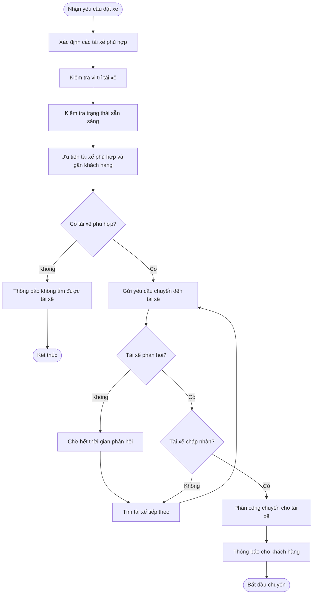
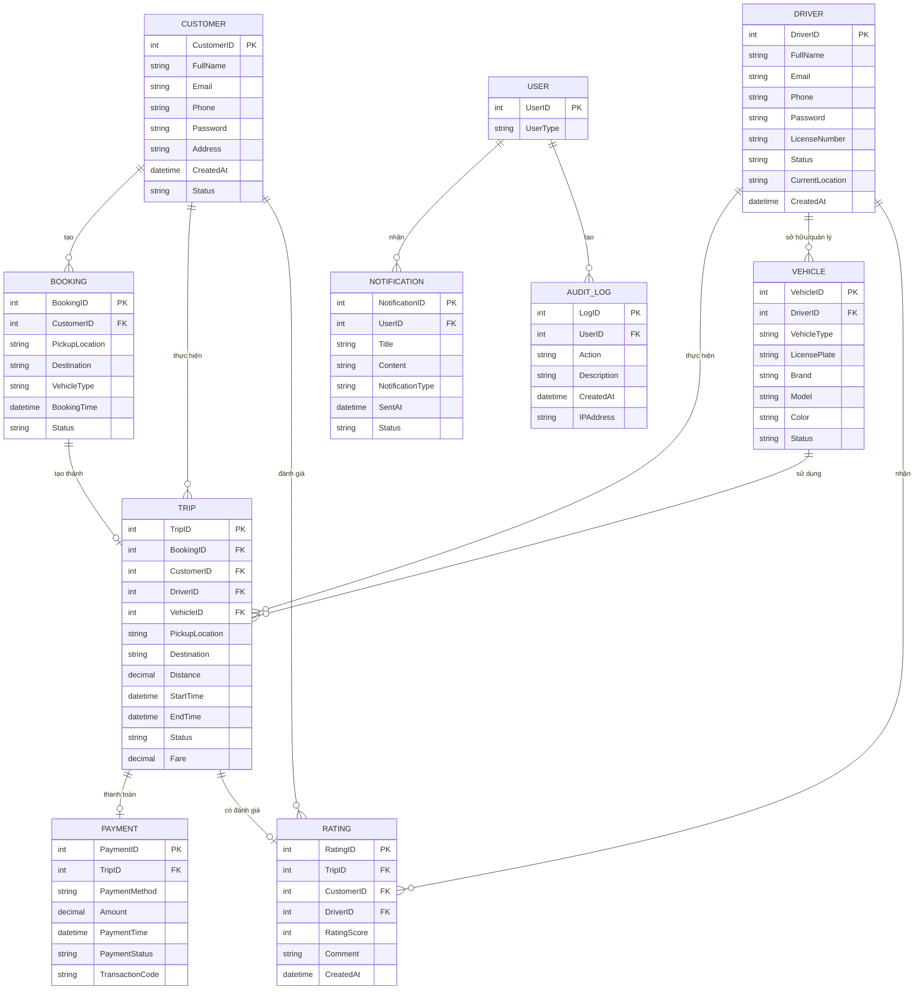
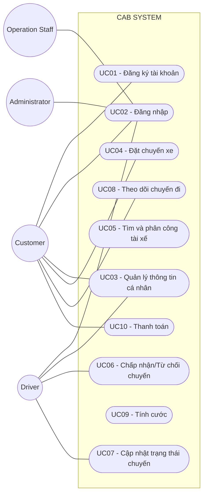

# B1. Xác định Business Context và Business Problem

## 1. Business Context – Bối cảnh nghiệp vụ

Công ty ABC đang cung cấp dịch vụ đặt xe trực tuyến thông qua tổng đài và một ứng dụng đơn giản. Doanh nghiệp có nhu cầu xây dựng **CAB System** mới để tự động hóa và quản lý tập trung toàn bộ quy trình đặt xe, từ khi khách hàng yêu cầu xe, tìm và phân công tài xế, thực hiện chuyến, thanh toán đến đánh giá sau chuyến.

**Đối tượng sử dụng chính:** Khách hàng, Tài xế, Nhân viên vận hành.

Hệ thống cần tích hợp với **cổng thanh toán điện tử và dịch vụ thông báo** bên ngoài.

## 2. Business Problem – Vấn đề nghiệp vụ

- Phân công tài xế còn **thủ công**, mất thời gian và khó tối ưu.
- Khách hàng **khó theo dõi trạng thái chuyến đi**.
- Thanh toán và giao dịch **chưa được quản lý tập trung**.
- Nhân viên vận hành gặp khó khăn trong việc **quản lý khách hàng, tài xế, chuyến đi và xử lý sự cố**.
- Khó tổng hợp dữ liệu để theo dõi **doanh thu, số chuyến, tỷ lệ hoàn thành và tỷ lệ hủy**.
- Hệ thống **khó mở rộng** khi số lượng khách hàng và tài xế tăng.

## 3. Mục tiêu kinh doanh

- Tự động hóa quy trình đặt xe và phân công tài xế.
- Nâng cao trải nghiệm và khả năng theo dõi chuyến của khách hàng.
- Quản lý tập trung chuyến đi, thanh toán và dữ liệu vận hành.
- Giảm thao tác thủ công và nâng cao hiệu quả của nhân viên.
- Xây dựng hệ thống **ổn định, bảo mật và có khả năng mở rộng**.

## 4. Giá trị của hệ thống mới

CAB System giúp **tự động hóa việc tìm tài xế, theo dõi chuyến, thanh toán và thông báo**, đồng thời cung cấp dữ liệu phục vụ quản lý và báo cáo — **giảm thời gian xử lý, nâng cao chất lượng dịch vụ, tăng hiệu quả vận hành và tạo nền tảng để doanh nghiệp mở rộng trong tương lai**.

---


## 2. Business Problem – Vấn đề nghiệp vụ

Hệ thống hiện tại tồn tại các vấn đề:

- Phân công tài xế còn **thủ công**, mất thời gian và khó tối ưu.
- Khách hàng **khó theo dõi trạng thái chuyến đi**.
- Thanh toán và giao dịch **chưa được quản lý tập trung**.
- Nhân viên vận hành gặp khó khăn trong việc **quản lý khách hàng, tài xế, chuyến đi và xử lý sự cố**.
- Khó tổng hợp dữ liệu để theo dõi **doanh thu, số chuyến, tỷ lệ hoàn thành và tỷ lệ hủy**.
- Hệ thống **khó mở rộng** khi số lượng khách hàng và tài xế tăng.

## 3. Mục tiêu kinh doanh

- Tự động hóa quy trình đặt xe và phân công tài xế.
- Nâng cao trải nghiệm và khả năng theo dõi chuyến của khách hàng.
- Quản lý tập trung chuyến đi, thanh toán và dữ liệu vận hành.
- Giảm thao tác thủ công và nâng cao hiệu quả của nhân viên.
- Xây dựng hệ thống **ổn định, bảo mật và có khả năng mở rộng**.

## 4. Giá trị của hệ thống mới

So với hệ thống cũ, CAB System giúp **tự động hóa việc tìm tài xế, theo dõi chuyến, thanh toán và thông báo**, đồng thời cung cấp dữ liệu phục vụ quản lý và báo cáo.

Hệ thống giúp **giảm thời gian xử lý, nâng cao chất lượng dịch vụ, tăng hiệu quả vận hành và tạo nền tảng để doanh nghiệp mở rộng trong tương lai**.


# B2. Xác định các bên liên quan (Stakeholders)
1.	Những stalkholder - 	Vai trò là gì 
2.	Vẽ ma trận stalkholder matrick
## 1. Những stalkholder - 	Vai trò là gì 

| Stakeholder | Vai trò |
|---|---|
| Khách hàng | Đăng ký, đặt xe, theo dõi chuyến, thanh toán và đánh giá tài xế. |
| Tài xế | Nhận chuyến, chấp nhận/từ chối chuyến, thực hiện chuyến và cập nhật trạng thái. |
| Nhân viên vận hành | Quản lý khách hàng, tài xế, phương tiện, chuyến đi và xử lý sự cố. |
| Ban giám đốc | Xác định mục tiêu kinh doanh, theo dõi doanh thu và hiệu quả hoạt động. |
| Bộ phận kế toán/tài chính | Theo dõi giao dịch, thanh toán và doanh thu. |
| Nhà cung cấp thanh toán | Xử lý các giao dịch thanh toán điện tử. |
| Nhà cung cấp thông báo | Cung cấp dịch vụ gửi thông báo như SMS, Email hoặc các kênh khác. |
| Business Analyst (BA) | Thu thập, phân tích và làm rõ yêu cầu của các bên liên quan. |
| Đội phát triển hệ thống | Thiết kế, xây dựng, kiểm thử và triển khai hệ thống. |

2.	Vẽ ma trận stalkholder matrick
## 3. Stakeholder Matrix

Ma trận Stakeholder được phân tích dựa trên hai tiêu chí:

- **Mức độ ảnh hưởng (Power):** Khả năng tác động đến quyết định, phạm vi, tiến độ và kết quả dự án.
- **Mức độ quan tâm (Interest):** Mức độ quan tâm của stakeholder đối với kết quả và hoạt động của hệ thống.

| MỨC ĐỘ ẢNH HƯỞNG | MỨC ĐỘ QUAN TÂM THẤP | MỨC ĐỘ QUAN TÂM CAO |
|---|---|---|
| **CAO** | Bộ phận tài chính<br>Nhà cung cấp thanh toán<br>Nhà cung cấp thông báo | Ban lãnh đạo<br>Nhân viên vận hành<br>System Admin<br>Business Analyst |
| **THẤP** | Stakeholder gián tiếp | Khách hàng<br>Tài xế<br>Đội phát triển<br>QA/Test |

### Sơ đồ Stakeholder Matrix

```text
                    MỨC ĐỘ ẢNH HƯỞNG (POWER)
                              CAO
                               │
                               │
          KEEP SATISFIED      │        MANAGE CLOSELY
                               │
          Bộ phận tài chính   │        Ban lãnh đạo
          Payment Provider    │        Nhân viên vận hành
          Notification        │        System Admin
          Provider            │        Business Analyst
                               │
───────────────────────────────┼──────────────────────────────
                               │
          MONITOR              │        KEEP INFORMED
                               │
          Stakeholder          │        Khách hàng
          gián tiếp            │        Tài xế
                               │        Đội phát triển
                               │        QA / Test
                               │
                               │
                              THẤP
                    MỨC ĐỘ QUAN TÂM (INTEREST)
                         THẤP       →       CAO
```
# B3. Xác định Business Goals

## BG01. Tự động hóa quy trình đặt xe

- Hệ thống tự động tiếp nhận và xử lý yêu cầu đặt xe.
- Giảm thao tác thủ công của nhân viên vận hành.
- Đảm bảo quy trình từ đặt xe đến hoàn thành chuyến được xử lý xuyên suốt.

## BG02. Tự động tìm và phân công tài xế

- Hệ thống tự động tìm tài xế phù hợp.
- Ưu tiên tài xế gần khách hàng và đang sẵn sàng.
- Tự động tìm tài xế khác khi tài xế từ chối hoặc không phản hồi.
- Thông báo cho khách hàng khi tìm được hoặc không tìm được tài xế.

## BG03. Nâng cao trải nghiệm khách hàng

- Cho phép khách hàng đặt xe nhanh chóng.
- Cho phép khách hàng theo dõi trạng thái chuyến.
- Cung cấp thông tin tài xế và thời gian dự kiến đến.
- Cho phép khách hàng xem lịch sử chuyến và đánh giá tài xế.

## BG04. Nâng cao hiệu quả vận hành

- Cho phép nhân viên quản lý khách hàng, tài xế, phương tiện và chuyến đi.
- Cho phép theo dõi các chuyến đang diễn ra.
- Hỗ trợ xử lý các trường hợp chuyến bị lỗi.
- Hỗ trợ tra cứu lịch sử giao dịch.

## BG05. Quản lý tính cước và thanh toán

- Tự động xác định số tiền khách hàng phải thanh toán.
- Hỗ trợ thanh toán tiền mặt.
- Hỗ trợ thanh toán điện tử thông qua Payment Provider.
- Xử lý trường hợp thanh toán thất bại.
- Không lưu trực tiếp thông tin thanh toán nhạy cảm.

## BG06. Xây dựng hệ thống thông báo

- Thông báo cho khách hàng về các sự kiện quan trọng của chuyến.
- Thông báo cho tài xế khi có chuyến mới hoặc thay đổi chuyến.
- Cho phép mở rộng thêm các kênh thông báo trong tương lai.

## BG07. Quản lý và khai thác dữ liệu

- Lưu trữ lịch sử chuyến đi.
- Lưu trữ lịch sử giao dịch.
- Lưu trữ dữ liệu vị trí tài xế.
- Lưu vết các thao tác quan trọng.
- Hỗ trợ tra cứu và kiểm tra dữ liệu khi xảy ra sự cố.

## BG08. Hỗ trợ báo cáo và quản lý hiệu quả

- Theo dõi số lượng chuyến.
- Theo dõi doanh thu.
- Theo dõi tỷ lệ chuyến hoàn thành.
- Theo dõi tỷ lệ chuyến hủy.
- Theo dõi hiệu quả hoạt động của tài xế.

## BG09. Đảm bảo bảo mật và phân quyền

- Xác thực khách hàng, tài xế và nhân viên.
- Phân quyền chức năng quản trị.
- Bảo vệ thông tin cá nhân.
- Bảo vệ dữ liệu phương tiện, vị trí và giao dịch.
- Lưu audit log đối với các thao tác quan trọng.

## BG10. Đảm bảo tính ổn định và khả năng mở rộng

- Hệ thống hoạt động ổn định khi nhu cầu tăng cao.
- Các thành phần có khả năng mở rộng độc lập.
- Lỗi ở Payment hoặc Notification không làm toàn bộ hệ thống đặt xe ngừng hoạt động.
- Cho phép triển khai từng phần mà hạn chế ảnh hưởng đến chức năng đang hoạt động.

## BG11. Hỗ trợ phát triển hệ thống trong tương lai

- Cho phép bổ sung loại dịch vụ mới.
- Cho phép bổ sung phương thức thanh toán mới.
- Cho phép tích hợp thêm Payment Provider.
- Cho phép tích hợp thêm Notification Provider.
- Cho phép thay đổi thành phần kỹ thuật mà không phải xây dựng lại toàn bộ hệ thống.

## BG12. Hoàn thành MVP trong 7 tuần

- Xác định và ưu tiên các chức năng cốt lõi.
- Hoàn thành phiên bản MVP trong thời gian 7 tuần.
- Ưu tiên quy trình:

```text
Đặt xe
  ↓
Tìm tài xế
  ↓
Phân công tài xế
  ↓
Thực hiện chuyến
  ↓
Hoàn thành chuyến
  ↓
Tính cước
  ↓
Thanh toán
  ↓
Thông báo
  ↓
Đánh giá
```
## B4: Xác định PHẠM VI SCOPE: 
1. Quản lý tài khoản người dùng
- Đăng ký và đăng nhập tài khoản khách hàng.
- Quản lý thông tin cá nhân khách hàng.
- Quản lý tài khoản và hồ sơ tài xế.
- Quản lý quyền truy cập của nhân viên vận hành và quản trị viên.
2. Quản lý tài xế và phương tiện
- Quản lý thông tin tài xế.
- Quản lý thông tin phương tiện.
- Theo dõi trạng thái hoạt động của tài xế.
- Theo dõi vị trí của tài xế.
- Quản lý khả năng nhận chuyến của tài xế.
3. Đặt xe và phân công tài xế
- Nhập điểm đón và điểm đến.
- Lựa chọn loại xe.
- Tiếp nhận yêu cầu đặt xe.
- Tìm kiếm tài xế phù hợp.
- Ưu tiên tài xế dựa trên vị trí, trạng thái và tiêu chí vận hành.
- Tiếp tục tìm tài xế khác khi tài xế từ chối hoặc không phản hồi.
- Thông báo khi không tìm được tài xế.
4. Quản lý chuyến đi
- Theo dõi trạng thái chuyến đi.
- Cập nhật trạng thái chuyến.
- Theo dõi thời gian dự kiến tài xế đến.
- Quản lý quá trình thực hiện chuyến.
- Xử lý các trường hợp chuyến bị hủy hoặc gặp sự cố.
- Lưu lịch sử chuyến đi.
5. Tính cước và thanh toán
- Xác định số tiền khách hàng phải trả.
- Hỗ trợ thanh toán bằng tiền mặt.
- Hỗ trợ thanh toán điện tử/chuyển khoản.
- Tích hợp với nhà cung cấp thanh toán bên ngoài.
- Xử lý kết quả thanh toán.
- Xử lý trường hợp thanh toán thất bại.
- Lưu lịch sử giao dịch.
- Không lưu trực tiếp thông tin nhạy cảm của thẻ hoặc tài khoản thanh toán.
6. Thông báo
- Thông báo cho khách hàng về trạng thái đặt xe.
- Thông báo khi tài xế nhận chuyến.
- Thông báo khi tài xế đến điểm đón.
- Thông báo khi chuyến hoàn thành.
- Thông báo kết quả thanh toán.
- Thông báo cho tài xế về chuyến mới và các thay đổi liên quan đến chuyến đi.
- Hỗ trợ mở rộng thêm các kênh thông báo trong tương lai.
7. Đánh giá và phản hồi
- Khách hàng đánh giá tài xế sau khi hoàn thành chuyến.
- Lưu thông tin đánh giá.
- Theo dõi chất lượng phục vụ của tài xế.
8. Quản trị và vận hành
- Quản lý khách hàng.
- Quản lý tài xế.
- Quản lý phương tiện.
- Theo dõi các chuyến đang diễn ra.
- Kiểm tra trạng thái tài xế.
- Hỗ trợ xử lý các chuyến bị lỗi.
- Tra cứu lịch sử giao dịch.
- Phân quyền các thao tác quản trị.
9. Báo cáo
- Báo cáo số lượng chuyến.
- Báo cáo doanh thu.
- Báo cáo tỷ lệ chuyến hoàn thành.
- Báo cáo tỷ lệ hủy chuyến.
- Báo cáo hiệu quả hoạt động của tài xế.
10. Bảo mật và kiểm soát
- Xác thực người dùng.
- Phân quyền truy cập.
- Bảo vệ thông tin cá nhân.
- Bảo vệ dữ liệu phương tiện.
- Bảo vệ dữ liệu vị trí.
- Bảo vệ dữ liệu giao dịch.
- Lưu vết các thao tác quan trọng.
### 11. Những chức năng KHÔNG nên làm trong MVP

> Các chức năng dưới đây **không nằm trong phạm vi MVP 7 tuần**, có thể xem xét ở các phiên bản tiếp theo.

#### 11.1. Quản lý tài khoản nâng cao
- Đăng nhập bằng Google/Facebook/Apple.
- Đăng nhập đa yếu tố (MFA) nâng cao.
- Single Sign-On (SSO).
- Quản lý nhiều thiết bị đăng nhập.
- Hệ thống thành viên nhiều cấp.
- Chương trình khách hàng thân thiết (Loyalty).

#### 11.2. Đặt xe nâng cao
- Đặt xe theo lịch trong tương lai.
- Đặt xe khứ hồi.
- Đặt xe nhiều điểm dừng.
- Đặt xe cho nhiều hành khách.
- Chia sẻ chuyến xe (Ride Sharing).
- Đặt xe theo nhóm.
- Đặt xe doanh nghiệp (Corporate Booking).

#### 11.3. Tìm và phân công tài xế nâng cao
- Sử dụng AI/Machine Learning để phân công tài xế.
- Dự đoán nhu cầu xe theo khu vực.
- Tối ưu phân công nhiều chuyến cùng lúc.
- Dynamic Dispatch nâng cao.
- Tự động điều chỉnh thuật toán dựa trên dữ liệu lịch sử.
- Hệ thống dự đoán thời gian đến bằng AI.

#### 11.4. Tính cước nâng cao
- Dynamic Pricing phức tạp.
- Surge Pricing.
- Hệ thống khuyến mãi nâng cao.
- Hệ thống voucher/coupon phức tạp.
- Loyalty Discount.
- Tự động tối ưu giá bằng AI.
- Nhiều mô hình tính cước phức tạp chưa được khách hàng xác nhận.

#### 11.5. Thanh toán nâng cao
- Tích hợp nhiều nhà cung cấp thanh toán cùng lúc.
- Xây dựng ví điện tử riêng.
- Thanh toán định kỳ (Subscription).
- Auto Billing.
- Hệ thống chia nhỏ và phân bổ thanh toán phức tạp.
- Hệ thống đối soát tài chính tự động nâng cao.

#### 11.6. Thông báo nâng cao
- Triển khai đồng thời quá nhiều kênh thông báo.
- Hệ thống gửi thông báo Marketing.
- Campaign Notification.
- Notification Analytics nâng cao.
- Hệ thống tự động tối ưu nội dung thông báo.
- Chatbot thông báo.

#### 11.7. Tính năng dành cho tài xế nâng cao
- Hệ thống thưởng/phạt tự động.
- Hệ thống hoa hồng phức tạp.
- Driver Ranking nâng cao.
- Gamification cho tài xế.
- Chương trình thưởng theo hiệu suất.
- Phân tích hành vi lái xe bằng AI.
- Hệ thống đào tạo tài xế trực tuyến.

#### 11.8. Bản đồ và điều hướng nâng cao
- Xây dựng hệ thống bản đồ riêng.
- Xây dựng hệ thống Navigation riêng.
- Tối ưu tuyến đường bằng AI.
- Phân tích giao thông nâng cao.
- Heatmap giao thông.
- Dự đoán tình trạng giao thông.
- Tự phát triển thuật toán bản đồ thay cho Map Provider.

#### 11.9. Báo cáo và phân tích nâng cao
- Business Intelligence Platform.
- Data Warehouse phức tạp.
- Predictive Analytics.
- Forecasting doanh thu bằng AI.
- Dashboard phân tích realtime nâng cao.
- Custom Report Builder.
- Phân tích hành vi khách hàng nâng cao.

#### 11.10. Chăm sóc khách hàng nâng cao
- Chat trực tiếp giữa khách hàng và tài xế.
- Chatbot AI.
- Trung tâm hỗ trợ khách hàng đa kênh.
- Hệ thống Ticketing nâng cao.
- Tổng đài VoIP tích hợp.
- CRM Platform đầy đủ.

#### 11.11. Mở rộng dịch vụ
- Giao hàng.
- Gọi xe đường dài.
- Thuê xe theo giờ.
- Xe hợp đồng.
- Vận chuyển hàng hóa.
- Các loại dịch vụ khác chưa được xác định trong phạm vi MVP.

#### 11.12. Quản trị nâng cao
- Workflow phê duyệt nhiều cấp.
- Custom Role Builder.
- Custom Permission Builder phức tạp.
- Audit Dashboard nâng cao.
- Tự động hóa toàn bộ quy trình vận hành.
- Hệ thống quản trị nhiều công ty/chi nhánh.

---

### 12. Các vấn đề CHƯA ĐỦ THÔNG TIN – Không tự triển khai

Các nội dung dưới đây cần được **Business Analyst xác nhận với khách hàng** trước khi đưa vào Development:

- Công thức tính cước cụ thể.
- Tiêu chí ưu tiên tài xế.
- Khoảng cách tối đa để tìm tài xế.
- Thời gian tài xế phải phản hồi yêu cầu.
- Số lần hệ thống thử tìm tài xế.
- Chính sách khi tài xế từ chối chuyến.
- Chính sách khi tài xế không phản hồi.
- Chính sách hủy chuyến của khách hàng.
- Chính sách hủy chuyến của tài xế.
- Phí hủy chuyến.
- Chính sách xử lý thanh toán thất bại.
- Quy định khi khách hàng mất kết nối mạng.
- Quy định khi tài xế mất kết nối mạng.
- Tần suất cập nhật vị trí tài xế.
- Thời gian lưu trữ dữ liệu.
- Chính sách đánh giá tài xế.
- Quy định xử lý đánh giá không hợp lệ.
- Chi tiết phân quyền nhân viên vận hành.
- Quy định về dữ liệu cá nhân và thời gian lưu trữ dữ liệu.

---

### 13. Nguyên tắc Scope cho MVP

```text
                     CAB SYSTEM MVP
                           │
          ┌────────────────┼────────────────┐
          │                │                │
          ▼                ▼                ▼
     PHẢI LÀM          CÓ THỂ LÀM        KHÔNG LÀM
      (MVP)            SAU MVP            (MVP)
          │                │                │
          ▼                ▼                ▼
     Đặt xe           Loyalty           AI Dispatch
     Tìm tài xế      Voucher            Dynamic Pricing
     Chuyến đi       Scheduled Ride     Chatbot AI
     Tính cước       Corporate Ride     Ride Sharing
     Thanh toán      Nhiều Payment      Ví điện tử
     Thông báo       Nhiều Channel      BI nâng cao
     Đánh giá        Dịch vụ mới        Navigation riêng
     Admin           Báo cáo nâng cao    CRM đầy đủ
```
# B5. Chuyển đổi yêu cầu thành Business Requirements

| Mã | Tên Business Requirement | Diễn giải |
|---|---|---|
| BR01 | Quản lý tài khoản khách hàng | Hệ thống cho phép khách hàng đăng ký, đăng nhập và quản lý thông tin cá nhân. |
| BR02 | Quản lý tài khoản tài xế | Hệ thống cho phép tạo và quản lý tài khoản, hồ sơ và thông tin hoạt động của tài xế. |
| BR03 | Quản lý phương tiện | Hệ thống cho phép quản lý thông tin phương tiện được sử dụng để thực hiện chuyến đi. |
| BR04 | Quản lý quyền truy cập | Hệ thống cho phép phân quyền cho nhân viên vận hành và quản trị viên theo vai trò. |
| BR05 | Quản lý trạng thái tài xế | Hệ thống cho phép tài xế cập nhật trạng thái hoạt động và trạng thái sẵn sàng nhận chuyến. |
| BR06 | Theo dõi vị trí tài xế | Hệ thống lưu và cập nhật vị trí tài xế để phục vụ việc tìm kiếm và phân công chuyến. |
| BR07 | Tạo yêu cầu đặt xe | Hệ thống cho phép khách hàng nhập điểm đón, điểm đến và lựa chọn loại xe để tạo yêu cầu đặt xe. |
| BR08 | Tiếp nhận yêu cầu đặt xe | Hệ thống tiếp nhận và lưu thông tin yêu cầu đặt xe của khách hàng. |
| BR09 | Tự động tìm tài xế | Hệ thống tự động tìm các tài xế phù hợp dựa trên vị trí, trạng thái sẵn sàng và các tiêu chí vận hành. |
| BR10 | Ưu tiên tài xế phù hợp | Hệ thống ưu tiên tài xế phù hợp và gần khách hàng theo các tiêu chí vận hành được doanh nghiệp xác định. |
| BR11 | Xử lý tài xế từ chối hoặc không phản hồi | Hệ thống tiếp tục tìm tài xế khác khi tài xế được đề xuất từ chối hoặc không phản hồi trong thời gian quy định. |
| BR12 | Thông báo không tìm được tài xế | Hệ thống thông báo rõ ràng cho khách hàng khi không tìm được tài xế phù hợp. |
| BR13 | Phân công tài xế | Hệ thống xác nhận và gán tài xế cho chuyến đi khi tài xế chấp nhận yêu cầu. |
| BR14 | Quản lý trạng thái chuyến đi | Hệ thống quản lý và cập nhật trạng thái chuyến từ lúc tạo yêu cầu đến khi hoàn thành hoặc hủy. |
| BR15 | Theo dõi chuyến đi | Hệ thống cho phép khách hàng theo dõi trạng thái chuyến và thông tin liên quan trong quá trình thực hiện chuyến. |
| BR16 | Theo dõi thời gian dự kiến | Hệ thống cung cấp thời gian dự kiến tài xế đến điểm đón cho khách hàng. |
| BR17 | Xử lý chuyến bị hủy hoặc lỗi | Hệ thống hỗ trợ xử lý các trường hợp chuyến bị hủy hoặc gặp sự cố theo chính sách của doanh nghiệp. |
| BR18 | Lưu lịch sử chuyến đi | Hệ thống lưu trữ thông tin các chuyến đi để khách hàng và nhân viên có thể tra cứu khi cần. |
| BR19 | Tính cước chuyến đi | Hệ thống xác định số tiền khách hàng phải trả dựa trên loại dịch vụ và thông tin chuyến đi. |
| BR20 | Thanh toán tiền mặt | Hệ thống hỗ trợ ghi nhận và quản lý kết quả thanh toán bằng tiền mặt. |
| BR21 | Thanh toán điện tử | Hệ thống hỗ trợ thanh toán điện tử thông qua nhà cung cấp thanh toán bên ngoài. |
| BR22 | Quản lý kết quả thanh toán | Hệ thống tiếp nhận, lưu trữ và cập nhật trạng thái giao dịch thanh toán. |
| BR23 | Xử lý thanh toán thất bại | Hệ thống thông báo cho khách hàng khi thanh toán thất bại và hỗ trợ xử lý lại theo chính sách doanh nghiệp. |
| BR24 | Bảo vệ thông tin thanh toán | Hệ thống không lưu trực tiếp các thông tin nhạy cảm của thẻ hoặc tài khoản thanh toán. |
| BR25 | Quản lý lịch sử giao dịch | Hệ thống lưu trữ và cho phép nhân viên tra cứu lịch sử giao dịch thanh toán. |
| BR26 | Thông báo trạng thái đặt xe | Hệ thống gửi thông báo cho khách hàng khi yêu cầu đặt xe được tiếp nhận và khi trạng thái chuyến thay đổi. |
| BR27 | Thông báo cho tài xế | Hệ thống gửi thông báo cho tài xế khi có chuyến mới hoặc có thay đổi liên quan đến chuyến đang thực hiện. |
| BR28 | Mở rộng kênh thông báo | Hệ thống được thiết kế để có thể bổ sung thêm các kênh thông báo trong tương lai. |
| BR29 | Đánh giá tài xế | Hệ thống cho phép khách hàng đánh giá tài xế sau khi chuyến đi hoàn thành. |
| BR30 | Quản lý phản hồi | Hệ thống lưu trữ thông tin đánh giá và phản hồi của khách hàng đối với tài xế. |
| BR31 | Quản lý khách hàng | Hệ thống cung cấp chức năng cho nhân viên vận hành quản lý và tra cứu thông tin khách hàng. |
| BR32 | Quản lý tài xế và phương tiện | Hệ thống cung cấp chức năng cho nhân viên vận hành quản lý tài xế và phương tiện. |
| BR33 | Theo dõi chuyến đang diễn ra | Hệ thống cho phép nhân viên vận hành theo dõi các chuyến đang thực hiện và trạng thái hiện tại. |
| BR34 | Hỗ trợ xử lý sự cố | Hệ thống cho phép nhân viên vận hành kiểm tra và hỗ trợ xử lý các trường hợp chuyến bị lỗi. |
| BR35 | Báo cáo hoạt động | Hệ thống cung cấp báo cáo về số lượng chuyến, doanh thu, tỷ lệ hoàn thành và tỷ lệ hủy chuyến. |
| BR36 | Báo cáo hiệu quả tài xế | Hệ thống cung cấp dữ liệu và báo cáo để đánh giá hiệu quả hoạt động của tài xế. |
| BR37 | Xác thực người dùng | Hệ thống yêu cầu người dùng xác thực trước khi sử dụng các chức năng yêu cầu tài khoản. |
| BR38 | Kiểm soát quyền truy cập | Hệ thống kiểm soát quyền truy cập dựa trên vai trò và quyền hạn của người dùng. |
| BR39 | Bảo vệ dữ liệu | Hệ thống bảo vệ thông tin cá nhân, thông tin phương tiện, dữ liệu vị trí và dữ liệu giao dịch. |
| BR40 | Lưu vết thao tác | Hệ thống lưu lại các thao tác quan trọng của người dùng và nhân viên để phục vụ kiểm tra, truy vết khi xảy ra sự cố. |
| BR41 | Đảm bảo khả năng mở rộng | Hệ thống được thiết kế để có thể mở rộng số lượng khách hàng, tài xế và các thành phần khi nhu cầu tăng. |
| BR42 | Đảm bảo tính độc lập của các thành phần | Hệ thống hạn chế việc lỗi tại các thành phần như thanh toán hoặc thông báo làm ảnh hưởng đến toàn bộ chức năng đặt xe. |
| BR43 | Hỗ trợ triển khai từng phần | Hệ thống cho phép triển khai các chức năng mới từng phần và hạn chế ảnh hưởng đến các chức năng đang hoạt động. |
| BR44 | Hỗ trợ mở rộng dịch vụ | Kiến trúc hệ thống cho phép bổ sung các loại dịch vụ mới trong tương lai mà không phải xây dựng lại toàn bộ hệ thống. |
| BR45 | Hỗ trợ mở rộng phương thức thanh toán | Hệ thống cho phép tích hợp thêm phương thức hoặc nhà cung cấp thanh toán trong tương lai. |
| BR46 | Hỗ trợ mở rộng nhà cung cấp thông báo | Hệ thống cho phép thay đổi hoặc bổ sung nhà cung cấp thông báo mà không ảnh hưởng lớn đến hệ thống hiện tại. |

## B6.  Business Process:

# Business Process – CAB System

 1. Quy trình đặt chuyến xe – BP01


2. Quy trình tìm và phân công tài xế – BP02

3. Quy trình theo dõi chuyến đi – BP03

4. Quy trình quản lý tài xế – BP04
   ```mermaid
   flowchart TD
    A([Nhân viên vận hành]) --> B[Đăng ký hoặc tạo tài khoản tài xế]
    B --> C[Nhập thông tin tài xế]
    C --> D[Nhập thông tin phương tiện]
    D --> E[Kiểm tra thông tin]
    E --> F{Thông tin hợp lệ?}

    F -- Không --> G[Yêu cầu cập nhật thông tin]
    G --> C

    F -- Có --> H[Tạo hồ sơ tài xế]
    H --> I[Tài xế đăng nhập]
    I --> J[Cập nhật trạng thái hoạt động]
    J --> K{Sẵn sàng nhận chuyến?}

    K -- Có --> L[Đưa tài xế vào danh sách có thể nhận chuyến]
    K -- Không --> M[Không phân công chuyến]
   ```
5. Quy trình quản lý chuyến đi – BP05
   ```mermaid
    flowchart TD
    A([Tạo yêu cầu]) --> B[Chờ tìm tài xế]
    B --> C{Đã có tài xế?}

    C -- Không --> D[Tiếp tục tìm tài xế]
    D --> C

    C -- Có --> E[Đã phân công tài xế]
    E --> F[Tài xế đang đến]
    F --> G[Đã đến điểm đón]
    G --> H[Đã đón khách]
    H --> I[Đang di chuyển]
    I --> J[Hoàn thành chuyến]

    B --> K{Khách hàng hủy?}
    K -- Có --> L[Hủy chuyến]
    K -- Không --> C

    L --> M[Lưu thông tin hủy chuyến]
    J --> N[Lưu thông tin chuyến]
    ```
6. Quy trình tính cước – BP06
   ```mermaid
   flowchart TD
    A([Chuyến hoàn thành]) --> B[Lấy thông tin chuyến]
    B --> C[Xác định loại dịch vụ]
    C --> D[Xác định thông tin quãng đường và chuyến đi]
    D --> E[Áp dụng quy tắc tính cước]
    E --> F[Tính tổng tiền]
    F --> G[Lưu thông tin cước]
    G --> H[Thông báo số tiền phải trả cho khách hàng]
    H --> I([Chuyển sang thanh toán])
   ```
7. Quy trình thanh toán – BP07
   ```mermaid
   flowchart TD
    A([Nhận số tiền phải trả]) --> B{Chọn phương thức thanh toán}

    B -- Tiền mặt --> C[Khách hàng thanh toán tiền mặt]
    C --> D[Xác nhận thanh toán]
    D --> E[Lưu giao dịch]

    B -- Thanh toán điện tử --> F[Gửi yêu cầu đến nhà cung cấp thanh toán]
    F --> G{Thanh toán thành công?}

    G -- Có --> H[Nhận kết quả giao dịch]
    H --> E

    G -- Không --> I[Thông báo thanh toán thất bại]
    I --> J{Khách hàng muốn thanh toán lại?}

    J -- Có --> F
    J -- Không --> K[Lưu giao dịch thất bại]

    E --> L[Thông báo kết quả thanh toán]
    K --> L
   ```
8. Quy trình thông báo – BP08
    ```mermaid
    flowchart TD
    A([Có sự kiện trong hệ thống]) --> B{Loại sự kiện}

    B -- Đặt xe --> C[Thông báo yêu cầu đã được tiếp nhận]
    B -- Tài xế nhận chuyến --> D[Thông báo tài xế đã nhận chuyến]
    B -- Tài xế đến --> E[Thông báo tài xế đã đến]
    B -- Hoàn thành chuyến --> F[Thông báo chuyến đã hoàn thành]
    B -- Thanh toán --> G[Thông báo kết quả thanh toán]
    B -- Chuyến mới --> H[Thông báo cho tài xế]

    C --> I[Gửi thông báo]
    D --> I
    E --> I
    F --> I
    G --> I
    H --> I

    I --> J([Kết thúc])
    ```
9. Quy trình đánh giá tài xế – BP09
    ```mermaid
    flowchart TD
    A([Chuyến hoàn thành]) --> B[Hiển thị yêu cầu đánh giá]
    B --> C[Khách hàng đánh giá tài xế]
    C --> D[Nhập điểm đánh giá]
    D --> E[Nhập nhận xét nếu có]
    E --> F[Gửi đánh giá]
    F --> G[Lưu đánh giá]
    G --> H[Cập nhật dữ liệu đánh giá tài xế]
    H --> I([Kết thúc])
    ```
10. Quy trình quản lý vận hành – BP10\
    ```mermaid
    flowchart TD
    A([Nhân viên vận hành đăng nhập]) --> B[Xác thực tài khoản]
    B --> C{Có quyền truy cập?}

    C -- Không --> D[Từ chối truy cập]
    D --> E([Kết thúc])

    C -- Có --> F[Truy cập giao diện quản trị]
    F --> G{Chọn chức năng}

    G -- Quản lý khách hàng --> H[Thêm/Sửa/Xem khách hàng]
    G -- Quản lý tài xế --> I[Thêm/Sửa/Xem tài xế]
    G -- Quản lý phương tiện --> J[Thêm/Sửa/Xem phương tiện]
    G -- Quản lý chuyến --> K[Xem và xử lý chuyến]
    G -- Quản lý giao dịch --> L[Tra cứu giao dịch]

    H --> M[Lưu thay đổi]
    I --> M
    J --> M
    K --> M
    L --> M

    M --> N([Kết thúc])
    ```
11. Quy trình báo cáo hoạt động – BP11
    ```mermaid
    flowchart TD
    A([Nhân viên/Quản lý yêu cầu báo cáo]) --> B[Chọn khoảng thời gian]
    B --> C[Hệ thống lấy dữ liệu]
    C --> D[Tổng hợp số lượng chuyến]
    D --> E[Tổng hợp doanh thu]
    E --> F[Tính tỷ lệ hoàn thành]
    F --> G[Tính tỷ lệ hủy]
    G --> H[Phân tích hiệu quả tài xế]
    H --> I[Hiển thị báo cáo]
    I --> J([Kết thúc])
    ```
12. Quy trình bảo mật và phân quyền – BP12
     ```mermaid
     flowchart TD
    A([Người dùng truy cập hệ thống]) --> B[Nhập thông tin đăng nhập]
    B --> C[Xác thực tài khoản]
    C --> D{Thông tin hợp lệ?}

    D -- Không --> E[Thông báo đăng nhập thất bại]
    E --> F([Kết thúc])

    D -- Có --> G[Xác định vai trò người dùng]
    G --> H[Kiểm tra quyền truy cập]
    H --> I{Có quyền thực hiện?}

    I -- Không --> J[Từ chối thao tác]
    J --> K[Ghi nhận log]
    K --> L([Kết thúc])

    I -- Có --> M[Cho phép thực hiện chức năng]
    M --> N[Ghi nhận thao tác quan trọng]
    N --> O[Bảo vệ dữ liệu]
    O --> P([Kết thúc])
     ````
# B7. Xây dựng Business Requirement và phân rã thành Functional Requirement

## 1. Nguyên tắc phân rã

Business Requirement (BR) mô tả **doanh nghiệp cần hệ thống đạt được điều gì**.

Functional Requirement (FR) mô tả **hệ thống phải làm gì để đáp ứng Business Requirement**.

```text
Business Requirement (BR)
        ↓
Functional Requirement (FR)
        ↓
Function / Module của hệ thống
```
## 2. Bảng phân rã Business Requirement → Functional Requirement

| Mã BR | Business Requirement | Mã FR | Functional Requirement |
|---|---|---|---|
| **BR01** | Quản lý tài khoản người dùng | **FR01** | Đăng ký, đăng nhập, đăng xuất và cập nhật thông tin người dùng. |
| **BR02** | Quản lý tài khoản tài xế | **FR01** | Tạo tài khoản, đăng nhập và cập nhật thông tin hồ sơ tài xế. |
| **BR03** | Quản lý phương tiện | **FR11** | Thêm, sửa, xem và quản lý thông tin phương tiện. |
| **BR04** | Quản lý quyền truy cập | **FR13** | Phân quyền và kiểm soát quyền truy cập các chức năng quản trị. |
| **BR05** | Quản lý trạng thái tài xế | **FR11** | Cập nhật và theo dõi trạng thái hoạt động, trạng thái sẵn sàng nhận chuyến của tài xế. |
| **BR06** | Theo dõi vị trí tài xế | **FR06** | Cập nhật, lưu và theo dõi vị trí tài xế để hỗ trợ tìm xe và xác định ETA. |
| **BR07** | Tạo yêu cầu đặt xe | **FR02** | Nhập điểm đón, điểm đến, chọn loại xe và gửi yêu cầu đặt xe. |
| **BR08** | Tiếp nhận yêu cầu đặt xe | **FR02** | Kiểm tra, tạo và lưu yêu cầu đặt xe, đồng thời cập nhật trạng thái chuyến. |
| **BR09** | Tự động tìm tài xế | **FR03** | Xác định và tìm tài xế phù hợp dựa trên vị trí, trạng thái và loại xe. |
| **BR10** | Ưu tiên tài xế phù hợp | **FR03** | Ưu tiên tài xế phù hợp và gần khách hàng theo tiêu chí vận hành. |
| **BR11** | Xử lý tài xế từ chối hoặc không phản hồi | **FR04** | Ghi nhận từ chối/không phản hồi và tiếp tục tìm tài xế khác. |
| **BR12** | Thông báo không tìm được tài xế | **FR09** | Thông báo cho khách hàng khi hệ thống không tìm được tài xế phù hợp. |
| **BR13** | Phân công tài xế | **FR04** | Gửi yêu cầu đến tài xế, ghi nhận tài xế chấp nhận và phân công tài xế cho chuyến. |
| **BR14** | Quản lý trạng thái chuyến đi | **FR05** | Tạo, cập nhật và quản lý trạng thái chuyến từ lúc đặt xe đến khi hoàn thành hoặc hủy. |
| **BR15** | Theo dõi chuyến đi | **FR05** | Cho phép khách hàng theo dõi trạng thái và thông tin chuyến đi. |
| **BR16** | Theo dõi thời gian dự kiến | **FR06** | Xác định và hiển thị thời gian dự kiến tài xế đến điểm đón. |
| **BR17** | Xử lý chuyến bị hủy hoặc lỗi | **FR05** | Xử lý hủy chuyến, ghi nhận lý do và hỗ trợ xử lý các chuyến bị lỗi. |
| **BR18** | Lưu lịch sử chuyến đi | **FR14** | Lưu và cho phép tra cứu lịch sử các chuyến đi. |
| **BR19** | Tính cước chuyến đi | **FR07** | Tính số tiền khách hàng phải trả dựa trên loại dịch vụ và thông tin chuyến. |
| **BR20** | Thanh toán tiền mặt | **FR08** | Hỗ trợ lựa chọn và ghi nhận thanh toán bằng tiền mặt. |
| **BR21** | Thanh toán điện tử | **FR08** | Tích hợp với nhà cung cấp thanh toán bên ngoài để xử lý thanh toán điện tử. |
| **BR22** | Quản lý kết quả thanh toán | **FR08** | Ghi nhận và cập nhật trạng thái giao dịch thanh toán thành công hoặc thất bại. |
| **BR23** | Xử lý thanh toán thất bại | **FR08** | Thông báo thanh toán thất bại và cho phép thanh toán lại theo chính sách. |
| **BR24** | Bảo vệ thông tin thanh toán | **FR08** | Không lưu trực tiếp thông tin nhạy cảm của thẻ hoặc tài khoản thanh toán. |
| **BR25** | Quản lý lịch sử giao dịch | **FR14** | Lưu và cho phép nhân viên vận hành tra cứu lịch sử giao dịch. |
| **BR26** | Thông báo trạng thái đặt xe | **FR09** | Gửi thông báo khi yêu cầu được tiếp nhận, tài xế nhận chuyến, tài xế đến, chuyến hoàn thành và thanh toán có kết quả. |
| **BR27** | Thông báo cho tài xế | **FR09** | Gửi thông báo cho tài xế về chuyến mới và các thay đổi liên quan đến chuyến. |
| **BR28** | Mở rộng kênh thông báo | **FR09** | Hỗ trợ tích hợp thêm các kênh hoặc nhà cung cấp thông báo trong tương lai. |
| **BR29** | Đánh giá tài xế | **FR10** | Cho phép khách hàng đánh giá và nhận xét tài xế sau khi hoàn thành chuyến. |
| **BR30** | Quản lý phản hồi | **FR10** | Lưu và quản lý dữ liệu đánh giá, phản hồi của khách hàng về tài xế. |
| **BR31** | Quản lý khách hàng | **FR11** | Nhân viên vận hành có thể xem và quản lý thông tin khách hàng. |
| **BR32** | Quản lý tài xế và phương tiện | **FR11** | Nhân viên vận hành có thể quản lý thông tin tài xế và phương tiện. |
| **BR33** | Theo dõi chuyến đang diễn ra | **FR11** | Nhân viên vận hành có thể xem và theo dõi các chuyến đang diễn ra. |
| **BR34** | Hỗ trợ xử lý sự cố | **FR11** | Nhân viên vận hành có thể xem và hỗ trợ xử lý các chuyến bị lỗi. |
| **BR35** | Báo cáo hoạt động | **FR12** | Cung cấp báo cáo về số lượng chuyến, doanh thu, tỷ lệ hoàn thành và tỷ lệ hủy. |
| **BR36** | Báo cáo hiệu quả tài xế | **FR12** | Cung cấp báo cáo về hiệu quả hoạt động và đánh giá tài xế. |
| **BR37** | Xác thực người dùng | **FR01** | Xác thực người dùng trước khi sử dụng các chức năng yêu cầu tài khoản. |
| **BR38** | Kiểm soát quyền truy cập | **FR13** | Kiểm tra quyền của người dùng trước khi thực hiện các thao tác quản trị. |
| **BR39** | Bảo vệ dữ liệu | **FR13** | Kiểm soát quyền truy cập đối với dữ liệu cá nhân, phương tiện, vị trí và giao dịch. |
| **BR40** | Lưu vết thao tác | **FR13** | Ghi nhận các thao tác quan trọng của người dùng để phục vụ kiểm tra và xử lý sự cố. |
| **BR41** | Đảm bảo khả năng mở rộng | **FR11** | Hỗ trợ mở rộng hệ thống và các thành phần khi số lượng người dùng, tài xế và chuyến tăng. |
| **BR42** | Đảm bảo tính độc lập của các thành phần | **FR09** | Đảm bảo lỗi ở thông báo hoặc thanh toán không làm dừng toàn bộ quy trình đặt xe. |
| **BR43** | Hỗ trợ triển khai từng phần | **FR11** | Cho phép các chức năng hoặc thành phần được triển khai và nâng cấp từng phần. |
| **BR44** | Hỗ trợ mở rộng dịch vụ | **FR02** | Cho phép bổ sung loại xe hoặc loại dịch vụ mới trong tương lai. |
| **BR45** | Hỗ trợ mở rộng phương thức thanh toán | **FR08** | Cho phép tích hợp thêm phương thức hoặc nhà cung cấp thanh toán. |
| **BR46** | Hỗ trợ mở rộng nhà cung cấp thông báo | **FR09** | Cho phép tích hợp thêm kênh hoặc nhà cung cấp thông báo mới. |

## 3. Phân rã theo Business Process

### BP01 – Quy trình đặt chuyến xe

```text
BP01
├── BR07 – Tạo yêu cầu đặt xe
│   └── FR02 – Đặt xe
├── BR08 – Tiếp nhận yêu cầu đặt xe
│   └── FR02 – Đặt xe
└── BR26 – Thông báo yêu cầu đặt xe
    └── FR09 – Thông báo
BP02 – Quy trình tìm và phân công tài xế
BP02
├── BR09 – Tự động tìm tài xế
│   └── FR03 – Tìm tài xế
├── BR10 – Ưu tiên tài xế phù hợp
│   └── FR03 – Tìm tài xế
├── BR11 – Xử lý tài xế từ chối hoặc không phản hồi
│   └── FR04 – Phân công tài xế
├── BR12 – Thông báo không tìm được tài xế
│   └── FR09 – Thông báo
├── BR13 – Phân công tài xế
│   └── FR04 – Phân công tài xế
└── BR26 – Thông báo tài xế nhận chuyến
    └── FR09 – Thông báo

BP03 – Quy trình theo dõi chuyến đi
BP03
├── BR14 – Quản lý trạng thái chuyến đi
│   └── FR05 – Quản lý chuyến đi
├── BR15 – Theo dõi chuyến đi
│   └── FR05 – Quản lý chuyến đi
├── BR16 – Theo dõi thời gian dự kiến
│   └── FR06 – Theo dõi vị trí
├── BR26 – Thông báo tài xế đến điểm đón
│   └── FR09 – Thông báo
└── BR27 – Thông báo cho tài xế
    └── FR09 – Thông báo

BP04 – Quy trình quản lý tài xế
BP04
├── BR02 – Quản lý tài khoản tài xế
│   └── FR01 – Quản lý tài khoản
├── BR03 – Quản lý phương tiện
│   └── FR11 – Quản lý vận hành
├── BR05 – Quản lý trạng thái tài xế
│   └── FR11 – Quản lý vận hành
└── BR06 – Theo dõi vị trí tài xế
    └── FR06 – Theo dõi vị trí

BP05 – Quy trình quản lý chuyến đi
BP05
├── BR14 – Quản lý trạng thái chuyến đi
│   └── FR05 – Quản lý chuyến đi
├── BR17 – Xử lý chuyến bị hủy hoặc lỗi
│   └── FR05 – Quản lý chuyến đi
└── BR18 – Lưu lịch sử chuyến đi
    └── FR14 – Quản lý lịch sử

BP06 – Quy trình tính cước
BP06
└── BR19 – Tính cước chuyến đi
    └── FR07 – Tính cước

BP07 – Quy trình thanh toán
BP07
├── BR20 – Thanh toán tiền mặt
│   └── FR08 – Thanh toán
├── BR21 – Thanh toán điện tử
│   └── FR08 – Thanh toán
├── BR22 – Quản lý kết quả thanh toán
│   └── FR08 – Thanh toán
├── BR23 – Xử lý thanh toán thất bại
│   └── FR08 – Thanh toán
├── BR24 – Bảo vệ thông tin thanh toán
│   └── FR08 – Thanh toán
└── BR25 – Quản lý lịch sử giao dịch
    └── FR14 – Quản lý lịch sử

BP08 – Quy trình thông báo
BP08
├── BR26 – Thông báo trạng thái đặt xe
│   └── FR09 – Thông báo
├── BR27 – Thông báo cho tài xế
│   └── FR09 – Thông báo
├── BR28 – Mở rộng kênh thông báo
│   └── FR09 – Thông báo
└── BR42 – Đảm bảo tính độc lập của thành phần thông báo
    └── FR09 – Thông báo

BP09 – Quy trình đánh giá tài xế
BP09
├── BR29 – Đánh giá tài xế
│   └── FR10 – Đánh giá tài xế
└── BR30 – Quản lý phản hồi
    └── FR10 – Đánh giá tài xế

BP10 – Quy trình quản lý vận hành
BP10
├── BR04 – Quản lý quyền truy cập
│   └── FR13 – Phân quyền
├── BR31 – Quản lý khách hàng
│   └── FR11 – Quản lý vận hành
├── BR32 – Quản lý tài xế và phương tiện
│   └── FR11 – Quản lý vận hành
├── BR33 – Theo dõi chuyến đang diễn ra
│   └── FR11 – Quản lý vận hành
├── BR34 – Hỗ trợ xử lý sự cố
│   └── FR11 – Quản lý vận hành
├── BR38 – Kiểm soát quyền truy cập
│   └── FR13 – Phân quyền
└── BR40 – Lưu vết thao tác
    └── FR13 – Phân quyền

BP11 – Quy trình báo cáo hoạt động
BP11
├── BR35 – Báo cáo hoạt động
│   └── FR12 – Báo cáo
└── BR36 – Báo cáo hiệu quả tài xế
    └── FR12 – Báo cáo

BP12 – Quy trình bảo mật và phân quyền
BP12
├── BR01 – Quản lý tài khoản người dùng
│   └── FR01 – Quản lý tài khoản
├── BR37 – Xác thực người dùng
│   └── FR01 – Quản lý tài khoản
├── BR38 – Kiểm soát quyền truy cập
│   └── FR13 – Phân quyền
├── BR39 – Bảo vệ dữ liệu
│   └── FR13 – Phân quyền
└── BR40 – Lưu vết thao tác
    └── FR13 – Phân quyền

BP13 – Quy trình mở rộng và khả năng phát triển hệ thống
BP13
├── BR41 – Đảm bảo khả năng mở rộng
│   └── FR11 – Quản lý vận hành
├── BR42 – Đảm bảo tính độc lập của các thành phần
│   └── FR09 – Thông báo
├── BR43 – Hỗ trợ triển khai từng phần
│   └── FR11 – Quản lý vận hành
├── BR44 – Hỗ trợ mở rộng dịch vụ
│   └── FR02 – Đặt xe
├── BR45 – Hỗ trợ mở rộng phương thức thanh toán
│   └── FR08 – Thanh toán
└── BR46 – Hỗ trợ mở rộng nhà cung cấp thông báo
    └── FR09 – Thông báo
```
## B8: Business Goal and Acceptance Criteria

| ID       | Business Goal                                | Acceptance Criteria                                                                                                                                                                                                                                                                                    |
| -------- | -------------------------------------------- | ------------------------------------------------------------------------------------------------------------------------------------------------------------------------------------------------------------------------------------------------------------------------------------------------------ |
| **BG01** | **Ưu tiên tài xế phù hợp**                   | • Ưu tiên tài xế đang sẵn sàng nhận chuyến.<br>• Ưu tiên tài xế có vị trí gần khách hàng.<br>• Có thể xem xét thêm ranking/đánh giá tài xế.<br>• Không đề xuất tài xế đang bận hoặc không sẵn sàng.                                                                                                    |
| **BG02** | **Giảm thời gian tìm tài xế**                | • Hệ thống tự động tìm tài xế sau khi khách hàng đặt xe.<br>• Gửi yêu cầu đến tài xế phù hợp.<br>• Tài xế không phản hồi trong thời gian quy định được xem là không nhận chuyến.<br>• Hệ thống tiếp tục tìm tài xế khác.                                                                               |
| **BG03** | **Xử lý tài xế từ chối hoặc không phản hồi** | • Nếu tài xế từ chối, hệ thống tìm tài xế khác.<br>• Nếu tài xế không phản hồi, hệ thống chuyển sang tài xế khác.<br>• Không gửi lại yêu cầu cho tài xế đã từ chối cùng chuyến.<br>• Khách hàng không cần tạo lại yêu cầu.                                                                             |
| **BG04** | **Xử lý khi không tìm được tài xế**          | • Nếu khu vực không có tài xế phù hợp, hệ thống thông báo cho khách hàng.<br>• Không để yêu cầu ở trạng thái “đang tìm tài xế” vô thời hạn.<br>• Lưu trạng thái không tìm được tài xế.<br>• Khách hàng có thể thực hiện lại yêu cầu.                                                                   |
| **BG05** | **Theo dõi trạng thái chuyến đi**            | • Khách hàng biết tài xế đã nhận chuyến.<br>• Cập nhật khi tài xế đến điểm đón.<br>• Cập nhật khi đã đón khách.<br>• Cập nhật khi đang di chuyển.<br>• Cập nhật khi chuyến hoàn thành.                                                                                                                 |
| **BG06** | **Đảm bảo thanh toán thành công**            | • Xác định số tiền phải thanh toán sau khi chuyến hoàn thành.<br>• Hỗ trợ nhiều phương thức thanh toán.<br>• Ghi nhận giao dịch khi thanh toán thành công.<br>• Thông báo kết quả thanh toán cho khách hàng.                                                                                           |
| **BG07** | **Xử lý thanh toán thất bại**                | • Thông báo cho khách hàng khi thanh toán thất bại.<br>• Ghi nhận giao dịch ở trạng thái thất bại.<br>• Cho phép thanh toán lại theo chính sách doanh nghiệp.<br>• Lỗi thanh toán không làm toàn bộ hệ thống đặt xe ngừng hoạt động.<br>• Không lưu thông tin thẻ nhạy cảm.                            |
| **BG08** | **Hỗ trợ thanh toán tiền mặt**               | • Khách hàng có thể chọn tiền mặt.<br>• Ghi nhận số tiền cần thanh toán.<br>• Ghi nhận kết quả thanh toán theo quy định.<br>• Lưu lịch sử giao dịch.                                                                                                                                                   |
| **BG09** | **Đảm bảo thông báo kịp thời**               | • Thông báo khi yêu cầu được tiếp nhận.<br>• Thông báo khi tài xế nhận chuyến.<br>• Thông báo khi tài xế đến điểm đón.<br>• Thông báo khi chuyến hoàn thành.<br>• Thông báo kết quả thanh toán.<br>• Tài xế nhận thông báo khi có chuyến mới.                                                          |
| **BG10** | **Xử lý hủy chuyến**                         | • Khách hàng chỉ được hủy theo chính sách doanh nghiệp.<br>• Cập nhật trạng thái chuyến thành “Đã hủy”.<br>• Thông báo cho tài xế khi chuyến bị hủy.<br>• Xác định phí hủy nếu có.<br>• Lưu lịch sử hủy chuyến.                                                                                        |
| **BG11** | **Đảm bảo bảo mật và phân quyền**            | • Người dùng phải xác thực trước khi sử dụng chức năng yêu cầu tài khoản.<br>• Nhân viên chỉ được thực hiện thao tác theo quyền được cấp.<br>• Ngăn người không có quyền thực hiện thao tác quản trị nhạy cảm.<br>• Lưu vết các thao tác quan trọng.<br>• Bảo vệ dữ liệu cá nhân, vị trí và giao dịch. |
| **BG12** | **Xử lý mất kết nối mạng**                   | • Không hủy chuyến ngay khi tài xế mất kết nối tạm thời.<br>• Ghi nhận thời điểm mất kết nối.<br>• Đồng bộ lại trạng thái khi tài xế kết nối lại.<br>• Xử lý theo chính sách nếu mất kết nối quá lâu.<br>• Thông báo cho khách hàng nếu ảnh hưởng đến chuyến.                                          |
| **BG13** | **Nâng cao chất lượng dịch vụ**              | • Khách hàng được đánh giá sau khi chuyến hoàn thành.<br>• Không cho phép đánh giá chuyến chưa hoàn thành.<br>• Lưu kết quả đánh giá.<br>• Sử dụng dữ liệu đánh giá để theo dõi chất lượng tài xế.                                                                                                     |
| **BG14** | **Hỗ trợ báo cáo hoạt động**                 | • Có thông tin số lượng chuyến.<br>• Có thông tin doanh thu.<br>• Có tỷ lệ chuyến hoàn thành.<br>• Có tỷ lệ chuyến hủy.<br>• Có thông tin hiệu quả hoạt động của tài xế.                                                                                                                               |

## B9. Mô hình hóa hệ thống – Mô hình dữ liệu

### 9.1. Xác định các thực thể và thuộc tính

| Thực thể | Thuộc tính |
|---|---|
| **Khách hàng (Customer)** | CustomerID, FullName, Email, Phone, Password, Address, CreatedAt, Status |
| **Tài xế (Driver)** | DriverID, FullName, Email, Phone, Password, LicenseNumber, Status, CurrentLocation, CreatedAt |
| **Phương tiện (Vehicle)** | VehicleID, DriverID, VehicleType, LicensePlate, Brand, Model, Color, Status |
| **Chuyến đi (Trip)** | TripID, CustomerID, DriverID, VehicleID, BookingID, PickupLocation, Destination, Distance, StartTime, EndTime, Status, Fare |
| **Yêu cầu đặt xe (Booking)** | BookingID, CustomerID, PickupLocation, Destination, VehicleType, BookingTime, Status |
| **Thanh toán (Payment)** | PaymentID, TripID, PaymentMethod, Amount, PaymentTime, PaymentStatus, TransactionCode |
| **Đánh giá (Rating)** | RatingID, TripID, CustomerID, DriverID, RatingScore, Comment, CreatedAt |
| **Thông báo (Notification)** | NotificationID, UserID, Title, Content, NotificationType, SentAt, Status |
| **Nhân viên vận hành (Staff)** | StaffID, FullName, Email, Phone, Password, Role, Status |
| **Log hệ thống (AuditLog)** | LogID, UserID, Action, Description, CreatedAt, IPAddress |

### 9.2. Mô tả một số thực thể chính

#### Customer – Khách hàng

- **CustomerID:** Mã khách hàng.
- **FullName:** Họ và tên.
- **Email:** Email đăng nhập.
- **Phone:** Số điện thoại.
- **Password:** Mật khẩu tài khoản.
- **Address:** Địa chỉ.
- **CreatedAt:** Ngày tạo tài khoản.
- **Status:** Trạng thái tài khoản.

#### Driver – Tài xế

- **DriverID:** Mã tài xế.
- **FullName:** Họ và tên.
- **Email:** Email.
- **Phone:** Số điện thoại.
- **Password:** Mật khẩu.
- **LicenseNumber:** Số giấy phép lái xe.
- **Status:** Trạng thái hoạt động.
- **CurrentLocation:** Vị trí hiện tại.
- **CreatedAt:** Ngày tạo tài khoản.

#### Vehicle – Phương tiện

- **VehicleID:** Mã phương tiện.
- **DriverID:** Mã tài xế.
- **VehicleType:** Loại xe.
- **LicensePlate:** Biển số xe.
- **Brand:** Hãng xe.
- **Model:** Mẫu xe.
- **Color:** Màu xe.
- **Status:** Trạng thái phương tiện.

#### Booking – Yêu cầu đặt xe

- **BookingID:** Mã yêu cầu đặt xe.
- **CustomerID:** Mã khách hàng.
- **PickupLocation:** Điểm đón.
- **Destination:** Điểm đến.
- **VehicleType:** Loại xe yêu cầu.
- **BookingTime:** Thời gian tạo yêu cầu.
- **Status:** Trạng thái yêu cầu.

#### Trip – Chuyến đi

- **TripID:** Mã chuyến.
- **BookingID:** Mã yêu cầu đặt xe.
- **CustomerID:** Mã khách hàng.
- **DriverID:** Mã tài xế.
- **VehicleID:** Mã phương tiện.
- **PickupLocation:** Điểm đón.
- **Destination:** Điểm đến.
- **Distance:** Quãng đường.
- **StartTime:** Thời gian bắt đầu.
- **EndTime:** Thời gian kết thúc.
- **Status:** Trạng thái chuyến.
- **Fare:** Cước phí.

#### Payment – Thanh toán

- **PaymentID:** Mã thanh toán.
- **TripID:** Mã chuyến.
- **PaymentMethod:** Phương thức thanh toán.
- **Amount:** Số tiền.
- **PaymentTime:** Thời gian thanh toán.
- **PaymentStatus:** Trạng thái thanh toán.
- **TransactionCode:** Mã giao dịch từ nhà cung cấp thanh toán.

### 9.3. Quan hệ giữa các thực thể

- **Customer 1 - N Booking:** Một khách hàng có thể tạo nhiều yêu cầu đặt xe.
- **Customer 1 - N Trip:** Một khách hàng có thể thực hiện nhiều chuyến.
- **Driver 1 - N Trip:** Một tài xế có thể thực hiện nhiều chuyến.
- **Driver 1 - N Vehicle:** Một tài xế có thể quản lý nhiều phương tiện.
- **Vehicle 1 - N Trip:** Một phương tiện có thể được sử dụng cho nhiều chuyến.
- **Booking 1 - 1 Trip:** Một yêu cầu đặt xe có thể tạo ra một chuyến đi.
- **Trip 1 - 1 Payment:** Một chuyến đi có một giao dịch thanh toán chính.
- **Trip 1 - 0..1 Rating:** Một chuyến đi có thể có tối đa một đánh giá.
- **Customer 1 - N Rating:** Một khách hàng có thể tạo nhiều đánh giá.
- **Driver 1 - N Rating:** Một tài xế có thể nhận nhiều đánh giá.
- **User 1 - N Notification:** Một người dùng có thể nhận nhiều thông báo.
- **User 1 - N AuditLog:** Một người dùng có thể tạo nhiều log thao tác.

### 9.4. Các thực thể cốt lõi của MVP

Trong phạm vi MVP 7 tuần, các thực thể quan trọng nhất là:

**Customer → Driver → Vehicle → Booking → Trip → Payment → Rating**

### 9.5. Sơ đồ ERD


## B10. Xác định Non-Functional Requirements

| Mã NFR | Nhóm yêu cầu | Non-Functional Requirement |
|---|---|---|
| **NFR01** | Hiệu năng | Hệ thống phải phản hồi các thao tác thông thường của người dùng trong thời gian phù hợp, đặc biệt đối với chức năng đặt xe và theo dõi chuyến. |
| **NFR02** | Hiệu năng | Hệ thống phải có khả năng xử lý đồng thời nhiều yêu cầu đặt xe và tìm tài xế trong thời gian cao điểm. |
| **NFR03** | Khả năng mở rộng | Hệ thống phải có khả năng mở rộng độc lập các thành phần khi số lượng khách hàng, tài xế và chuyến đi tăng. |
| **NFR04** | Tính sẵn sàng | Hệ thống phải duy trì hoạt động ổn định trong thời gian cao điểm và hạn chế tối đa thời gian ngừng hoạt động. |
| **NFR05** | Khả năng chịu lỗi | Lỗi tại chức năng thanh toán, thông báo hoặc một thành phần riêng lẻ không được làm dừng toàn bộ hệ thống đặt xe. |
| **NFR06** | Khả năng phục hồi | Hệ thống phải có khả năng phục hồi và tiếp tục xử lý khi xảy ra lỗi hoặc mất kết nối tạm thời. |
| **NFR07** | Bảo mật | Người dùng phải được xác thực trước khi sử dụng các chức năng yêu cầu tài khoản. |
| **NFR08** | Phân quyền | Hệ thống phải kiểm soát quyền truy cập dựa trên vai trò của khách hàng, tài xế, nhân viên vận hành và quản trị viên. |
| **NFR09** | Bảo mật dữ liệu | Thông tin cá nhân, thông tin phương tiện, dữ liệu vị trí và dữ liệu giao dịch phải được bảo vệ khỏi truy cập trái phép. |
| **NFR10** | Bảo mật thanh toán | Hệ thống không được lưu trực tiếp thông tin nhạy cảm của thẻ hoặc tài khoản thanh toán. |
| **NFR11** | Audit | Các thao tác quản trị và thao tác quan trọng phải được ghi nhận log để phục vụ kiểm tra và xử lý sự cố. |
| **NFR12** | Tin cậy dữ liệu | Dữ liệu chuyến đi, thanh toán và giao dịch phải được lưu trữ chính xác và nhất quán. |
| **NFR13** | Tính mở rộng | Kiến trúc phải cho phép bổ sung loại dịch vụ, phương thức thanh toán và nhà cung cấp thông báo mới mà không phải xây dựng lại toàn bộ hệ thống. |
| **NFR14** | Khả năng bảo trì | Các thành phần hệ thống phải được thiết kế độc lập để có thể bảo trì hoặc nâng cấp mà hạn chế ảnh hưởng đến các chức năng khác. |
| **NFR15** | Khả năng triển khai | Hệ thống phải hỗ trợ triển khai từng phần để giảm ảnh hưởng đến các chức năng đang hoạt động. |
| **NFR16** | Khả năng tương thích | Hệ thống phải có khả năng tích hợp với các nhà cung cấp bên ngoài như thanh toán và thông báo. |
| **NFR17** | Khả năng mở rộng thông báo | Kiến trúc thông báo phải cho phép bổ sung các kênh như Push Notification, SMS, Email hoặc các nhà cung cấp khác trong tương lai. |
| **NFR18** | Giám sát | Hệ thống cần có khả năng theo dõi trạng thái hoạt động, lỗi và các chỉ số quan trọng của các thành phần. |
| **NFR19** | Sao lưu | Dữ liệu quan trọng phải được sao lưu và có phương án khôi phục khi xảy ra sự cố. |
| **NFR20** | Khả năng sử dụng | Giao diện dành cho khách hàng, tài xế và nhân viên vận hành phải dễ sử dụng và phù hợp với từng nhóm người dùng. |

## B11. Xác định và vẽ Use Case

# Đặc tả User Case

## UC01 – Đăng ký tài khoản

| Thành phần | Nội dung |
|---|---|
| **Mã UC** | UC01 |
| **Tên** | Đăng ký tài khoản |
| **Actor** | Khách hàng |
| **Mục tiêu** | Tạo tài khoản để sử dụng dịch vụ CAB |
| **Tiền điều kiện** | Khách hàng chưa có tài khoản |
| **Luồng chính** | 1. Khách hàng chọn chức năng đăng ký.<br>2. Nhập họ tên, email, số điện thoại và mật khẩu.<br>3. Hệ thống kiểm tra thông tin.<br>4. Hệ thống tạo tài khoản.<br>5. Hệ thống thông báo đăng ký thành công. |
| **Ngoại lệ** | Email hoặc số điện thoại đã tồn tại → hệ thống thông báo lỗi và yêu cầu nhập lại. |
| **Hậu điều kiện** | Tài khoản khách hàng được tạo thành công. |

---

## UC02 – Đăng nhập

| Thành phần | Nội dung |
|---|---|
| **Mã UC** | UC02 |
| **Tên** | Đăng nhập |
| **Actor** | Khách hàng, Tài xế, Nhân viên vận hành, Quản trị viên |
| **Mục tiêu** | Xác thực người dùng để sử dụng các chức năng của hệ thống |
| **Tiền điều kiện** | Người dùng đã có tài khoản |
| **Luồng chính** | 1. Người dùng mở chức năng đăng nhập.<br>2. Nhập email/số điện thoại và mật khẩu.<br>3. Hệ thống kiểm tra thông tin đăng nhập.<br>4. Hệ thống xác định vai trò của người dùng.<br>5. Hệ thống cho phép truy cập các chức năng tương ứng với vai trò. |
| **Ngoại lệ** | Thông tin đăng nhập không chính xác → hệ thống thông báo lỗi và yêu cầu nhập lại. |
| **Hậu điều kiện** | Người dùng đăng nhập thành công và được cấp quyền truy cập phù hợp. |

---

## UC03 – Quản lý thông tin cá nhân

| Thành phần | Nội dung |
|---|---|
| **Mã UC** | UC03 |
| **Tên** | Quản lý thông tin cá nhân |
| **Actor** | Khách hàng, Tài xế |
| **Mục tiêu** | Cho phép người dùng xem và cập nhật thông tin cá nhân |
| **Tiền điều kiện** | Người dùng đã đăng nhập |
| **Luồng chính** | 1. Người dùng mở chức năng thông tin cá nhân.<br>2. Hệ thống hiển thị thông tin hiện tại.<br>3. Người dùng chỉnh sửa thông tin cần thay đổi.<br>4. Người dùng chọn lưu.<br>5. Hệ thống kiểm tra dữ liệu.<br>6. Hệ thống cập nhật thông tin. |
| **Ngoại lệ** | Thông tin không hợp lệ → hệ thống thông báo lỗi và yêu cầu người dùng nhập lại. |
| **Hậu điều kiện** | Thông tin cá nhân được cập nhật thành công. |

---

## UC04 – Đặt chuyến xe

| Thành phần | Nội dung |
|---|---|
| **Mã UC** | UC04 |
| **Tên** | Đặt chuyến xe |
| **Actor** | Khách hàng |
| **Mục tiêu** | Cho phép khách hàng tạo yêu cầu đặt chuyến xe |
| **Tiền điều kiện** | Khách hàng đã đăng nhập |
| **Luồng chính** | 1. Khách hàng chọn chức năng đặt xe.<br>2. Nhập điểm đón.<br>3. Nhập điểm đến.<br>4. Chọn loại xe/dịch vụ.<br>5. Hệ thống hiển thị thông tin chuyến và cước dự kiến.<br>6. Khách hàng xác nhận đặt xe.<br>7. Hệ thống tạo yêu cầu đặt chuyến.<br>8. Hệ thống bắt đầu tìm tài xế phù hợp. |
| **Ngoại lệ** | Điểm đón, điểm đến hoặc thông tin chuyến không hợp lệ → hệ thống yêu cầu nhập lại.<br><br>Không có tài xế phù hợp → hệ thống thông báo cho khách hàng. |
| **Hậu điều kiện** | Yêu cầu đặt chuyến được tạo và chuyển sang quá trình tìm tài xế. |

---

## UC05 – Tìm và phân công tài xế

| Thành phần | Nội dung |
|---|---|
| **Mã UC** | UC05 |
| **Tên** | Tìm và phân công tài xế |
| **Actor** | Hệ thống |
| **Mục tiêu** | Tìm tài xế phù hợp và phân công tài xế cho chuyến xe |
| **Tiền điều kiện** | Có yêu cầu đặt chuyến đang chờ tài xế |
| **Luồng chính** | 1. Hệ thống nhận yêu cầu đặt chuyến.<br>2. Hệ thống lấy thông tin vị trí điểm đón.<br>3. Tìm các tài xế đang ở trạng thái sẵn sàng.<br>4. Hệ thống lựa chọn tài xế phù hợp, ưu tiên tài xế ở gần điểm đón.<br>5. Hệ thống gửi yêu cầu nhận chuyến cho tài xế.<br>6. Tài xế chấp nhận chuyến.<br>7. Hệ thống phân công tài xế cho chuyến.<br>8. Hệ thống thông báo thông tin tài xế cho khách hàng. |
| **Ngoại lệ** | Tài xế từ chối hoặc không phản hồi → hệ thống tiếp tục tìm tài xế khác.<br><br>Không tìm được tài xế → hệ thống thông báo cho khách hàng. |
| **Hậu điều kiện** | Chuyến xe được phân công tài xế hoặc yêu cầu đặt chuyến được thông báo không thành công. |

---

## UC06 – Chấp nhận/Từ chối chuyến

| Thành phần | Nội dung |
|---|---|
| **Mã UC** | UC06 |
| **Tên** | Chấp nhận/Từ chối chuyến |
| **Actor** | Tài xế |
| **Mục tiêu** | Cho phép tài xế phản hồi yêu cầu chuyến xe |
| **Tiền điều kiện** | Tài xế đã đăng nhập, đang ở trạng thái sẵn sàng và nhận được yêu cầu chuyến |
| **Luồng chính** | 1. Tài xế nhận thông báo có chuyến mới.<br>2. Tài xế xem thông tin chuyến.<br>3. Tài xế chọn chấp nhận hoặc từ chối chuyến.<br>4. Hệ thống ghi nhận lựa chọn của tài xế.<br>5. Nếu chấp nhận, hệ thống phân công chuyến cho tài xế.<br>6. Nếu từ chối, hệ thống chuyển yêu cầu sang quá trình tìm tài xế khác. |
| **Ngoại lệ** | Tài xế không phản hồi trong thời gian quy định → hệ thống tự động chuyển sang tìm tài xế khác. |
| **Hậu điều kiện** | Chuyến được tài xế chấp nhận hoặc được chuyển sang tài xế khác. |

---

## UC07 – Cập nhật trạng thái chuyến

| Thành phần | Nội dung |
|---|---|
| **Mã UC** | UC07 |
| **Tên** | Cập nhật trạng thái chuyến |
| **Actor** | Tài xế |
| **Mục tiêu** | Cập nhật trạng thái và tiến trình thực hiện chuyến xe |
| **Tiền điều kiện** | Tài xế đã được phân công chuyến |
| **Luồng chính** | 1. Tài xế xác nhận đã nhận chuyến.<br>2. Tài xế di chuyển đến điểm đón.<br>3. Tài xế cập nhật trạng thái đã đến điểm đón.<br>4. Tài xế đón khách và cập nhật trạng thái đã đón khách.<br>5. Tài xế bắt đầu di chuyển đến điểm đến.<br>6. Tài xế cập nhật trạng thái đang di chuyển.<br>7. Khi đến điểm đến, tài xế cập nhật trạng thái hoàn thành chuyến. |
| **Ngoại lệ** | Mất kết nối mạng → hệ thống lưu trạng thái tạm thời và đồng bộ lại khi kết nối được khôi phục. |
| **Hậu điều kiện** | Trạng thái chuyến được cập nhật chính xác trên hệ thống. |

---

## UC08 – Theo dõi chuyến đi

| Thành phần | Nội dung |
|---|---|
| **Mã UC** | UC08 |
| **Tên** | Theo dõi chuyến đi |
| **Actor** | Khách hàng |
| **Mục tiêu** | Cho phép khách hàng theo dõi vị trí và trạng thái chuyến xe |
| **Tiền điều kiện** | Chuyến xe đã được phân công tài xế |
| **Luồng chính** | 1. Khách hàng mở thông tin chuyến đang thực hiện.<br>2. Hệ thống hiển thị thông tin tài xế và phương tiện.<br>3. Hệ thống hiển thị vị trí hiện tại của tài xế trên bản đồ.<br>4. Hệ thống hiển thị trạng thái chuyến.<br>5. Hệ thống liên tục cập nhật vị trí và trạng thái trong quá trình di chuyển. |
| **Ngoại lệ** | Không nhận được dữ liệu vị trí → hệ thống thông báo vị trí hiện tại không khả dụng và tiếp tục thử cập nhật. |
| **Hậu điều kiện** | Khách hàng nắm được vị trí và trạng thái hiện tại của chuyến xe. |

---

## UC09 – Tính cước

| Thành phần | Nội dung |
|---|---|
| **Mã UC** | UC09 |
| **Tên** | Tính cước |
| **Actor** | Hệ thống |
| **Mục tiêu** | Xác định số tiền khách hàng phải thanh toán cho chuyến xe |
| **Tiền điều kiện** | Chuyến xe đã hoàn thành |
| **Luồng chính** | 1. Hệ thống lấy thông tin chuyến xe.<br>2. Xác định loại dịch vụ và phương tiện.<br>3. Lấy thông tin quãng đường, thời gian và các phụ phí nếu có.<br>4. Hệ thống áp dụng quy tắc tính cước.<br>5. Tính tổng số tiền phải thanh toán.<br>6. Lưu thông tin cước.<br>7. Thông báo số tiền cho khách hàng. |
| **Ngoại lệ** | Thiếu dữ liệu chuyến hoặc dữ liệu không hợp lệ → hệ thống chuyển yêu cầu sang nhân viên vận hành xử lý. |
| **Hậu điều kiện** | Số tiền phải thanh toán được xác định và lưu vào hệ thống. |

---

## UC10 – Thanh toán

| Thành phần | Nội dung |
|---|---|
| **Mã UC** | UC10 |
| **Tên** | Thanh toán |
| **Actor** | Khách hàng, Nhà cung cấp thanh toán |
| **Mục tiêu** | Cho phép khách hàng thanh toán chi phí chuyến xe |
| **Tiền điều kiện** | Chuyến xe đã hoàn thành và hệ thống đã xác định số tiền phải trả |
| **Luồng chính** | 1. Khách hàng xem số tiền cần thanh toán.<br>2. Khách hàng lựa chọn phương thức thanh toán.<br>3. Nếu thanh toán tiền mặt, hệ thống ghi nhận trạng thái thanh toán.<br>4. Nếu thanh toán điện tử, hệ thống gửi yêu cầu đến nhà cung cấp thanh toán.<br>5. Nhà cung cấp thanh toán xử lý giao dịch.<br>6. Hệ thống nhận kết quả giao dịch.<br>7. Hệ thống lưu thông tin thanh toán.<br>8. Hệ thống thông báo kết quả cho khách hàng. |
| **Ngoại lệ** | Thanh toán điện tử thất bại → hệ thống thông báo lỗi và cho phép khách hàng thực hiện thanh toán lại theo chính sách. |
| **Hậu điều kiện** | Giao dịch được ghi nhận với trạng thái thành công hoặc thất bại. |

---

## UC11 – Xem lịch sử chuyến

| Thành phần | Nội dung |
|---|---|
| **Mã UC** | UC11 |
| **Tên** | Xem lịch sử chuyến |
| **Actor** | Khách hàng |
| **Mục tiêu** | Cho phép khách hàng xem lại các chuyến xe đã thực hiện |
| **Tiền điều kiện** | Khách hàng đã đăng nhập |
| **Luồng chính** | 1. Khách hàng chọn chức năng lịch sử chuyến.<br>2. Hệ thống lấy danh sách các chuyến đã thực hiện.<br>3. Hệ thống hiển thị thông tin chuyến gồm thời gian, điểm đón, điểm đến, tài xế, cước phí và trạng thái.<br>4. Khách hàng chọn một chuyến để xem chi tiết. |
| **Ngoại lệ** | Không có chuyến trong lịch sử → hệ thống thông báo chưa có dữ liệu lịch sử. |
| **Hậu điều kiện** | Khách hàng xem được lịch sử và chi tiết các chuyến đã thực hiện. |

---

## UC12 – Đánh giá tài xế

| Thành phần | Nội dung |
|---|---|
| **Mã UC** | UC12 |
| **Tên** | Đánh giá tài xế |
| **Actor** | Khách hàng |
| **Mục tiêu** | Cho phép khách hàng đánh giá chất lượng chuyến đi và tài xế |
| **Tiền điều kiện** | Chuyến xe đã hoàn thành và khách hàng đã đăng nhập |
| **Luồng chính** | 1. Khách hàng mở thông tin chuyến đã hoàn thành.<br>2. Chọn chức năng đánh giá tài xế.<br>3. Chọn số sao đánh giá.<br>4. Nhập nhận xét nếu muốn.<br>5. Khách hàng gửi đánh giá.<br>6. Hệ thống kiểm tra và lưu đánh giá.<br>7. Hệ thống thông báo đánh giá thành công. |
| **Ngoại lệ** | Số sao không hợp lệ hoặc đánh giá không đúng định dạng → hệ thống yêu cầu nhập lại. |
| **Hậu điều kiện** | Đánh giá của khách hàng được lưu vào hệ thống. |

---

## UC13 – Quản lý hồ sơ và phương tiện

| Thành phần | Nội dung |
|---|---|
| **Mã UC** | UC13 |
| **Tên** | Quản lý hồ sơ và phương tiện |
| **Actor** | Tài xế |
| **Mục tiêu** | Cho phép tài xế cập nhật thông tin cá nhân và thông tin phương tiện |
| **Tiền điều kiện** | Tài xế đã đăng nhập |
| **Luồng chính** | 1. Tài xế mở chức năng hồ sơ và phương tiện.<br>2. Hệ thống hiển thị thông tin hiện tại.<br>3. Tài xế cập nhật thông tin cá nhân hoặc phương tiện.<br>4. Tài xế gửi thông tin cập nhật.<br>5. Hệ thống kiểm tra dữ liệu.<br>6. Hệ thống lưu thông tin mới. |
| **Ngoại lệ** | Thông tin hoặc giấy tờ không hợp lệ → hệ thống thông báo lỗi và yêu cầu cập nhật lại. |
| **Hậu điều kiện** | Hồ sơ hoặc thông tin phương tiện được cập nhật. |

---

## UC14 – Cập nhật vị trí

| Thành phần | Nội dung |
|---|---|
| **Mã UC** | UC14 |
| **Tên** | Cập nhật vị trí |
| **Actor** | Tài xế, Hệ thống định vị |
| **Mục tiêu** | Cập nhật vị trí hiện tại của tài xế để phục vụ điều phối và theo dõi chuyến |
| **Tiền điều kiện** | Tài xế đã đăng nhập và cho phép hệ thống sử dụng vị trí |
| **Luồng chính** | 1. Hệ thống lấy vị trí hiện tại của tài xế.<br>2. Tài xế gửi dữ liệu vị trí lên hệ thống.<br>3. Hệ thống kiểm tra dữ liệu vị trí.<br>4. Hệ thống lưu/cập nhật vị trí.<br>5. Vị trí được sử dụng cho việc tìm tài xế và theo dõi chuyến. |
| **Ngoại lệ** | Không lấy được vị trí hoặc mất kết nối → hệ thống giữ vị trí gần nhất và thử cập nhật lại. |
| **Hậu điều kiện** | Vị trí hiện tại hoặc vị trí gần nhất của tài xế được cập nhật trên hệ thống. |

---

## UC15 – Quản lý khách hàng

| Thành phần | Nội dung |
|---|---|
| **Mã UC** | UC15 |
| **Tên** | Quản lý khách hàng |
| **Actor** | Nhân viên vận hành |
| **Mục tiêu** | Quản lý thông tin và trạng thái hoạt động của khách hàng |
| **Tiền điều kiện** | Nhân viên vận hành đã đăng nhập và có quyền quản lý khách hàng |
| **Luồng chính** | 1. Nhân viên mở chức năng quản lý khách hàng.<br>2. Hệ thống hiển thị danh sách khách hàng.<br>3. Nhân viên tìm kiếm hoặc chọn khách hàng.<br>4. Xem thông tin chi tiết.<br>5. Nhân viên cập nhật trạng thái hoặc thông tin theo quyền hạn.<br>6. Hệ thống lưu thay đổi. |
| **Ngoại lệ** | Không tìm thấy khách hàng → hệ thống thông báo không có dữ liệu phù hợp.<br><br>Thông tin cập nhật không hợp lệ → hệ thống yêu cầu nhập lại. |
| **Hậu điều kiện** | Thông tin hoặc trạng thái khách hàng được cập nhật. |

---

## UC16 – Quản lý tài xế

| Thành phần | Nội dung |
|---|---|
| **Mã UC** | UC16 |
| **Tên** | Quản lý tài xế |
| **Actor** | Nhân viên vận hành |
| **Mục tiêu** | Quản lý thông tin, trạng thái và hoạt động của tài xế |
| **Tiền điều kiện** | Nhân viên vận hành đã đăng nhập và có quyền quản lý tài xế |
| **Luồng chính** | 1. Nhân viên mở chức năng quản lý tài xế.<br>2. Hệ thống hiển thị danh sách tài xế.<br>3. Nhân viên tìm kiếm và xem thông tin tài xế.<br>4. Nhân viên cập nhật thông tin hoặc trạng thái tài xế.<br>5. Hệ thống kiểm tra dữ liệu.<br>6. Hệ thống lưu thay đổi. |
| **Ngoại lệ** | Không tìm thấy tài xế → hệ thống thông báo không có dữ liệu.<br><br>Thông tin không hợp lệ → hệ thống yêu cầu nhập lại. |
| **Hậu điều kiện** | Thông tin và trạng thái tài xế được cập nhật. |

---

## UC17 – Quản lý chuyến đi

| Thành phần | Nội dung |
|---|---|
| **Mã UC** | UC17 |
| **Tên** | Quản lý chuyến đi |
| **Actor** | Nhân viên vận hành |
| **Mục tiêu** | Theo dõi và xử lý các chuyến xe trong hệ thống |
| **Tiền điều kiện** | Nhân viên vận hành đã đăng nhập và có quyền quản lý chuyến |
| **Luồng chính** | 1. Nhân viên mở chức năng quản lý chuyến.<br>2. Hệ thống hiển thị danh sách chuyến.<br>3. Nhân viên tìm kiếm chuyến theo mã, khách hàng, tài xế hoặc trạng thái.<br>4. Nhân viên xem chi tiết chuyến.<br>5. Nhân viên thực hiện các thao tác xử lý khi cần.<br>6. Hệ thống cập nhật kết quả xử lý. |
| **Ngoại lệ** | Không tìm thấy chuyến → hệ thống thông báo không có dữ liệu phù hợp.<br><br>Không thể cập nhật chuyến → hệ thống thông báo lỗi. |
| **Hậu điều kiện** | Thông tin hoặc trạng thái chuyến được cập nhật theo thao tác của nhân viên. |

---

## UC18 – Xử lý sự cố

| Thành phần | Nội dung |
|---|---|
| **Mã UC** | UC18 |
| **Tên** | Xử lý sự cố |
| **Actor** | Nhân viên vận hành |
| **Mục tiêu** | Tiếp nhận và xử lý các sự cố phát sinh trong quá trình sử dụng dịch vụ |
| **Tiền điều kiện** | Nhân viên vận hành đã đăng nhập và có sự cố cần xử lý |
| **Luồng chính** | 1. Nhân viên nhận thông báo sự cố.<br>2. Nhân viên xem thông tin sự cố.<br>3. Kiểm tra thông tin khách hàng, tài xế và chuyến liên quan.<br>4. Xác định nguyên nhân và phương án xử lý.<br>5. Thực hiện xử lý sự cố.<br>6. Cập nhật kết quả xử lý.<br>7. Hệ thống lưu lịch sử xử lý. |
| **Ngoại lệ** | Không đủ thông tin → nhân viên yêu cầu bổ sung thông tin.<br><br>Sự cố vượt quá quyền xử lý → chuyển cho cấp quản lý có thẩm quyền. |
| **Hậu điều kiện** | Sự cố được xử lý hoặc chuyển sang bộ phận/cấp có thẩm quyền. |

---

## UC19 – Quản lý tài khoản và phân quyền

| Thành phần | Nội dung |
|---|---|
| **Mã UC** | UC19 |
| **Tên** | Quản lý tài khoản và phân quyền |
| **Actor** | Quản trị viên |
| **Mục tiêu** | Quản lý tài khoản người dùng và quyền truy cập hệ thống |
| **Tiền điều kiện** | Quản trị viên đã đăng nhập |
| **Luồng chính** | 1. Quản trị viên mở chức năng quản lý tài khoản và phân quyền.<br>2. Hệ thống hiển thị danh sách tài khoản và vai trò.<br>3. Quản trị viên tìm kiếm hoặc chọn tài khoản.<br>4. Quản trị viên tạo, khóa, mở khóa hoặc cập nhật tài khoản.<br>5. Quản trị viên thiết lập vai trò/quyền truy cập.<br>6. Hệ thống kiểm tra quyền hạn.<br>7. Hệ thống lưu thay đổi. |
| **Ngoại lệ** | Tài khoản không tồn tại → hệ thống thông báo lỗi.<br><br>Quyền phân công không hợp lệ → hệ thống từ chối thao tác và thông báo lỗi. |
| **Hậu điều kiện** | Tài khoản và quyền truy cập được cập nhật theo yêu cầu. |

---

## UC20 – Xem báo cáo

| Thành phần | Nội dung |
|---|---|
| **Mã UC** | UC20 |
| **Tên** | Xem báo cáo |
| **Actor** | Quản trị viên |
| **Mục tiêu** | Cung cấp các báo cáo về hoạt động của hệ thống CAB |
| **Tiền điều kiện** | Quản trị viên đã đăng nhập và có quyền xem báo cáo |
| **Luồng chính** | 1. Quản trị viên mở chức năng báo cáo.<br>2. Chọn loại báo cáo cần xem.<br>3. Chọn khoảng thời gian và các tiêu chí lọc.<br>4. Hệ thống tổng hợp dữ liệu.<br>5. Hệ thống hiển thị báo cáo.<br>6. Quản trị viên xem hoặc xuất báo cáo nếu được hỗ trợ. |
| **Ngoại lệ** | Không có dữ liệu trong khoảng thời gian đã chọn → hệ thống thông báo không có dữ liệu.<br><br>Lỗi tổng hợp dữ liệu → hệ thống thông báo và yêu cầu thực hiện lại. |
| **Hậu điều kiện** | Báo cáo được hiển thị hoặc xuất thành công. |

## B13. Acceptance Criteria (AC) – Tiêu chí chấp nhận

**Mục đích:** Acceptance Criteria xác định **điều kiện cụ thể để một Business Requirement (BR) được xem là hoàn thành (Done)**. Mỗi AC được viết theo cấu trúc **Given – When – Then** để đảm bảo có thể kiểm tra (testable) và không gây hiểu nhầm giữa các bên liên quan.

```text
Business Requirement (BR)
        ↓
Acceptance Criteria (AC)
        ↓
Điều kiện xác nhận BR đã hoàn thành (Definition of Done)
```

### Bảng Acceptance Criteria theo từng Business Requirement

| Mã BR | Business Requirement | Mã AC | Acceptance Criteria (Given – When – Then) |
|---|---|---|---|
| BR01 | Quản lý tài khoản khách hàng | AC01 | **Given** khách hàng chưa có tài khoản, **When** nhập đầy đủ thông tin hợp lệ và đăng ký, **Then** hệ thống tạo tài khoản thành công và khách hàng có thể đăng nhập. BR được xem là hoàn thành khi khách hàng đăng ký, đăng nhập, sửa thông tin cá nhân đều hoạt động đúng và dữ liệu trùng lặp (email/SĐT) bị từ chối. |
| BR02 | Quản lý tài khoản tài xế | AC02 | **Given** tài xế được tạo tài khoản (tự đăng ký hoặc do nhân viên tạo), **When** tài xế đăng nhập, **Then** hệ thống hiển thị đúng hồ sơ và cho phép cập nhật thông tin. Hoàn thành khi tài khoản tài xế có thể được tạo, đăng nhập và chỉnh sửa hồ sơ mà không phát sinh lỗi dữ liệu. |
| BR03 | Quản lý phương tiện | AC03 | **Given** tài xế/nhân viên vận hành có quyền, **When** thêm/sửa thông tin phương tiện, **Then** hệ thống lưu và hiển thị đúng thông tin phương tiện gắn với tài xế. Hoàn thành khi CRUD phương tiện hoạt động và mỗi phương tiện được liên kết đúng với tài xế sở hữu. |
| BR04 | Quản lý quyền truy cập | AC04 | **Given** nhân viên/quản trị viên có vai trò xác định, **When** truy cập chức năng quản trị, **Then** hệ thống chỉ cho phép thao tác đúng theo quyền được cấp. Hoàn thành khi thử truy cập chức năng ngoài quyền hạn bị từ chối 100%. |
| BR05 | Quản lý trạng thái tài xế | AC05 | **Given** tài xế đã đăng nhập, **When** chuyển trạng thái (sẵn sàng/không sẵn sàng), **Then** hệ thống cập nhật trạng thái ngay lập tức và chỉ tài xế "sẵn sàng" mới được đưa vào danh sách tìm kiếm. |
| BR06 | Theo dõi vị trí tài xế | AC06 | **Given** tài xế đang hoạt động, **When** vị trí thay đổi, **Then** hệ thống cập nhật vị trí mới nhất và vị trí này được sử dụng cho việc tìm tài xế/ETA. Hoàn thành khi vị trí hiển thị đúng và không trễ quá mức quy định (cần xác nhận thêm với khách hàng). |
| BR07 | Tạo yêu cầu đặt xe | AC07 | **Given** khách hàng đã đăng nhập, **When** nhập điểm đón, điểm đến, loại xe và xác nhận, **Then** hệ thống tạo yêu cầu đặt xe với trạng thái "Đang tìm tài xế". Hoàn thành khi yêu cầu thiếu dữ liệu bắt buộc luôn bị chặn trước khi gửi. |
| BR08 | Tiếp nhận yêu cầu đặt xe | AC08 | **Given** yêu cầu đặt xe hợp lệ được gửi, **When** hệ thống nhận yêu cầu, **Then** yêu cầu được lưu và trạng thái ban đầu được thiết lập đúng, đồng thời chuyển sang quy trình tìm tài xế (BP02). |
| BR09 | Tự động tìm tài xế | AC09 | **Given** có yêu cầu đặt xe đang chờ, **When** hệ thống tìm kiếm, **Then** danh sách tài xế trả về chỉ gồm tài xế đang "sẵn sàng" và phù hợp loại xe. Hoàn thành khi không có tài xế "bận"/"offline" nào lọt vào danh sách đề xuất. |
| BR10 | Ưu tiên tài xế phù hợp | AC10 | **Given** có nhiều tài xế phù hợp, **When** hệ thống xếp hạng, **Then** tài xế gần khách hàng nhất và đáp ứng tiêu chí vận hành được ưu tiên gửi yêu cầu trước. |
| BR11 | Xử lý tài xế từ chối/không phản hồi | AC11 | **Given** tài xế được đề xuất từ chối hoặc không phản hồi trong thời gian quy định, **When** hết thời gian chờ, **Then** hệ thống tự động chuyển sang tài xế tiếp theo mà không yêu cầu khách hàng tạo lại yêu cầu, và không gửi lại cho tài xế đã từ chối cùng chuyến. |
| BR12 | Thông báo không tìm được tài xế | AC12 | **Given** không còn tài xế phù hợp sau khi đã thử hết danh sách/số lần quy định, **When** hệ thống xác nhận không tìm được, **Then** khách hàng nhận được thông báo rõ ràng và trạng thái yêu cầu chuyển thành "Không tìm được tài xế" (không treo vô thời hạn). |
| BR13 | Phân công tài xế | AC13 | **Given** tài xế chấp nhận chuyến, **When** hệ thống xác nhận, **Then** chuyến được gán chính thức cho tài xế đó, các tài xế khác không còn nhận được yêu cầu cho chuyến này. |
| BR14 | Quản lý trạng thái chuyến đi | AC14 | **Given** chuyến đang được thực hiện, **When** có sự kiện thay đổi (đến điểm đón, đón khách, di chuyển, hoàn thành, hủy), **Then** trạng thái chuyến được cập nhật đúng thứ tự và không cho phép nhảy cóc trạng thái không hợp lệ. |
| BR15 | Theo dõi chuyến đi | AC15 | **Given** chuyến đã có tài xế, **When** khách hàng mở màn hình theo dõi, **Then** hệ thống hiển thị đúng trạng thái và thông tin chuyến hiện tại theo thời gian thực (near real-time). |
| BR16 | Theo dõi thời gian dự kiến | AC16 | **Given** tài xế đang di chuyển đến điểm đón, **When** vị trí tài xế cập nhật, **Then** hệ thống hiển thị thời gian dự kiến đến (ETA) cho khách hàng. |
| BR17 | Xử lý chuyến bị hủy hoặc lỗi | AC17 | **Given** khách hàng/tài xế hủy chuyến hoặc chuyến gặp lỗi, **When** yêu cầu hủy/lỗi được ghi nhận, **Then** hệ thống cập nhật trạng thái "Đã hủy"/"Lỗi", lưu lý do và thông báo cho bên liên quan. (Chính sách hủy/phí hủy cần BA làm rõ thêm.) |
| BR18 | Lưu lịch sử chuyến đi | AC18 | **Given** chuyến đã hoàn thành hoặc bị hủy, **When** hệ thống lưu dữ liệu, **Then** khách hàng và nhân viên vận hành có thể tra cứu lại đầy đủ thông tin chuyến trong lịch sử. |
| BR19 | Tính cước chuyến đi | AC19 | **Given** chuyến đã hoàn thành, **When** hệ thống tính cước, **Then** số tiền hiển thị chính xác theo loại dịch vụ và thông tin chuyến, được lưu lại trước khi chuyển sang bước thanh toán. |
| BR20 | Thanh toán tiền mặt | AC20 | **Given** khách hàng chọn thanh toán tiền mặt, **When** giao dịch được xác nhận, **Then** hệ thống ghi nhận trạng thái thanh toán thành công và lưu vào lịch sử giao dịch. |
| BR21 | Thanh toán điện tử | AC21 | **Given** khách hàng chọn thanh toán điện tử, **When** hệ thống gửi yêu cầu đến Payment Provider, **Then** kết quả giao dịch (thành công/thất bại) được nhận và xử lý đúng theo phản hồi từ nhà cung cấp. |
| BR22 | Quản lý kết quả thanh toán | AC22 | **Given** giao dịch thanh toán đã hoàn tất (thành công hoặc thất bại), **When** hệ thống nhận kết quả, **Then** trạng thái giao dịch được cập nhật chính xác và không bị trùng lặp bản ghi. |
| BR23 | Xử lý thanh toán thất bại | AC23 | **Given** giao dịch thanh toán điện tử thất bại, **When** hệ thống ghi nhận lỗi, **Then** khách hàng được thông báo và có tùy chọn thanh toán lại theo chính sách doanh nghiệp. |
| BR24 | Bảo vệ thông tin thanh toán | AC24 | **Given** khách hàng thực hiện thanh toán điện tử, **When** dữ liệu thẻ/tài khoản được xử lý, **Then** hệ thống CAB không lưu trữ trực tiếp thông tin nhạy cảm này (chỉ lưu token/mã giao dịch từ Payment Provider). |
| BR25 | Quản lý lịch sử giao dịch | AC25 | **Given** giao dịch đã phát sinh, **When** nhân viên vận hành tra cứu, **Then** hệ thống hiển thị đầy đủ, chính xác lịch sử giao dịch theo chuyến/khách hàng. |
| BR26 | Thông báo trạng thái đặt xe | AC26 | **Given** có sự kiện quan trọng của chuyến (tiếp nhận, tài xế nhận chuyến, tài xế đến, hoàn thành, kết quả thanh toán), **When** sự kiện xảy ra, **Then** khách hàng nhận được thông báo tương ứng. |
| BR27 | Thông báo cho tài xế | AC27 | **Given** có chuyến mới hoặc thay đổi liên quan đến chuyến đang thực hiện, **When** sự kiện xảy ra, **Then** tài xế nhận được thông báo kịp thời. |
| BR28 | Mở rộng kênh thông báo | AC28 | **Given** doanh nghiệp muốn thêm kênh thông báo mới (SMS, Push, Email...), **When** tích hợp kênh mới, **Then** hệ thống thêm được mà không cần sửa đổi logic nghiệp vụ hiện có (kiến trúc tách rời notification). |
| BR29 | Đánh giá tài xế | AC29 | **Given** chuyến đã hoàn thành, **When** khách hàng gửi đánh giá hợp lệ (điểm số, nhận xét), **Then** hệ thống lưu đánh giá và không cho phép đánh giá chuyến chưa hoàn thành. |
| BR30 | Quản lý phản hồi | AC30 | **Given** đánh giá đã được gửi, **When** hệ thống xử lý, **Then** dữ liệu đánh giá được lưu và liên kết đúng với tài xế để phục vụ theo dõi chất lượng. |
| BR31 | Quản lý khách hàng | AC31 | **Given** nhân viên vận hành có quyền, **When** tìm kiếm/xem/cập nhật thông tin khách hàng, **Then** thao tác thực hiện đúng và chỉ trong phạm vi quyền hạn được cấp. |
| BR32 | Quản lý tài xế và phương tiện | AC32 | **Given** nhân viên vận hành có quyền, **When** quản lý hồ sơ tài xế/phương tiện, **Then** dữ liệu được cập nhật chính xác và phản ánh đúng trên các module liên quan (tìm tài xế, chuyến đi). |
| BR33 | Theo dõi chuyến đang diễn ra | AC33 | **Given** có chuyến đang thực hiện, **When** nhân viên vận hành mở màn hình giám sát, **Then** danh sách và trạng thái các chuyến hiển thị đúng thời gian thực. |
| BR34 | Hỗ trợ xử lý sự cố | AC34 | **Given** chuyến gặp sự cố, **When** nhân viên vận hành can thiệp, **Then** nhân viên có thể xem chi tiết, thực hiện xử lý và hệ thống lưu lại lịch sử xử lý sự cố. |
| BR35 | Báo cáo hoạt động | AC35 | **Given** cần xem báo cáo trong khoảng thời gian xác định, **When** yêu cầu báo cáo, **Then** hệ thống hiển thị đúng số lượng chuyến, doanh thu, tỷ lệ hoàn thành và tỷ lệ hủy khớp với dữ liệu gốc. |
| BR36 | Báo cáo hiệu quả tài xế | AC36 | **Given** dữ liệu chuyến và đánh giá đã có, **When** xem báo cáo hiệu quả tài xế, **Then** hệ thống tổng hợp đúng số liệu (số chuyến, đánh giá trung bình, tỷ lệ hủy...) theo từng tài xế. |
| BR37 | Xác thực người dùng | AC37 | **Given** người dùng chưa đăng nhập, **When** cố truy cập chức năng yêu cầu tài khoản, **Then** hệ thống từ chối và yêu cầu đăng nhập. Hoàn thành khi 100% chức năng cần xác thực đều bị chặn nếu chưa đăng nhập. |
| BR38 | Kiểm soát quyền truy cập | AC38 | **Given** người dùng đã đăng nhập với vai trò xác định, **When** thực hiện thao tác ngoài quyền hạn, **Then** hệ thống từ chối thao tác và ghi log. |
| BR39 | Bảo vệ dữ liệu | AC39 | **Given** dữ liệu cá nhân/phương tiện/vị trí/giao dịch tồn tại trong hệ thống, **When** có truy cập trái phép, **Then** hệ thống ngăn chặn và không để lộ dữ liệu ra ngoài phạm vi quyền hạn. |
| BR40 | Lưu vết thao tác | AC40 | **Given** người dùng thực hiện thao tác quan trọng (tạo/sửa/xóa dữ liệu nhạy cảm), **When** thao tác hoàn tất, **Then** hệ thống ghi log đầy đủ (ai, làm gì, khi nào) và log không thể chỉnh sửa/xóa bởi người dùng thường. |
| BR41 | Đảm bảo khả năng mở rộng | AC41 | **Given** số lượng khách hàng/tài xế/chuyến tăng cao, **When** hệ thống chịu tải, **Then** các thành phần có thể mở rộng độc lập mà không cần thiết kế lại kiến trúc tổng thể (đánh giá qua kiến trúc, không phải test tải trong MVP). |
| BR42 | Đảm bảo tính độc lập của các thành phần | AC42 | **Given** module thanh toán hoặc thông báo gặp lỗi/timeout, **When** lỗi xảy ra, **Then** luồng đặt xe/chuyến đi chính vẫn hoạt động bình thường, không bị dừng theo. |
| BR43 | Hỗ trợ triển khai từng phần | AC43 | **Given** cần cập nhật một chức năng, **When** triển khai, **Then** chỉ chức năng đó bị ảnh hưởng, các chức năng khác đang hoạt động không bị gián đoạn (đánh giá qua thiết kế kiến trúc modular). |
| BR44 | Hỗ trợ mở rộng dịch vụ | AC44 | **Given** doanh nghiệp muốn thêm loại dịch vụ/loại xe mới, **When** bổ sung, **Then** hệ thống cho phép thêm mà không cần sửa lại toàn bộ luồng đặt xe hiện có. |
| BR45 | Hỗ trợ mở rộng phương thức thanh toán | AC45 | **Given** doanh nghiệp muốn tích hợp thêm phương thức/nhà cung cấp thanh toán, **When** tích hợp, **Then** hệ thống thêm được mà không phải viết lại toàn bộ module thanh toán hiện tại. |
| BR46 | Hỗ trợ mở rộng nhà cung cấp thông báo | AC46 | **Given** doanh nghiệp muốn đổi/thêm nhà cung cấp thông báo, **When** cấu hình lại, **Then** các luồng gửi thông báo hiện có (BR26, BR27) không bị ảnh hưởng. |

### Nguyên tắc chung xác định "BR hoàn thành" (Definition of Done ở cấp Business Requirement)

Một Business Requirement được xem là **hoàn thành (Done)** khi đáp ứng đủ các điều kiện sau:

1. Toàn bộ Acceptance Criteria (AC) liên quan đến BR đó **đạt (Pass)** khi kiểm thử theo luồng chính lẫn các trường hợp ngoại lệ đã liệt kê.
2. Chức năng liên quan hoạt động đúng với các **Use Case** đã đặc tả ở B11 (không có luồng nào bị chặn hoặc lỗi ngoài dự kiến).
3. Dữ liệu liên quan được lưu trữ chính xác, nhất quán theo mô hình dữ liệu ở B9.
4. Không vi phạm các **Non-Functional Requirement** liên quan (bảo mật, phân quyền, audit log — B10).
5. Đối với các BR liên quan đến nội dung **chưa chốt chính sách** (VD: BR11, BR17, BR23...), BR chỉ được coi là hoàn thành khi đã có xác nhận chính thức từ khách hàng về chính sách và hệ thống triển khai đúng theo chính sách đó — nếu chưa có xác nhận, BR ở trạng thái "Blocked – chờ làm rõ", không được đánh giá là Done.

## B14. MA TRẬN TRUY XUẤT YÊU CẦU (RTM – Requirements Traceability Matrix)

**Mục đích:** RTM giúp truy xuất nguồn gốc và mối liên hệ xuyên suốt giữa **Mục tiêu kinh doanh (BG) → Yêu cầu nghiệp vụ (BR) → Yêu cầu chức năng (FR) → Use Case (UC) → Tiêu chí chấp nhận (AC)**, đảm bảo mọi yêu cầu đều được thiết kế, xây dựng và kiểm thử đầy đủ, không bị bỏ sót hoặc dư thừa.

```text
BG (Business Goal)
   ↓
BR (Business Requirement)
   ↓
FR (Functional Requirement)
   ↓
UC (Use Case)
   ↓
AC (Acceptance Criteria)
```

### Bảng RTM

| BG | BR | FR | UC | AC |
|---|---|---|---|---|
| BG01 – Tự động hóa quy trình đặt xe | BR07 – Tạo yêu cầu đặt xe | FR02 | UC04 | AC07 |
| BG01 – Tự động hóa quy trình đặt xe | BR08 – Tiếp nhận yêu cầu đặt xe | FR02 | UC04 | AC08 |
| BG02 – Tự động tìm và phân công tài xế | BR09 – Tự động tìm tài xế | FR03 | UC05 | AC09 |
| BG02 – Tự động tìm và phân công tài xế | BR10 – Ưu tiên tài xế phù hợp | FR03 | UC05 | AC10 |
| BG02 – Tự động tìm và phân công tài xế | BR11 – Xử lý tài xế từ chối/không phản hồi | FR04 | UC05, UC06 | AC11 |
| BG02 – Tự động tìm và phân công tài xế | BR12 – Thông báo không tìm được tài xế | FR09 | UC05 | AC12 |
| BG02 – Tự động tìm và phân công tài xế | BR13 – Phân công tài xế | FR04 | UC05, UC06 | AC13 |
| BG02 – Tự động tìm và phân công tài xế | BR05 – Quản lý trạng thái tài xế | FR11 | UC06, UC07 | AC05 |
| BG02 – Tự động tìm và phân công tài xế | BR06 – Theo dõi vị trí tài xế | FR06 | UC14 | AC06 |
| BG03 – Nâng cao trải nghiệm khách hàng | BR01 – Quản lý tài khoản khách hàng | FR01 | UC01, UC02, UC03 | AC01 |
| BG03 – Nâng cao trải nghiệm khách hàng | BR14 – Quản lý trạng thái chuyến đi | FR05 | UC07 | AC14 |
| BG03 – Nâng cao trải nghiệm khách hàng | BR15 – Theo dõi chuyến đi | FR05 | UC08 | AC15 |
| BG03 – Nâng cao trải nghiệm khách hàng | BR16 – Theo dõi thời gian dự kiến | FR06 | UC08 | AC16 |
| BG03 – Nâng cao trải nghiệm khách hàng | BR18 – Lưu lịch sử chuyến đi | FR14 | UC11 | AC18 |
| BG03 – Nâng cao trải nghiệm khách hàng | BR29 – Đánh giá tài xế | FR10 | UC12 | AC29 |
| BG03 – Nâng cao trải nghiệm khách hàng | BR30 – Quản lý phản hồi | FR10 | UC12 | AC30 |
| BG04 – Nâng cao hiệu quả vận hành | BR02 – Quản lý tài khoản tài xế | FR01 | UC02, UC13 | AC02 |
| BG04 – Nâng cao hiệu quả vận hành | BR03 – Quản lý phương tiện | FR11 | UC13 | AC03 |
| BG04 – Nâng cao hiệu quả vận hành | BR17 – Xử lý chuyến bị hủy hoặc lỗi | FR05 | UC17, UC18 | AC17 |
| BG04 – Nâng cao hiệu quả vận hành | BR31 – Quản lý khách hàng | FR11 | UC15 | AC31 |
| BG04 – Nâng cao hiệu quả vận hành | BR32 – Quản lý tài xế và phương tiện | FR11 | UC16 | AC32 |
| BG04 – Nâng cao hiệu quả vận hành | BR33 – Theo dõi chuyến đang diễn ra | FR11 | UC17 | AC33 |
| BG04 – Nâng cao hiệu quả vận hành | BR34 – Hỗ trợ xử lý sự cố | FR11 | UC18 | AC34 |
| BG05 – Quản lý tính cước và thanh toán | BR19 – Tính cước chuyến đi | FR07 | UC09 | AC19 |
| BG05 – Quản lý tính cước và thanh toán | BR20 – Thanh toán tiền mặt | FR08 | UC10 | AC20 |
| BG05 – Quản lý tính cước và thanh toán | BR21 – Thanh toán điện tử | FR08 | UC10 | AC21 |
| BG05 – Quản lý tính cước và thanh toán | BR22 – Quản lý kết quả thanh toán | FR08 | UC10 | AC22 |
| BG05 – Quản lý tính cước và thanh toán | BR23 – Xử lý thanh toán thất bại | FR08 | UC10 | AC23 |
| BG05 – Quản lý tính cước và thanh toán | BR24 – Bảo vệ thông tin thanh toán | FR08 | UC10 | AC24 |
| BG06 – Xây dựng hệ thống thông báo | BR26 – Thông báo trạng thái đặt xe | FR09 | UC04, UC08 | AC26 |
| BG06 – Xây dựng hệ thống thông báo | BR27 – Thông báo cho tài xế | FR09 | UC06, UC07 | AC27 |
| BG06 – Xây dựng hệ thống thông báo | BR28 – Mở rộng kênh thông báo | FR09 | – (kiến trúc, không có UC trực tiếp) | AC28 |
| BG07 – Quản lý và khai thác dữ liệu | BR18 – Lưu lịch sử chuyến đi | FR14 | UC11 | AC18 |
| BG07 – Quản lý và khai thác dữ liệu | BR25 – Quản lý lịch sử giao dịch | FR14 | UC17 | AC25 |
| BG07 – Quản lý và khai thác dữ liệu | BR40 – Lưu vết thao tác | FR13 | UC19 | AC40 |
| BG08 – Hỗ trợ báo cáo và quản lý hiệu quả | BR35 – Báo cáo hoạt động | FR12 | UC20 | AC35 |
| BG08 – Hỗ trợ báo cáo và quản lý hiệu quả | BR36 – Báo cáo hiệu quả tài xế | FR12 | UC20 | AC36 |
| BG09 – Đảm bảo bảo mật và phân quyền | BR04 – Quản lý quyền truy cập | FR13 | UC19 | AC04 |
| BG09 – Đảm bảo bảo mật và phân quyền | BR37 – Xác thực người dùng | FR01 | UC02 | AC37 |
| BG09 – Đảm bảo bảo mật và phân quyền | BR38 – Kiểm soát quyền truy cập | FR13 | UC19 | AC38 |
| BG09 – Đảm bảo bảo mật và phân quyền | BR39 – Bảo vệ dữ liệu | FR13 | UC19 | AC39 |
| BG09 – Đảm bảo bảo mật và phân quyền | BR40 – Lưu vết thao tác | FR13 | UC19 | AC40 |
| BG10 – Đảm bảo tính ổn định và khả năng mở rộng | BR41 – Đảm bảo khả năng mở rộng | FR11 | – (kiến trúc, không có UC trực tiếp) | AC41 |
| BG10 – Đảm bảo tính ổn định và khả năng mở rộng | BR42 – Đảm bảo tính độc lập của các thành phần | FR09 | – (kiến trúc, không có UC trực tiếp) | AC42 |
| BG10 – Đảm bảo tính ổn định và khả năng mở rộng | BR43 – Hỗ trợ triển khai từng phần | FR11 | – (kiến trúc, không có UC trực tiếp) | AC43 |
| BG11 – Hỗ trợ phát triển hệ thống trong tương lai | BR44 – Hỗ trợ mở rộng dịch vụ | FR02 | UC04 | AC44 |
| BG11 – Hỗ trợ phát triển hệ thống trong tương lai | BR45 – Hỗ trợ mở rộng phương thức thanh toán | FR08 | UC10 | AC45 |
| BG11 – Hỗ trợ phát triển hệ thống trong tương lai | BR46 – Hỗ trợ mở rộng nhà cung cấp thông báo | FR09 | – (kiến trúc, không có UC trực tiếp) | AC46 |
| BG12 – Hoàn thành MVP trong 7 tuần | (Xuyên suốt toàn bộ BR01–BR46 thuộc phạm vi MVP) | Tất cả FR01–FR14 | Tất cả UC01–UC20 | Tất cả AC01–AC46 |

### Ghi chú về ma trận RTM

- **Các dòng có UC = "– (kiến trúc, không có UC trực tiếp)"**: đây là các Business Requirement thuộc nhóm **phi chức năng / kiến trúc hệ thống** (khả năng mở rộng, tính độc lập thành phần, mở rộng kênh thông báo...), không gắn với một thao tác cụ thể của người dùng nên không có Use Case tương ứng. Các yêu cầu này được kiểm chứng thông qua thiết kế kiến trúc và NFR (B10), không qua kịch bản Use Case.
- **BR18, BR40** xuất hiện ở hai BG khác nhau (BG03/BG07 và BG07/BG09) vì các yêu cầu này phục vụ đồng thời nhiều mục tiêu kinh doanh (trải nghiệm khách hàng, khai thác dữ liệu, bảo mật).
- **BG12 (Hoàn thành MVP trong 7 tuần)** là mục tiêu bao trùm toàn bộ dự án, không gắn riêng với một BR cụ thể mà là điều kiện ràng buộc về phạm vi và thời gian cho toàn bộ các BR còn lại.
- Ma trận này cần được **cập nhật liên tục** trong suốt vòng đời dự án khi có thay đổi yêu cầu, bổ sung Use Case mới, hoặc điều chỉnh Acceptance Criteria sau khi làm rõ với khách hàng (xem mục "Các vấn đề chưa đủ thông tin" ở B4.12).
