# B1. Xác định Business Context và Business Problem

## 1. Business Context – Bối cảnh nghiệp vụ

Công ty ABC đang cung cấp dịch vụ đặt xe trực tuyến thông qua tổng đài và một ứng dụng đơn giản. Doanh nghiệp có nhu cầu xây dựng **CAB System** mới để tự động hóa và quản lý tập trung toàn bộ quy trình đặt xe, từ khi khách hàng yêu cầu xe, tìm và phân công tài xế, thực hiện chuyến, thanh toán đến đánh giá sau chuyến.

**Đối tượng sử dụng chính:** Khách hàng, Tài xế, Nhân viên vận hành.

Hệ thống cần tích hợp với **cổng thanh toán điện tử và dịch vụ thông báo** bên ngoài.

## 2. Business Problem – Vấn đề nghiệp vụ

Hệ thống hiện tại tồn tại các vấn đề:

- Phân công tài xế còn **thủ công**, mất thời gian và khó tối ưu.
- Khách hàng **khó theo dõi trạng thái chuyến đi**.
- Thanh toán và giao dịch **chưa được quản lý tập trung**.
- Nhân viên vận hành gặp khó khăn trong việc **quản lý khách hàng, tài xế, chuyến đi và xử lý sự cố**.
- Khó tổng hợp dữ liệu để theo dõi **doanh thu, số chuyến, tỷ lệ hoàn thành và tỷ lệ hủy**.
- Hệ thống **khó mở rộng** khi số lượng khách hàng và tài xế tăng.

## 3. Mục tiêu kinh doanh

- Tự động hóa quy trình đặt xe và phân công tài xế.
- Nâng cao trải nghiệm và khả năng theo dõi chuyến của khách hàng.
- Quản lý tập trung chuyến đi, thanh toán và dữ liệu vận hành.
- Giảm thao tác thủ công và nâng cao hiệu quả của nhân viên.
- Xây dựng hệ thống **ổn định, bảo mật và có khả năng mở rộng**.

## 4. Giá trị của hệ thống mới

So với hệ thống cũ, CAB System giúp **tự động hóa việc tìm tài xế, theo dõi chuyến, thanh toán và thông báo**, đồng thời cung cấp dữ liệu phục vụ quản lý và báo cáo.

Hệ thống giúp **giảm thời gian xử lý, nâng cao chất lượng dịch vụ, tăng hiệu quả vận hành và tạo nền tảng để doanh nghiệp mở rộng trong tương lai**.

# B2. Xác định các bên liên quan (Stakeholders)

## 1. Danh sách Stakeholder và vai trò

| Stakeholder | Vai trò |
|---|---|
| Khách hàng | Đăng ký, đặt xe, theo dõi chuyến, thanh toán và đánh giá tài xế. |
| Tài xế | Nhận chuyến, chấp nhận/từ chối chuyến, thực hiện chuyến và cập nhật trạng thái. |
| Nhân viên vận hành | Quản lý khách hàng, tài xế, phương tiện, chuyến đi và xử lý sự cố. |
| Ban giám đốc | Xác định mục tiêu kinh doanh, theo dõi doanh thu và hiệu quả hoạt động. |
| Bộ phận kế toán/tài chính | Theo dõi giao dịch, thanh toán và doanh thu. |
| Nhà cung cấp thanh toán | Xử lý các giao dịch thanh toán điện tử. |
| Nhà cung cấp thông báo | Cung cấp dịch vụ gửi thông báo như SMS, Email hoặc các kênh khác. |
| Business Analyst (BA) | Thu thập, phân tích và làm rõ yêu cầu của các bên liên quan. |
| Đội phát triển hệ thống | Thiết kế, xây dựng, kiểm thử và triển khai hệ thống. |

## 2. Stakeholder Matrix

| MỨC ĐỘ ẢNH HƯỞNG | MỨC ĐỘ QUAN TÂM THẤP | MỨC ĐỘ QUAN TÂM CAO |
|---|---|---|
| **CAO** | Bộ phận tài chính<br>Nhà cung cấp thanh toán<br>Nhà cung cấp thông báo | Ban lãnh đạo<br>Nhân viên vận hành<br>System Admin<br>Business Analyst |
| **THẤP** | Stakeholder gián tiếp | Khách hàng<br>Tài xế<br>Đội phát triển<br>QA/Test |

```text
                    MỨC ĐỘ ẢNH HƯỞNG (POWER)
                              CAO
                               │
          KEEP SATISFIED      │        MANAGE CLOSELY
                               │
          Bộ phận tài chính   │        Ban lãnh đạo
          Payment Provider    │        Nhân viên vận hành
          Notification        │        System Admin
          Provider            │        Business Analyst
                               │
───────────────────────────────┼──────────────────────────────
                               │
          MONITOR              │        KEEP INFORMED
                               │
          Stakeholder          │        Khách hàng
          gián tiếp            │        Tài xế
                               │        Đội phát triển
                               │        QA / Test
                               │
                              THẤP
                    MỨC ĐỘ QUAN TÂM (INTEREST)
                         THẤP       →       CAO
```

---

# B3. Xác định Business Goals (BG) – Bộ mã chính thức toàn dự án

## BG01. Tự động hóa quy trình đặt xe
- Hệ thống tự động tiếp nhận và xử lý yêu cầu đặt xe.
- Giảm thao tác thủ công của nhân viên vận hành.
- Đảm bảo quy trình từ đặt xe đến hoàn thành chuyến được xử lý xuyên suốt.

## BG02. Tự động tìm và phân công tài xế
- Hệ thống tự động tìm tài xế phù hợp.
- Ưu tiên tài xế gần khách hàng và đang sẵn sàng.
- Tự động tìm tài xế khác khi tài xế từ chối hoặc không phản hồi.
- Thông báo cho khách hàng khi tìm được hoặc không tìm được tài xế.

## BG03. Nâng cao trải nghiệm khách hàng
- Cho phép khách hàng đặt xe nhanh chóng.
- Cho phép khách hàng theo dõi trạng thái chuyến.
- Cung cấp thông tin tài xế và thời gian dự kiến đến.
- Cho phép khách hàng xem lịch sử chuyến và đánh giá tài xế.

## BG04. Nâng cao hiệu quả vận hành
- Cho phép nhân viên quản lý khách hàng, tài xế, phương tiện và chuyến đi.
- Cho phép theo dõi các chuyến đang diễn ra.
- Hỗ trợ xử lý các trường hợp chuyến bị lỗi.
- Hỗ trợ tra cứu lịch sử giao dịch.

## BG05. Quản lý tính cước và thanh toán
- Tự động xác định số tiền khách hàng phải thanh toán.
- Hỗ trợ thanh toán tiền mặt.
- Hỗ trợ thanh toán điện tử thông qua Payment Provider.
- Xử lý trường hợp thanh toán thất bại.
- Không lưu trực tiếp thông tin thanh toán nhạy cảm.

## BG06. Xây dựng hệ thống thông báo
- Thông báo cho khách hàng về các sự kiện quan trọng của chuyến.
- Thông báo cho tài xế khi có chuyến mới hoặc thay đổi chuyến.
- Cho phép mở rộng thêm các kênh thông báo trong tương lai.

## BG07. Quản lý và khai thác dữ liệu
- Lưu trữ lịch sử chuyến đi, lịch sử giao dịch, dữ liệu vị trí tài xế.
- Lưu vết các thao tác quan trọng.
- Hỗ trợ tra cứu và kiểm tra dữ liệu khi xảy ra sự cố.

## BG08. Hỗ trợ báo cáo và quản lý hiệu quả
- Theo dõi số lượng chuyến, doanh thu, tỷ lệ hoàn thành, tỷ lệ hủy, hiệu quả tài xế.

## BG09. Đảm bảo bảo mật và phân quyền
- Xác thực khách hàng, tài xế và nhân viên.
- Phân quyền chức năng quản trị.
- Bảo vệ thông tin cá nhân, dữ liệu phương tiện/vị trí/giao dịch.
- Lưu audit log đối với các thao tác quan trọng.

## BG10. Đảm bảo tính ổn định và khả năng mở rộng
- Hệ thống hoạt động ổn định khi nhu cầu tăng cao.
- Các thành phần có khả năng mở rộng độc lập.
- Lỗi ở Payment/Notification không làm toàn bộ hệ thống đặt xe ngừng hoạt động *(riêng nguyên tắc "lỗi không lan" áp dụng ngay trong MVP — xem BR42)*.
- Cho phép triển khai từng phần mà hạn chế ảnh hưởng đến chức năng đang hoạt động.

## BG11. Hỗ trợ phát triển hệ thống trong tương lai
- Cho phép bổ sung loại dịch vụ mới, phương thức thanh toán mới.
- Cho phép tích hợp thêm Payment Provider, Notification Provider.
- Cho phép thay đổi thành phần kỹ thuật mà không phải xây dựng lại toàn bộ hệ thống.

## BG12. Hoàn thành MVP trong 7 tuần
- Xác định và ưu tiên các chức năng cốt lõi.
- Hoàn thành phiên bản MVP trong thời gian 7 tuần.
- Ưu tiên quy trình:

```text
Đặt xe → Tìm tài xế → Phân công tài xế → Thực hiện chuyến
  → Hoàn thành chuyến → Tính cước → Thanh toán → Thông báo → Đánh giá
```

---

# B4. Xác định PHẠM VI (SCOPE)

## 1. Quản lý tài khoản người dùng
- Đăng ký/đăng nhập tài khoản khách hàng, quản lý thông tin cá nhân.
- Quản lý tài khoản và hồ sơ tài xế.
- Quản lý quyền truy cập của nhân viên vận hành và quản trị viên.

## 2. Quản lý tài xế và phương tiện
- Quản lý thông tin tài xế, phương tiện.
- Theo dõi trạng thái hoạt động và vị trí của tài xế.
- Quản lý khả năng nhận chuyến của tài xế.

## 3. Đặt xe và phân công tài xế
- Nhập điểm đón/đến, chọn loại xe, tiếp nhận yêu cầu đặt xe.
- Tìm kiếm và ưu tiên tài xế phù hợp.
- Tiếp tục tìm tài xế khác khi tài xế từ chối/không phản hồi.
- Thông báo khi không tìm được tài xế.

## 4. Quản lý chuyến đi
- Theo dõi và cập nhật trạng thái chuyến đi.
- Theo dõi thời gian dự kiến tài xế đến.
- Quản lý quá trình thực hiện chuyến; xử lý chuyến bị hủy/sự cố.
- Lưu lịch sử chuyến đi.

## 5. Tính cước và thanh toán
- Xác định số tiền khách hàng phải trả.
- Hỗ trợ thanh toán tiền mặt và điện tử/chuyển khoản.
- Tích hợp nhà cung cấp thanh toán bên ngoài, xử lý kết quả/thất bại.
- Lưu lịch sử giao dịch; không lưu trực tiếp thông tin nhạy cảm của thẻ.

## 6. Thông báo
- Thông báo trạng thái đặt xe, tài xế nhận chuyến, tài xế đến, chuyến hoàn thành, kết quả thanh toán.
- Thông báo cho tài xế về chuyến mới và thay đổi liên quan.
- Hỗ trợ mở rộng thêm kênh thông báo trong tương lai.

## 7. Đánh giá và phản hồi
- Khách hàng đánh giá tài xế sau khi hoàn thành chuyến; lưu và theo dõi chất lượng.

## 8. Quản trị và vận hành
- Quản lý khách hàng, tài xế, phương tiện; theo dõi chuyến đang diễn ra.
- Hỗ trợ xử lý chuyến bị lỗi; tra cứu lịch sử giao dịch; phân quyền thao tác.

## 9. Báo cáo
- Báo cáo số lượng chuyến, doanh thu, tỷ lệ hoàn thành/hủy, hiệu quả tài xế.

## 10. Bảo mật và kiểm soát
- Xác thực người dùng, phân quyền truy cập.
- Bảo vệ thông tin cá nhân, phương tiện, vị trí, giao dịch.
- Lưu vết các thao tác quan trọng.

## 11. Những chức năng KHÔNG nên làm trong MVP

> Các nhóm dưới đây **không nằm trong phạm vi MVP 7 tuần**.

**11.1 Tài khoản nâng cao:** Đăng nhập Google/Facebook/Apple, MFA nâng cao, SSO, đa thiết bị, membership nhiều cấp, Loyalty.

**11.2 Đặt xe nâng cao:** Đặt lịch tương lai, khứ hồi, nhiều điểm dừng, nhiều hành khách, Ride Sharing, đặt nhóm, Corporate Booking.

**11.3 Tìm/phân công tài xế nâng cao:** AI/ML dispatch, dự đoán nhu cầu khu vực, tối ưu đa chuyến, Dynamic Dispatch, dự đoán ETA bằng AI.

**11.4 Tính cước nâng cao:** Dynamic/Surge Pricing, khuyến mãi/voucher phức tạp, Loyalty Discount, tối ưu giá bằng AI.

**11.5 Thanh toán nâng cao:** Đa Payment Provider đồng thời, ví điện tử riêng, Subscription, Auto Billing, đối soát tài chính tự động nâng cao.

**11.6 Thông báo nâng cao:** Đa kênh đồng thời, Marketing/Campaign Notification, Analytics nâng cao, Chatbot thông báo.

**11.7 Tài xế nâng cao:** Thưởng/phạt tự động, hoa hồng phức tạp, Ranking/Gamification, phân tích hành vi lái xe AI, đào tạo online.

**11.8 Bản đồ nâng cao:** Bản đồ/Navigation tự xây, tối ưu tuyến AI, Heatmap, dự đoán giao thông.

**11.9 Báo cáo nâng cao:** BI Platform, Data Warehouse, Predictive Analytics, Forecasting AI, Custom Report Builder.

**11.10 CSKH nâng cao:** Chat trực tiếp KH-tài xế, Chatbot AI, contact center đa kênh, Ticketing nâng cao, CRM đầy đủ.

**11.11 Mở rộng dịch vụ:** Giao hàng, đường dài, thuê xe theo giờ, xe hợp đồng, vận chuyển hàng hóa.

**11.12 Quản trị nâng cao:** Workflow phê duyệt nhiều cấp, Custom Role/Permission Builder, Audit Dashboard nâng cao, quản trị đa công ty/chi nhánh.

## 12. Các vấn đề CHƯA ĐỦ THÔNG TIN – cần BA xác nhận với khách hàng trước khi Development

- Công thức tính cước cụ thể; tiêu chí ưu tiên tài xế; khoảng cách tối đa tìm tài xế.
- Thời gian tài xế phải phản hồi; số lần thử tìm tài xế.
- Chính sách khi tài xế từ chối/không phản hồi.
- Chính sách hủy chuyến (khách hàng/tài xế); phí hủy chuyến.
- Chính sách xử lý thanh toán thất bại.
- Quy định khi mất kết nối mạng (khách hàng/tài xế).
- Tần suất cập nhật vị trí tài xế; thời gian lưu trữ dữ liệu.
- Chính sách đánh giá tài xế và xử lý đánh giá không hợp lệ.
- Chi tiết phân quyền nhân viên vận hành.
- Quy định về dữ liệu cá nhân và thời gian lưu trữ.

## 13. Nguyên tắc Scope cho MVP

```text
                     CAB SYSTEM MVP
                           │
          ┌────────────────┼────────────────┐
          │                │                │
          ▼                ▼                ▼
     PHẢI LÀM          CÓ THỂ LÀM        KHÔNG LÀM
      (MVP)            SAU MVP            (MVP)
          │                │                │
          ▼                ▼                ▼
     Đặt xe           Loyalty           AI Dispatch
     Tìm tài xế      Voucher            Dynamic Pricing
     Chuyến đi       Scheduled Ride     Chatbot AI
     Tính cước       Corporate Ride     Ride Sharing
     Thanh toán      Nhiều Payment      Ví điện tử
     Thông báo       Nhiều Channel      BI nâng cao
     Đánh giá        Dịch vụ mới        Navigation riêng
     Admin           Báo cáo nâng cao   CRM đầy đủ
```

---

# B5. Chuyển đổi yêu cầu thành Business Requirements (BR)

| Mã | Tên Business Requirement | Diễn giải |
|---|---|---|---|
| BR01 | Quản lý tài khoản khách hàng | Hệ thống cho phép khách hàng đăng ký, đăng nhập và quản lý thông tin cá nhân. |
| BR02 | Quản lý tài khoản tài xế | Hệ thống cho phép tạo và quản lý tài khoản, hồ sơ và thông tin hoạt động của tài xế. |
| BR03 | Quản lý phương tiện | Hệ thống cho phép quản lý thông tin phương tiện được sử dụng để thực hiện chuyến đi. |
| BR04 | Quản lý quyền truy cập | Hệ thống cho phép phân quyền cho nhân viên vận hành và quản trị viên theo vai trò. |
| BR05 | Quản lý trạng thái tài xế | Hệ thống cho phép tài xế cập nhật trạng thái hoạt động và sẵn sàng nhận chuyến. |
| BR06 | Theo dõi vị trí tài xế | Hệ thống lưu và cập nhật vị trí tài xế để phục vụ tìm kiếm và phân công chuyến. |
| BR07 | Tạo yêu cầu đặt xe | Hệ thống cho phép khách hàng nhập điểm đón, điểm đến và loại xe để tạo yêu cầu. |
| BR08 | Tiếp nhận yêu cầu đặt xe | Hệ thống tiếp nhận và lưu thông tin yêu cầu đặt xe của khách hàng. |
| BR09 | Tự động tìm tài xế | Hệ thống tự động tìm tài xế phù hợp dựa trên vị trí, trạng thái, tiêu chí vận hành. |
| BR10 | Ưu tiên tài xế phù hợp | Hệ thống ưu tiên tài xế phù hợp và gần khách hàng theo tiêu chí vận hành. |
| BR11 | Xử lý tài xế từ chối/không phản hồi | Hệ thống tiếp tục tìm tài xế khác khi bị từ chối/không phản hồi. |
| BR12 | Thông báo không tìm được tài xế | Hệ thống thông báo rõ ràng khi không tìm được tài xế phù hợp. |
| BR13 | Phân công tài xế | Hệ thống xác nhận và gán tài xế cho chuyến khi tài xế chấp nhận. |
| BR14 | Quản lý trạng thái chuyến đi | Hệ thống quản lý và cập nhật trạng thái chuyến từ lúc tạo đến hoàn thành/hủy. |
| BR15 | Theo dõi chuyến đi | Hệ thống cho phép khách hàng theo dõi trạng thái và thông tin chuyến. |
| BR16 | Theo dõi thời gian dự kiến | Hệ thống cung cấp ETA tài xế đến điểm đón cho khách hàng. |
| BR17 | Xử lý chuyến bị hủy hoặc lỗi | Hệ thống hỗ trợ xử lý chuyến bị hủy/sự cố theo chính sách doanh nghiệp. |
| BR18 | Lưu lịch sử chuyến đi | Hệ thống lưu trữ thông tin chuyến để tra cứu khi cần. |
| BR19 | Tính cước chuyến đi | Hệ thống xác định số tiền khách hàng phải trả dựa trên loại dịch vụ và thông tin chuyến. |
| BR20 | Thanh toán tiền mặt | Hệ thống hỗ trợ ghi nhận và quản lý kết quả thanh toán bằng tiền mặt. |
| BR21 | Thanh toán điện tử | Hệ thống hỗ trợ thanh toán điện tử qua nhà cung cấp thanh toán bên ngoài. |
| BR22 | Quản lý kết quả thanh toán | Hệ thống tiếp nhận, lưu trữ và cập nhật trạng thái giao dịch thanh toán. |
| BR23 | Xử lý thanh toán thất bại | Hệ thống thông báo và hỗ trợ xử lý lại khi thanh toán thất bại. |
| BR24 | Bảo vệ thông tin thanh toán | Hệ thống không lưu trực tiếp thông tin nhạy cảm của thẻ/tài khoản. |
| BR25 | Quản lý lịch sử giao dịch | Hệ thống lưu trữ và cho phép nhân viên tra cứu lịch sử giao dịch. |
| BR26 | Thông báo trạng thái đặt xe | Gửi thông báo khi yêu cầu tiếp nhận và khi trạng thái chuyến thay đổi. |
| BR27 | Thông báo cho tài xế | Gửi thông báo cho tài xế khi có chuyến mới hoặc thay đổi liên quan. |
| BR28 | Mở rộng kênh thông báo | Thiết kế để bổ sung thêm kênh thông báo trong tương lai. |
| BR29 | Đánh giá tài xế | Cho phép khách hàng đánh giá tài xế sau khi chuyến hoàn thành. |
| BR30 | Quản lý phản hồi | Lưu trữ thông tin đánh giá và phản hồi của khách hàng. |
| BR31 | Quản lý khách hàng | Chức năng cho nhân viên vận hành quản lý/tra cứu thông tin khách hàng. |
| BR32 | Quản lý tài xế và phương tiện | Chức năng cho nhân viên vận hành quản lý tài xế và phương tiện. |
| BR33 | Theo dõi chuyến đang diễn ra | Nhân viên vận hành theo dõi các chuyến đang thực hiện. |
| BR34 | Hỗ trợ xử lý sự cố | Nhân viên vận hành kiểm tra và hỗ trợ xử lý chuyến bị lỗi. |
| BR35 | Báo cáo hoạt động | Cung cấp báo cáo số chuyến, doanh thu, tỷ lệ hoàn thành/hủy. |
| BR36 | Báo cáo hiệu quả tài xế | Cung cấp dữ liệu và báo cáo đánh giá hiệu quả tài xế. |
| BR37 | Xác thực người dùng | Yêu cầu xác thực trước khi sử dụng chức năng cần tài khoản. |
| BR38 | Kiểm soát quyền truy cập | Kiểm soát quyền truy cập dựa trên vai trò và quyền hạn. |
| BR39 | Bảo vệ dữ liệu | Bảo vệ thông tin cá nhân, phương tiện, vị trí, giao dịch. |
| BR40 | Lưu vết thao tác | Lưu lại các thao tác quan trọng phục vụ kiểm tra, truy vết. |
| BR41 | Đảm bảo khả năng mở rộng | Thiết kế để mở rộng số lượng KH/tài xế/thành phần khi nhu cầu tăng. |
| BR42 | Đảm bảo tính độc lập của các thành phần | Hạn chế lỗi tại Payment/Notification ảnh hưởng toàn bộ đặt xe *(nguyên tắc cần áp dụng ngay trong code MVP — không phải hạ tầng phức tạp)*. |
| BR43 | Hỗ trợ triển khai từng phần | Cho phép triển khai chức năng mới từng phần, hạn chế ảnh hưởng hệ thống đang chạy. |
| BR44 | Hỗ trợ mở rộng dịch vụ | Kiến trúc cho phép bổ sung loại dịch vụ mới trong tương lai. |
| BR45 | Hỗ trợ mở rộng phương thức thanh toán | Cho phép tích hợp thêm phương thức/nhà cung cấp thanh toán. |
| BR46 | Hỗ trợ mở rộng nhà cung cấp thông báo | Cho phép thay đổi/bổ sung nhà cung cấp thông báo trong tương lai. |

---

# B6. Business Process – CAB System

### BP01 – Quy trình đặt chuyến xe


### BP02 – Quy trình tìm và phân công tài xế


### BP03 – Quy trình theo dõi chuyến đi


### BP04 – Quy trình quản lý tài xế
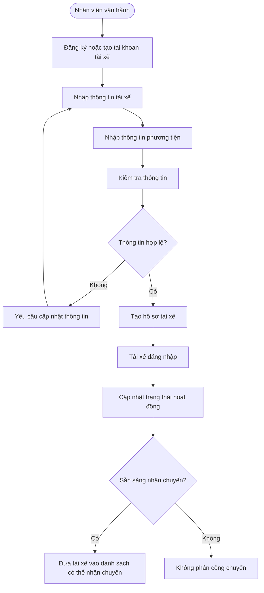

### BP05 – Quy trình quản lý chuyến đi
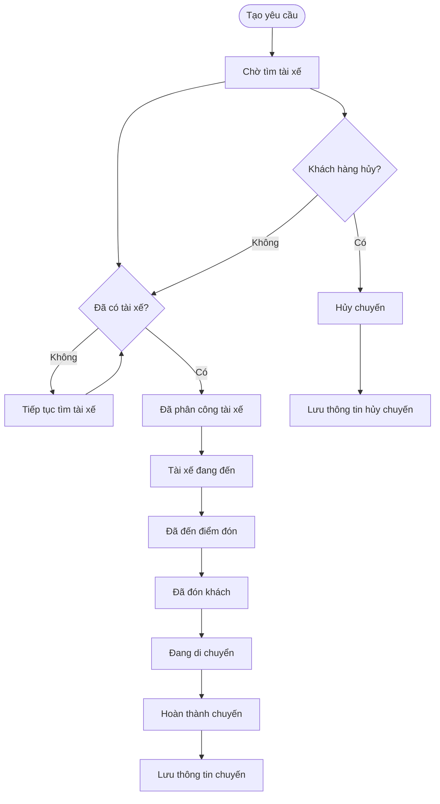

### BP06 – Quy trình tính cước
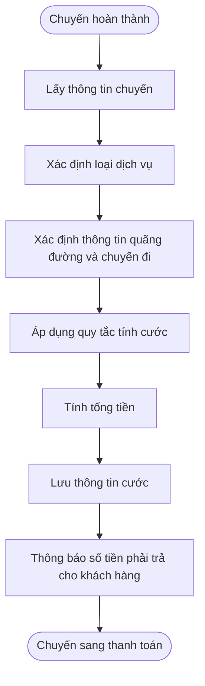

### BP07 – Quy trình thanh toán
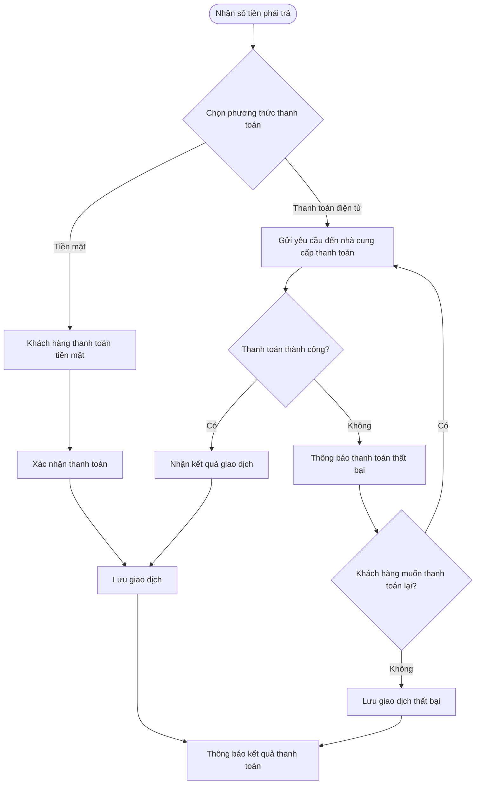

### BP08 – Quy trình thông báo
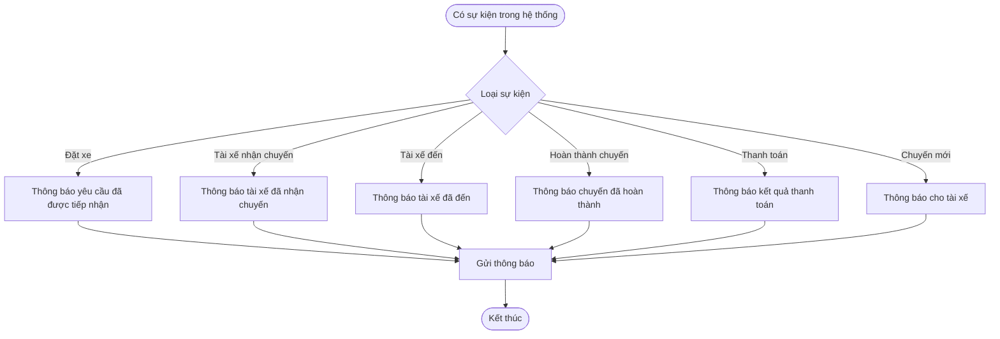

### BP09 – Quy trình đánh giá tài xế
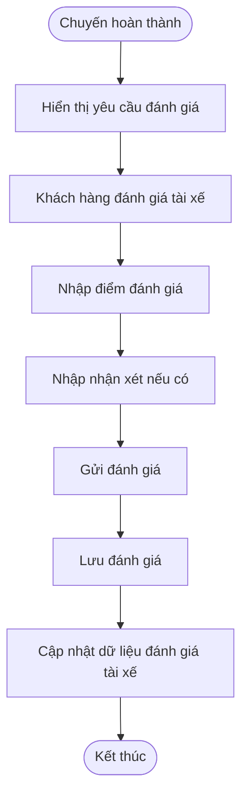

### BP10 – Quy trình quản lý vận hành
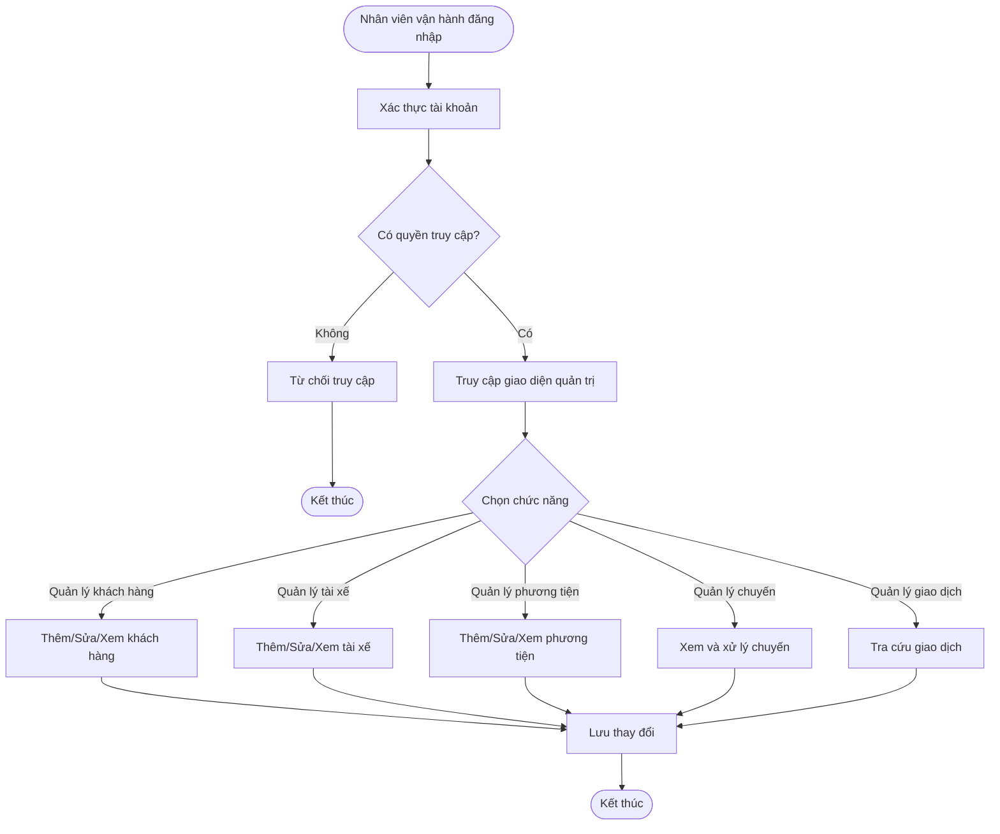

### BP11 – Quy trình báo cáo hoạt động
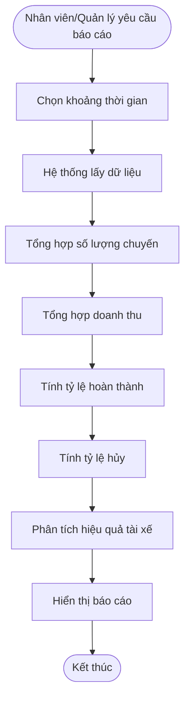

### BP12 – Quy trình bảo mật và phân quyền
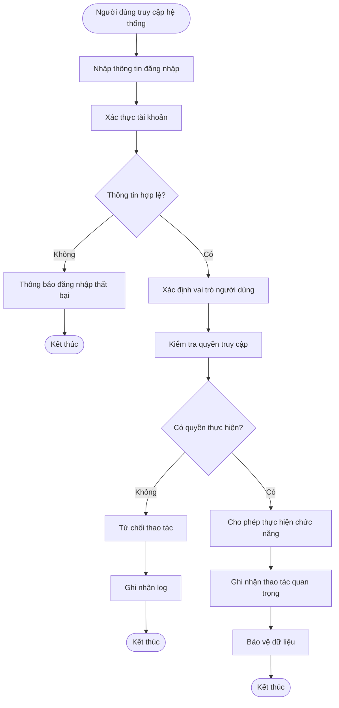

---


# B7. Xây dựng Business Requirement và phân rã thành Functional Requirement (FR)

## 1. Nguyên tắc phân rã

```text
Business Requirement (BR) → Functional Requirement (FR) → Function/Module hệ thống
```

## 2. Danh mục Functional Requirement (FR01–FR14)

| Mã FR | Tên FR | Mô tả tổng quát |
|---|---|---|
| FR01 | Quản lý tài khoản | Đăng ký, đăng nhập, đăng xuất, xác thực, cập nhật thông tin KH/tài xế. |
| FR02 | Đặt xe | Nhập điểm đón/đến, chọn loại xe, tạo/tiếp nhận yêu cầu đặt xe. |
| FR03 | Tìm tài xế | Xác định và ưu tiên tài xế phù hợp theo vị trí, trạng thái, tiêu chí vận hành. |
| FR04 | Phân công tài xế | Gửi yêu cầu chuyến, xử lý chấp nhận/từ chối/không phản hồi, gán tài xế chính thức. |
| FR05 | Quản lý chuyến đi | Quản lý, cập nhật trạng thái chuyến; theo dõi; xử lý hủy/lỗi. |
| FR06 | Theo dõi vị trí | Cập nhật, lưu vị trí tài xế; tính ETA. |
| FR07 | Tính cước | Xác định số tiền khách hàng phải trả. |
| FR08 | Thanh toán | Tiền mặt/điện tử, xử lý kết quả và thất bại, bảo vệ thông tin nhạy cảm. |
| FR09 | Thông báo | Gửi thông báo theo sự kiện; đảm bảo độc lập thành phần (BR42). |
| FR10 | Đánh giá tài xế | Cho phép đánh giá, lưu và quản lý phản hồi. |
| FR11 | Quản lý vận hành | Nhân viên quản lý khách hàng, tài xế, phương tiện, chuyến. |
| FR12 | Báo cáo | Báo cáo số chuyến, doanh thu, tỷ lệ hoàn thành/hủy, hiệu quả tài xế. |
| FR13 | Phân quyền | Kiểm soát quyền truy cập, bảo vệ dữ liệu, audit log. |
| FR14 | Quản lý lịch sử | Lưu, tra cứu lịch sử chuyến đi và giao dịch. |

## 3. Bảng phân rã Business Requirement → Functional Requirement

| Mã BR | Mã FR | Functional Requirement áp dụng |
|---|---|---|---|
| BR01 | FR01 | Đăng ký, đăng nhập, đăng xuất và cập nhật thông tin người dùng. |
| BR02 | FR01 | Tạo tài khoản, đăng nhập và cập nhật thông tin hồ sơ tài xế. |
| BR03 | FR11 | Thêm, sửa, xem và quản lý thông tin phương tiện. |
| BR04 | FR13 | Phân quyền và kiểm soát quyền truy cập các chức năng quản trị. |
| BR05 | FR11 | Cập nhật và theo dõi trạng thái hoạt động, sẵn sàng nhận chuyến. |
| BR06 | FR06 | Cập nhật, lưu, theo dõi vị trí tài xế phục vụ tìm xe và ETA. |
| BR07 | FR02 | Nhập điểm đón, điểm đến, chọn loại xe và gửi yêu cầu đặt xe. |
| BR08 | FR02 | Kiểm tra, tạo, lưu yêu cầu đặt xe, cập nhật trạng thái chuyến. |
| BR09 | FR03 | Xác định và tìm tài xế phù hợp dựa trên vị trí, trạng thái, loại xe. |
| BR10 | FR03 | Ưu tiên tài xế phù hợp và gần khách hàng theo tiêu chí vận hành. |
| BR11 | FR04 | Ghi nhận từ chối/không phản hồi và tiếp tục tìm tài xế khác. |
| BR12 | FR09 | Thông báo khi hệ thống không tìm được tài xế phù hợp. |
| BR13 | FR04 | Gửi yêu cầu, ghi nhận chấp nhận, phân công tài xế cho chuyến. |
| BR14 | FR05 | Tạo, cập nhật, quản lý trạng thái chuyến từ đặt xe đến hoàn thành/hủy. |
| BR15 | FR05 | Cho phép khách hàng theo dõi trạng thái và thông tin chuyến. |
| BR16 | FR06 | Xác định và hiển thị ETA tài xế đến điểm đón. |
| BR17 | FR05 | Xử lý hủy chuyến, ghi nhận lý do, hỗ trợ xử lý chuyến bị lỗi. |
| BR18 | FR14 | Lưu và cho phép tra cứu lịch sử các chuyến đi. |
| BR19 | FR07 | Tính số tiền khách hàng phải trả dựa trên loại dịch vụ và thông tin chuyến. |
| BR20 | FR08 | Hỗ trợ lựa chọn và ghi nhận thanh toán bằng tiền mặt. |
| BR21 | FR08 | Tích hợp nhà cung cấp thanh toán bên ngoài để xử lý thanh toán điện tử. |
| BR22 | FR08 | Ghi nhận và cập nhật trạng thái giao dịch thanh toán thành công/thất bại. |
| BR23 | FR08 | Thông báo thất bại và cho phép thanh toán lại theo chính sách. |
| BR24 | FR08 | Không lưu trực tiếp thông tin nhạy cảm của thẻ/tài khoản. |
| BR25 | FR14 | Lưu và cho phép nhân viên vận hành tra cứu lịch sử giao dịch. |
| BR26 | FR09 | Gửi thông báo theo các sự kiện quan trọng của chuyến. |
| BR27 | FR09 | Gửi thông báo cho tài xế về chuyến mới và thay đổi liên quan. |
| BR28 | FR09 | Hỗ trợ tích hợp thêm kênh/nhà cung cấp thông báo trong tương lai. |
| BR29 | FR10 | Cho phép khách hàng đánh giá và nhận xét tài xế sau khi hoàn thành chuyến. |
| BR30 | FR10 | Lưu và quản lý dữ liệu đánh giá, phản hồi của khách hàng. |
| BR31 | FR11 | Nhân viên vận hành xem và quản lý thông tin khách hàng. |
| BR32 | FR11 | Nhân viên vận hành quản lý thông tin tài xế và phương tiện. |
| BR33 | FR11 | Nhân viên vận hành xem và theo dõi các chuyến đang diễn ra. |
| BR34 | FR11 | Nhân viên vận hành xem và hỗ trợ xử lý các chuyến bị lỗi. |
| BR35 | FR12 | Cung cấp báo cáo số lượng chuyến, doanh thu, tỷ lệ hoàn thành/hủy. |
| BR36 | FR12 | Cung cấp báo cáo về hiệu quả hoạt động và đánh giá tài xế. |
| BR37 | FR01 | Xác thực người dùng trước khi sử dụng chức năng yêu cầu tài khoản. |
| BR38 | FR13 | Kiểm tra quyền của người dùng trước khi thực hiện thao tác quản trị. |
| BR39 | FR13 | Kiểm soát quyền truy cập đối với dữ liệu cá nhân, phương tiện, vị trí, giao dịch. |
| BR40 | FR13 | Ghi nhận các thao tác quan trọng để phục vụ kiểm tra, xử lý sự cố. |
| BR41 | FR11 | Hỗ trợ mở rộng hệ thống khi số lượng người dùng, tài xế, chuyến tăng. |
| BR42 | FR09 | Đảm bảo lỗi ở thông báo/thanh toán không làm dừng toàn bộ quy trình đặt xe. |
| BR43 | FR11 | Cho phép các chức năng/thành phần được triển khai, nâng cấp từng phần. |
| BR44 | FR02 | Cho phép bổ sung loại xe/dịch vụ mới trong tương lai. |
| BR45 | FR08 | Cho phép tích hợp thêm phương thức/nhà cung cấp thanh toán. |
| BR46 | FR09 | Cho phép tích hợp thêm kênh/nhà cung cấp thông báo mới. |

## 4. Phân rã theo Business Process

```text
BP01 – Quy trình đặt chuyến xe
├── BR07 – Tạo yêu cầu đặt xe            → FR02
├── BR08 – Tiếp nhận yêu cầu đặt xe      → FR02
└── BR26 – Thông báo yêu cầu đặt xe      → FR09

BP02 – Quy trình tìm và phân công tài xế
├── BR09 – Tự động tìm tài xế                        → FR03
├── BR10 – Ưu tiên tài xế phù hợp                     → FR03
├── BR11 – Xử lý tài xế từ chối/không phản hồi        → FR04
├── BR12 – Thông báo không tìm được tài xế            → FR09
├── BR13 – Phân công tài xế                           → FR04
└── BR26 – Thông báo tài xế nhận chuyến               → FR09

BP03 – Quy trình theo dõi chuyến đi
├── BR14 – Quản lý trạng thái chuyến đi   → FR05
├── BR15 – Theo dõi chuyến đi             → FR05
├── BR16 – Theo dõi thời gian dự kiến     → FR06
├── BR26 – Thông báo tài xế đến điểm đón  → FR09
└── BR27 – Thông báo cho tài xế           → FR09

BP04 – Quy trình quản lý tài xế
├── BR02 – Quản lý tài khoản tài xế   → FR01
├── BR03 – Quản lý phương tiện        → FR11
├── BR05 – Quản lý trạng thái tài xế  → FR11
└── BR06 – Theo dõi vị trí tài xế     → FR06

BP05 – Quy trình quản lý chuyến đi
├── BR14 – Quản lý trạng thái chuyến đi   → FR05
├── BR17 – Xử lý chuyến bị hủy hoặc lỗi   → FR05
└── BR18 – Lưu lịch sử chuyến đi          → FR14

BP06 – Quy trình tính cước
└── BR19 – Tính cước chuyến đi → FR07

BP07 – Quy trình thanh toán
├── BR20 – Thanh toán tiền mặt            → FR08
├── BR21 – Thanh toán điện tử             → FR08
├── BR22 – Quản lý kết quả thanh toán     → FR08
├── BR23 – Xử lý thanh toán thất bại      → FR08
├── BR24 – Bảo vệ thông tin thanh toán    → FR08
└── BR25 – Quản lý lịch sử giao dịch      → FR14

BP08 – Quy trình thông báo
├── BR26 – Thông báo trạng thái đặt xe                    → FR09
├── BR27 – Thông báo cho tài xế                           → FR09
├── BR28 – Mở rộng kênh thông báo                         → FR09
└── BR42 – Đảm bảo tính độc lập của thành phần thông báo  → FR09

BP09 – Quy trình đánh giá tài xế
├── BR29 – Đánh giá tài xế    → FR10
└── BR30 – Quản lý phản hồi   → FR10

BP10 – Quy trình quản lý vận hành
├── BR04 – Quản lý quyền truy cập          → FR13
├── BR31 – Quản lý khách hàng              → FR11
├── BR32 – Quản lý tài xế và phương tiện   → FR11
├── BR33 – Theo dõi chuyến đang diễn ra    → FR11
├── BR34 – Hỗ trợ xử lý sự cố              → FR11
├── BR38 – Kiểm soát quyền truy cập        → FR13
└── BR40 – Lưu vết thao tác                → FR13

BP11 – Quy trình báo cáo hoạt động
├── BR35 – Báo cáo hoạt động          → FR12
└── BR36 – Báo cáo hiệu quả tài xế    → FR12

BP12 – Quy trình bảo mật và phân quyền
├── BR01 – Quản lý tài khoản người dùng   → FR01
├── BR37 – Xác thực người dùng            → FR01
├── BR38 – Kiểm soát quyền truy cập       → FR13
├── BR39 – Bảo vệ dữ liệu                 → FR13
└── BR40 – Lưu vết thao tác               → FR13

BP13 – Nguyên tắc kiến trúc mở rộng 
├── BR41 – Đảm bảo khả năng mở rộng                → FR11
├── BR42 – Đảm bảo tính độc lập của các thành phần → FR09 
├── BR43 – Hỗ trợ triển khai từng phần              → FR11
├── BR44 – Hỗ trợ mở rộng dịch vụ                   → FR02
├── BR45 – Hỗ trợ mở rộng phương thức thanh toán    → FR08
└── BR46 – Hỗ trợ mở rộng nhà cung cấp thông báo    → FR09
```

---
# B8. Kịch bản minh họa cho từng Business Goal (SC – Scenario)

| Mã SC | Gắn với BG | Tên kịch bản | Điều kiện minh họa |
|---|---|---|---|
| SC01 | BG02 | Ưu tiên tài xế phù hợp | Ưu tiên tài xế sẵn sàng & gần khách hàng; có thể xét thêm ranking; không đề xuất tài xế bận/offline. |
| SC02 | BG02 | Giảm thời gian tìm tài xế | Tự động tìm tài xế ngay sau khi đặt xe; không phản hồi trong thời gian quy định = không nhận chuyến; tiếp tục tìm tài xế khác. |
| SC03 | BG02 | Xử lý tài xế từ chối/không phản hồi | Từ chối/không phản hồi → tìm tài xế khác; không gửi lại cho tài xế đã từ chối cùng chuyến; khách hàng không cần tạo lại yêu cầu. |
| SC04 | BG02 | Xử lý khi không tìm được tài xế | Thông báo cho khách hàng; không treo trạng thái vô thời hạn; lưu trạng thái; khách hàng có thể đặt lại. |
| SC05 | BG03 | Theo dõi trạng thái chuyến đi | Cập nhật đủ các mốc: nhận chuyến, đến điểm đón, đón khách, di chuyển, hoàn thành. |
| SC06 | BG05 | Đảm bảo thanh toán thành công | Xác định số tiền sau khi hoàn thành; hỗ trợ nhiều phương thức; ghi nhận giao dịch; thông báo kết quả. |
| SC07 | BG05 | Xử lý thanh toán thất bại | Thông báo thất bại; ghi nhận trạng thái; cho phép thanh toán lại; lỗi không làm dừng hệ thống; không lưu thông tin thẻ. |
| SC08 | BG05 | Hỗ trợ thanh toán tiền mặt | Chọn tiền mặt; ghi nhận số tiền và kết quả; lưu lịch sử giao dịch. |
| SC09 | BG06 | Đảm bảo thông báo kịp thời | Thông báo đủ các mốc sự kiện cho khách hàng và tài xế. |
| SC10 | BG04 | Xử lý hủy chuyến | Hủy theo chính sách doanh nghiệp; cập nhật trạng thái "Đã hủy"; thông báo tài xế; xác định phí hủy nếu có; lưu lịch sử. |
| SC11 | BG09 | Đảm bảo bảo mật và phân quyền | Xác thực trước khi dùng chức năng cần tài khoản; đúng quyền hạn; lưu vết thao tác; bảo vệ dữ liệu. |
| SC12 | BG10 | Xử lý mất kết nối mạng | Không hủy chuyến ngay; ghi nhận thời điểm mất kết nối; đồng bộ lại khi kết nối phục hồi; thông báo nếu ảnh hưởng chuyến. |
| SC13 | BG03 | Nâng cao chất lượng dịch vụ | Đánh giá sau khi hoàn thành; không đánh giá chuyến chưa hoàn thành; lưu và dùng dữ liệu theo dõi chất lượng. |
| SC14 | BG08 | Hỗ trợ báo cáo hoạt động | Có đủ số liệu: số chuyến, doanh thu, tỷ lệ hoàn thành/hủy, hiệu quả tài xế. |

---

# B9. Mô hình hóa hệ thống – Mô hình dữ liệu

## 9.1. Các thực thể và thuộc tính

| Thực thể | Thuộc tính |
|---|---|
| Khách hàng (Customer) | CustomerID, FullName, Email, Phone, Password, Address, CreatedAt, Status |
| Tài xế (Driver) | DriverID, FullName, Email, Phone, Password, LicenseNumber, Status, CurrentLocation, CreatedAt |
| Phương tiện (Vehicle) | VehicleID, DriverID, VehicleType, LicensePlate, Brand, Model, Color, Status |
| Chuyến đi (Trip) | TripID, CustomerID, DriverID, VehicleID, BookingID, PickupLocation, Destination, Distance, StartTime, EndTime, Status, Fare |
| Yêu cầu đặt xe (Booking) | BookingID, CustomerID, PickupLocation, Destination, VehicleType, BookingTime, Status |
| Thanh toán (Payment) | PaymentID, TripID, PaymentMethod, Amount, PaymentTime, PaymentStatus, TransactionCode |
| Đánh giá (Rating) | RatingID, TripID, CustomerID, DriverID, RatingScore, Comment, CreatedAt |
| Thông báo (Notification) | NotificationID, UserID, Title, Content, NotificationType, SentAt, Status |
| Nhân viên vận hành (Staff) | StaffID, FullName, Email, Phone, Password, Role, Status |
| Log hệ thống (AuditLog) | LogID, UserID, Action, Description, CreatedAt, IPAddress |

## 9.2. Mô tả một số thực thể chính

**Customer:** CustomerID, FullName, Email (đăng nhập), Phone, Password, Address, CreatedAt, Status.
**Driver:** DriverID, FullName, Email, Phone, Password, LicenseNumber, Status, CurrentLocation, CreatedAt.
**Vehicle:** VehicleID, DriverID, VehicleType, LicensePlate, Brand, Model, Color, Status.
**Booking:** BookingID, CustomerID, PickupLocation, Destination, VehicleType, BookingTime, Status.
**Trip:** TripID, BookingID, CustomerID, DriverID, VehicleID, PickupLocation, Destination, Distance, StartTime, EndTime, Status, Fare.
**Payment:** PaymentID, TripID, PaymentMethod, Amount, PaymentTime, PaymentStatus, TransactionCode.

## 9.3. Quan hệ giữa các thực thể

- Customer 1–N Booking; Customer 1–N Trip; Customer 1–N Rating.
- Driver 1–N Trip; Driver 1–N Vehicle; Driver 1–N Rating.
- Vehicle 1–N Trip.
- Booking 1–1 Trip.
- Trip 1–1 Payment; Trip 1–0..1 Rating.
- User 1–N Notification; User 1–N AuditLog.

## 9.4. Các thực thể cốt lõi của MVP

**Customer → Driver → Vehicle → Booking → Trip → Payment → Rating**

## 9.5. Sơ đồ ERD

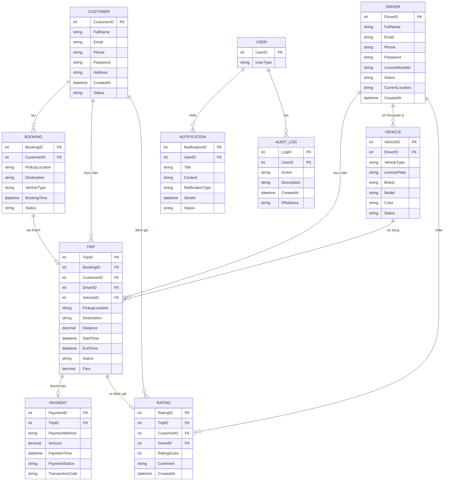

---

# B10. Xác định Non-Functional Requirements (NFR)

| Mã NFR | Nhóm | Non-Functional Requirement |
|---|---|---|---|
| NFR01 | Hiệu năng | Phản hồi các thao tác thông thường trong thời gian phù hợp, đặc biệt đặt xe và theo dõi chuyến. |
| NFR02 | Hiệu năng | Xử lý đồng thời nhiều yêu cầu đặt xe/tìm tài xế trong giờ cao điểm (cần benchmark tải — không bắt buộc test tải đầy đủ trong MVP). |
| NFR03 | Khả năng mở rộng | Mở rộng độc lập các thành phần khi số lượng KH/tài xế/chuyến tăng — nguyên tắc thiết kế, không phải deliverable MVP. |
| NFR04 | Tính sẵn sàng | Duy trì hoạt động ổn định trong giờ cao điểm, hạn chế downtime cơ bản. |
| NFR05 | Khả năng chịu lỗi | Lỗi tại thanh toán/thông báo không làm dừng toàn bộ hệ thống đặt xe (áp dụng bằng try-catch/async, không cần circuit breaker phức tạp). |
| NFR06 | Khả năng phục hồi | Phục hồi và tiếp tục xử lý khi mất kết nối tạm thời (ở mức cơ bản: lưu trạng thái, đồng bộ lại). |
| NFR07 | Bảo mật | Xác thực trước khi dùng chức năng yêu cầu tài khoản. |
| NFR08 | Phân quyền | Kiểm soát quyền truy cập theo vai trò từng nhóm người dùng. |
| NFR09 | Bảo mật dữ liệu | Bảo vệ thông tin cá nhân, phương tiện, vị trí, giao dịch khỏi truy cập trái phép. |
| NFR10 | Bảo mật thanh toán | Không lưu trực tiếp thông tin nhạy cảm của thẻ/tài khoản thanh toán. |
| NFR11 | Audit | Ghi log thao tác quản trị và thao tác quan trọng. |
| NFR12 | Tin cậy dữ liệu | Dữ liệu chuyến, thanh toán, giao dịch lưu trữ chính xác, nhất quán. |
| NFR13 | Tính mở rộng | Bổ sung dịch vụ/phương thức thanh toán/nhà cung cấp thông báo mới mà không xây lại toàn hệ thống. |
| NFR14 | Khả năng bảo trì | Thành phần thiết kế độc lập để bảo trì/nâng cấp không ảnh hưởng chức năng khác. |
| NFR15 | Khả năng triển khai | Hỗ trợ triển khai từng phần — thuộc quy trình CI/CD dài hạn, không bắt buộc MVP. |
| NFR16 | Khả năng tương thích | Tích hợp được với nhà cung cấp bên ngoài (thanh toán, thông báo) — bắt buộc vì MVP cần chạy thật với Payment/Notification Provider. |
| NFR17 | Mở rộng thông báo | Kiến trúc thông báo cho phép bổ sung kênh trong tương lai. |
| NFR18 | Giám sát | Theo dõi trạng thái hoạt động, lỗi, chỉ số hệ thống — thuộc hạ tầng vận hành, không phải hạng mục code MVP. |
| NFR19 | Sao lưu | Sao lưu dữ liệu quan trọng và phương án khôi phục — có thể dùng backup mặc định của DB, không cần xây hệ thống backup riêng trong MVP. |
| NFR20 | Khả năng sử dụng | Giao diện dễ sử dụng, phù hợp từng nhóm người dùng (KH, tài xế, nhân viên). |

---

# B11. Xác định và vẽ Use Case (UC01–UC20) — 🟢 toàn bộ thuộc MVP

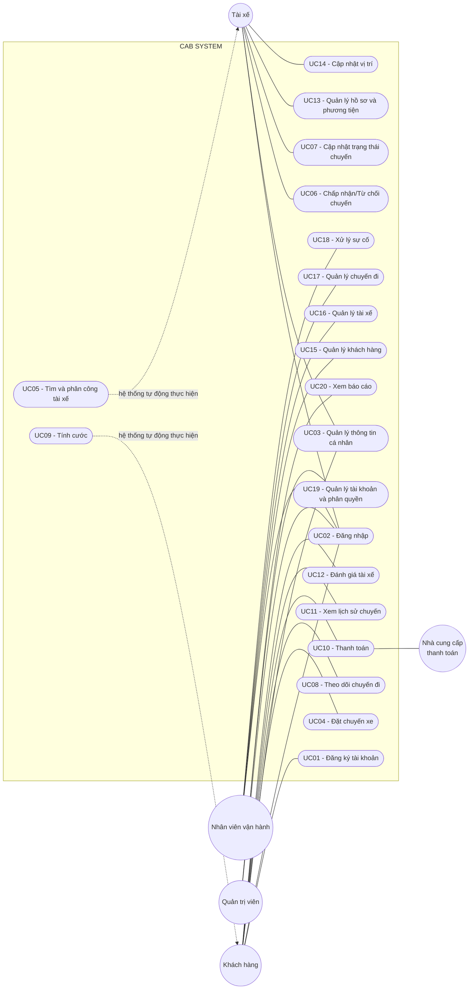

# Đặc tả Use Case

## UC01 – Đăng ký tài khoản
| Thành phần | Nội dung |
|---|---|
| Actor | Khách hàng |
| Mục tiêu | Tạo tài khoản để sử dụng dịch vụ CAB |
| Tiền điều kiện | Khách hàng chưa có tài khoản |
| Luồng chính | 1. Chọn chức năng đăng ký. 2. Nhập họ tên, email, SĐT, mật khẩu. 3. Hệ thống kiểm tra thông tin. 4. Tạo tài khoản. 5. Thông báo thành công. |
| Ngoại lệ | Email/SĐT đã tồn tại → thông báo lỗi, yêu cầu nhập lại. |
| Hậu điều kiện | Tài khoản khách hàng được tạo thành công. |

## UC02 – Đăng nhập
| Thành phần | Nội dung |
|---|---|
| Actor | Khách hàng, Tài xế, Nhân viên vận hành, Quản trị viên |
| Mục tiêu | Xác thực người dùng |
| Tiền điều kiện | Người dùng đã có tài khoản |
| Luồng chính | 1. Mở chức năng đăng nhập. 2. Nhập email/SĐT và mật khẩu. 3. Kiểm tra thông tin. 4. Xác định vai trò. 5. Cho phép truy cập chức năng tương ứng. |
| Ngoại lệ | Thông tin sai → thông báo lỗi, yêu cầu nhập lại. |
| Hậu điều kiện | Đăng nhập thành công, được cấp quyền phù hợp. |

## UC03 – Quản lý thông tin cá nhân
| Thành phần | Nội dung |
|---|---|
| Actor | Khách hàng, Tài xế |
| Mục tiêu | Xem và cập nhật thông tin cá nhân |
| Tiền điều kiện | Đã đăng nhập |
| Luồng chính | 1. Mở chức năng. 2. Xem thông tin hiện tại. 3. Chỉnh sửa. 4. Lưu. 5. Kiểm tra dữ liệu. 6. Cập nhật. |
| Ngoại lệ | Thông tin không hợp lệ → yêu cầu nhập lại. |
| Hậu điều kiện | Thông tin cá nhân được cập nhật. |

## UC04 – Đặt chuyến xe
| Thành phần | Nội dung |
|---|---|
| Actor | Khách hàng |
| Mục tiêu | Tạo yêu cầu đặt chuyến xe |
| Tiền điều kiện | Khách hàng đã đăng nhập |
| Luồng chính | 1. Chọn đặt xe. 2. Nhập điểm đón. 3. Nhập điểm đến. 4. Chọn loại xe. 5. Xem cước dự kiến. 6. Xác nhận. 7. Tạo yêu cầu. 8. Bắt đầu tìm tài xế. |
| Ngoại lệ | Thông tin không hợp lệ → nhập lại. Không có tài xế phù hợp → thông báo. |
| Hậu điều kiện | Yêu cầu đặt chuyến được tạo, chuyển sang tìm tài xế. |

## UC05 – Tìm và phân công tài xế
| Thành phần | Nội dung |
|---|---|
| Actor | Hệ thống |
| Mục tiêu | Tìm và phân công tài xế phù hợp |
| Tiền điều kiện | Có yêu cầu đặt chuyến chờ tài xế |
| Luồng chính | 1. Nhận yêu cầu. 2. Lấy vị trí điểm đón. 3. Tìm tài xế sẵn sàng. 4. Chọn ưu tiên gần nhất. 5. Gửi yêu cầu nhận chuyến. 6. Tài xế chấp nhận. 7. Phân công. 8. Thông báo khách hàng. |
| Ngoại lệ | Từ chối/không phản hồi → tìm tiếp. Không tìm được → thông báo. |
| Hậu điều kiện | Chuyến được phân công hoặc thông báo không thành công. |

## UC06 – Chấp nhận/Từ chối chuyến
| Thành phần | Nội dung |
|---|---|
| Actor | Tài xế |
| Mục tiêu | Phản hồi yêu cầu chuyến xe |
| Tiền điều kiện | Tài xế sẵn sàng và nhận được yêu cầu chuyến |
| Luồng chính | 1. Nhận thông báo chuyến mới. 2. Xem thông tin. 3. Chấp nhận/từ chối. 4. Ghi nhận lựa chọn. 5. Nếu chấp nhận → phân công. 6. Nếu từ chối → tìm tài xế khác. |
| Ngoại lệ | Không phản hồi đúng hạn → tự động chuyển tài xế khác. |
| Hậu điều kiện | Chuyến được chấp nhận hoặc chuyển tài xế khác. |

## UC07 – Cập nhật trạng thái chuyến
| Thành phần | Nội dung |
|---|---|
| Actor | Tài xế |
| Mục tiêu | Cập nhật tiến trình thực hiện chuyến |
| Tiền điều kiện | Tài xế đã được phân công chuyến |
| Luồng chính | 1. Nhận chuyến. 2. Di chuyển đến điểm đón. 3. Cập nhật đã đến. 4. Đón khách, cập nhật đã đón. 5. Di chuyển đến điểm đến. 6. Cập nhật đang di chuyển. 7. Cập nhật hoàn thành. |
| Ngoại lệ | Mất kết nối → lưu tạm và đồng bộ khi có mạng lại. |
| Hậu điều kiện | Trạng thái chuyến được cập nhật chính xác. |

## UC08 – Theo dõi chuyến đi
| Thành phần | Nội dung |
|---|---|
| Actor | Khách hàng |
| Mục tiêu | Theo dõi vị trí và trạng thái chuyến xe |
| Tiền điều kiện | Chuyến đã được phân công tài xế |
| Luồng chính | 1. Mở thông tin chuyến. 2. Xem thông tin tài xế/phương tiện. 3. Xem vị trí trên bản đồ. 4. Xem trạng thái. 5. Cập nhật liên tục. |
| Ngoại lệ | Không có dữ liệu vị trí → thông báo và thử lại. |
| Hậu điều kiện | Khách hàng nắm được vị trí/trạng thái hiện tại. |

## UC09 – Tính cước
| Thành phần | Nội dung |
|---|---|
| Actor | Hệ thống |
| Mục tiêu | Xác định số tiền phải thanh toán |
| Tiền điều kiện | Chuyến đã hoàn thành |
| Luồng chính | 1. Lấy thông tin chuyến. 2. Xác định loại dịch vụ. 3. Lấy quãng đường/thời gian. 4. Áp quy tắc tính cước. 5. Tính tổng tiền. 6. Lưu cước. 7. Thông báo khách hàng. |
| Ngoại lệ | Thiếu dữ liệu → chuyển nhân viên vận hành xử lý. |
| Hậu điều kiện | Số tiền được xác định và lưu vào hệ thống. |

## UC10 – Thanh toán
| Thành phần | Nội dung |
|---|---|
| Actor | Khách hàng, Nhà cung cấp thanh toán |
| Mục tiêu | Thanh toán chi phí chuyến xe |
| Tiền điều kiện | Chuyến hoàn thành, đã xác định số tiền |
| Luồng chính | 1. Xem số tiền. 2. Chọn phương thức. 3. Tiền mặt → ghi nhận. 4. Điện tử → gửi Payment Provider. 5. Xử lý giao dịch. 6. Nhận kết quả. 7. Lưu thông tin. 8. Thông báo kết quả. |
| Ngoại lệ | Thất bại → thông báo lỗi, cho phép thanh toán lại. |
| Hậu điều kiện | Giao dịch ghi nhận thành công/thất bại. |

## UC11 – Xem lịch sử chuyến
| Thành phần | Nội dung |
|---|---|
| Actor | Khách hàng |
| Mục tiêu | Xem lại các chuyến đã thực hiện |
| Tiền điều kiện | Đã đăng nhập |
| Luồng chính | 1. Chọn lịch sử chuyến. 2. Lấy danh sách. 3. Hiển thị thông tin. 4. Chọn xem chi tiết. |
| Ngoại lệ | Không có dữ liệu → thông báo chưa có lịch sử. |
| Hậu điều kiện | Khách hàng xem được lịch sử/chi tiết chuyến. |

## UC12 – Đánh giá tài xế
| Thành phần | Nội dung |
|---|---|
| Actor | Khách hàng |
| Mục tiêu | Đánh giá chất lượng chuyến và tài xế |
| Tiền điều kiện | Chuyến hoàn thành, đã đăng nhập |
| Luồng chính | 1. Mở chuyến đã hoàn thành. 2. Chọn đánh giá. 3. Chọn số sao. 4. Nhập nhận xét. 5. Gửi. 6. Lưu. 7. Thông báo thành công. |
| Ngoại lệ | Dữ liệu không hợp lệ → yêu cầu nhập lại. |
| Hậu điều kiện | Đánh giá được lưu vào hệ thống. |

## UC13 – Quản lý hồ sơ và phương tiện
| Thành phần | Nội dung |
|---|---|
| Actor | Tài xế |
| Mục tiêu | Cập nhật thông tin cá nhân và phương tiện |
| Tiền điều kiện | Tài xế đã đăng nhập |
| Luồng chính | 1. Mở hồ sơ. 2. Xem thông tin. 3. Cập nhật. 4. Gửi. 5. Kiểm tra. 6. Lưu. |
| Ngoại lệ | Thông tin không hợp lệ → thông báo lỗi. |
| Hậu điều kiện | Hồ sơ/phương tiện được cập nhật. |

## UC14 – Cập nhật vị trí
| Thành phần | Nội dung |
|---|---|
| Actor | Tài xế, Hệ thống định vị |
| Mục tiêu | Cập nhật vị trí phục vụ điều phối, theo dõi |
| Tiền điều kiện | Tài xế đã đăng nhập, cho phép dùng vị trí |
| Luồng chính | 1. Lấy vị trí hiện tại. 2. Gửi dữ liệu. 3. Kiểm tra dữ liệu. 4. Lưu/cập nhật. 5. Sử dụng cho tìm tài xế/theo dõi. |
| Ngoại lệ | Mất kết nối → giữ vị trí gần nhất, thử lại. |
| Hậu điều kiện | Vị trí được cập nhật. |

## UC15 – Quản lý khách hàng
| Thành phần | Nội dung |
|---|---|
| Actor | Nhân viên vận hành |
| Mục tiêu | Quản lý thông tin/trạng thái khách hàng |
| Tiền điều kiện | Nhân viên có quyền quản lý khách hàng |
| Luồng chính | 1. Mở chức năng. 2. Xem danh sách. 3. Tìm/chọn khách hàng. 4. Xem chi tiết. 5. Cập nhật theo quyền. 6. Lưu. |
| Ngoại lệ | Không tìm thấy → thông báo. Dữ liệu không hợp lệ → nhập lại. |
| Hậu điều kiện | Thông tin khách hàng được cập nhật. |

## UC16 – Quản lý tài xế
| Thành phần | Nội dung |
|---|---|
| Actor | Nhân viên vận hành |
| Mục tiêu | Quản lý thông tin/trạng thái tài xế |
| Tiền điều kiện | Nhân viên có quyền quản lý tài xế |
| Luồng chính | 1. Mở chức năng. 2. Xem danh sách. 3. Tìm/xem tài xế. 4. Cập nhật. 5. Kiểm tra. 6. Lưu. |
| Ngoại lệ | Không tìm thấy → thông báo. Dữ liệu không hợp lệ → nhập lại. |
| Hậu điều kiện | Thông tin/trạng thái tài xế được cập nhật. |

## UC17 – Quản lý chuyến đi
| Thành phần | Nội dung |
|---|---|
| Actor | Nhân viên vận hành |
| Mục tiêu | Theo dõi và xử lý các chuyến |
| Tiền điều kiện | Nhân viên có quyền quản lý chuyến |
| Luồng chính | 1. Mở chức năng. 2. Xem danh sách. 3. Tìm kiếm chuyến. 4. Xem chi tiết. 5. Xử lý. 6. Cập nhật kết quả. |
| Ngoại lệ | Không tìm thấy → thông báo. Không thể cập nhật → thông báo lỗi. |
| Hậu điều kiện | Thông tin/trạng thái chuyến được cập nhật. |

## UC18 – Xử lý sự cố
| Thành phần | Nội dung |
|---|---|
| Actor | Nhân viên vận hành |
| Mục tiêu | Tiếp nhận, xử lý sự cố phát sinh |
| Tiền điều kiện | Nhân viên đã đăng nhập, có sự cố cần xử lý |
| Luồng chính | 1. Nhận thông báo sự cố. 2. Xem thông tin. 3. Kiểm tra liên quan. 4. Xác định phương án. 5. Xử lý. 6. Cập nhật kết quả. 7. Lưu lịch sử. |
| Ngoại lệ | Thiếu thông tin → yêu cầu bổ sung. Vượt quyền → chuyển cấp quản lý. |
| Hậu điều kiện | Sự cố được xử lý hoặc chuyển cấp có thẩm quyền. |

## UC19 – Quản lý tài khoản và phân quyền
| Thành phần | Nội dung |
|---|---|
| Actor | Quản trị viên |
| Mục tiêu | Quản lý tài khoản và quyền truy cập |
| Tiền điều kiện | Quản trị viên đã đăng nhập |
| Luồng chính | 1. Mở chức năng. 2. Xem danh sách tài khoản/vai trò. 3. Tìm/chọn tài khoản. 4. Tạo/khóa/mở/cập nhật. 5. Thiết lập quyền. 6. Kiểm tra quyền hạn. 7. Lưu. |
| Ngoại lệ | Tài khoản không tồn tại → lỗi. Phân quyền không hợp lệ → từ chối. |
| Hậu điều kiện | Tài khoản/quyền được cập nhật. |

## UC20 – Xem báo cáo
| Thành phần | Nội dung |
|---|---|
| Actor | Quản trị viên |
| Mục tiêu | Cung cấp báo cáo hoạt động hệ thống |
| Tiền điều kiện | Quản trị viên có quyền xem báo cáo |
| Luồng chính | 1. Mở báo cáo. 2. Chọn loại báo cáo. 3. Chọn khoảng thời gian/tiêu chí. 4. Tổng hợp dữ liệu. 5. Hiển thị. 6. Xem/xuất báo cáo. |
| Ngoại lệ | Không có dữ liệu → thông báo. Lỗi tổng hợp → thông báo, yêu cầu thử lại. |
| Hậu điều kiện | Báo cáo hiển thị/xuất thành công. |

---

# B12. Business Rules và Ràng buộc trạng thái (🟢 MVP)

## 12.1. Quy tắc nghiệp vụ cốt lõi

| Mã BRule | Quy tắc |
|---|---|
| BRule01 | Tài khoản (Customer/Driver) phải có Email/SĐT duy nhất trong hệ thống. |
| BRule02 | Chỉ tài xế trạng thái "Sẵn sàng" mới được đưa vào danh sách tìm kiếm phân công. |
| BRule03 | Một chuyến chỉ được gán cho duy nhất một tài xế tại một thời điểm. |
| BRule04 | Tài xế đã từ chối một chuyến thì không được gửi lại yêu cầu cho cùng chuyến đó. |
| BRule05 | Trạng thái chuyến phải theo đúng trình tự: Đang tìm tài xế → Đã phân công → Đang đến điểm đón → Đã đón khách → Đang di chuyển → Hoàn thành (hoặc chuyển Đã hủy/Lỗi tại bất kỳ bước nào trước hoàn thành). Không nhảy cóc trạng thái. |
| BRule06 | Chỉ tính cước sau khi chuyến ở trạng thái "Hoàn thành". |
| BRule07 | Không cho phép đánh giá chuyến chưa "Hoàn thành". |
| BRule08 | Mỗi chuyến chỉ được đánh giá tối đa một lần bởi khách hàng thực hiện chuyến đó. |
| BRule09 | Không lưu trực tiếp thông tin nhạy cảm của thẻ/tài khoản thanh toán — chỉ lưu TransactionCode. |
| BRule10 | Giao dịch thất bại lưu trạng thái "Thất bại", cho phép thanh toán lại theo chính sách (chi tiết cần BA làm rõ — B4.12). |
| BRule11 | Nhân viên vận hành chỉ thao tác trong phạm vi quyền hạn được cấp. |
| BRule12 | Mọi thao tác quan trọng phải được ghi vào Audit Log. |
| BRule13 | Mất kết nối tạm thời không tự động hủy chuyến — lưu thời điểm mất kết nối, chờ đồng bộ lại (thời gian chờ cụ thể cần BA làm rõ). |
| BRule14 | Lỗi ở module Thanh toán/Thông báo không được làm gián đoạn luồng nghiệp vụ chính. |

## 12.2. Sơ đồ trạng thái chuyến đi (Trip State Machine)

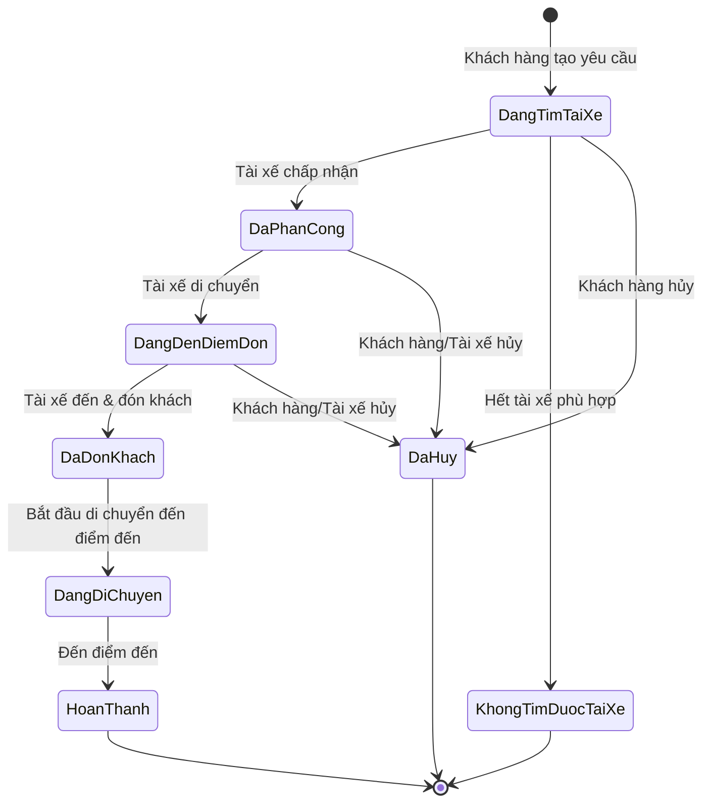

---

# B13. Acceptance Criteria (AC) — 🟢 toàn bộ thuộc MVP

**Mục đích:** Xác định điều kiện cụ thể để một BR được xem là hoàn thành (Done), theo cấu trúc **Given – When – Then**.

```text
Business Requirement (BR) → Acceptance Criteria (AC) → Definition of Done
```

| Mã BR | Business Requirement | Mã AC | Acceptance Criteria (Given – When – Then) |
|---|---|---|---|
| BR01 | Quản lý tài khoản khách hàng | AC01 | **Given** khách hàng chưa có tài khoản, **When** nhập đầy đủ thông tin hợp lệ và đăng ký, **Then** hệ thống tạo tài khoản thành công. Hoàn thành khi đăng ký/đăng nhập/sửa thông tin hoạt động đúng và dữ liệu trùng lặp bị từ chối. |
| BR02 | Quản lý tài khoản tài xế | AC02 | **Given** tài xế được tạo tài khoản, **When** đăng nhập, **Then** hệ thống hiển thị đúng hồ sơ và cho phép cập nhật. |
| BR03 | Quản lý phương tiện | AC03 | **Given** người có quyền, **When** thêm/sửa phương tiện, **Then** hệ thống lưu và liên kết đúng với tài xế sở hữu. |
| BR04 | Quản lý quyền truy cập | AC04 | **Given** nhân viên/quản trị viên có vai trò xác định, **When** truy cập chức năng quản trị, **Then** chỉ cho phép thao tác đúng quyền được cấp. |
| BR05 | Quản lý trạng thái tài xế | AC05 | **Given** tài xế đã đăng nhập, **When** chuyển trạng thái, **Then** cập nhật ngay và chỉ tài xế "sẵn sàng" được tìm kiếm. |
| BR06 | Theo dõi vị trí tài xế | AC06 | **Given** tài xế đang hoạt động, **When** vị trí thay đổi, **Then** hệ thống cập nhật và dùng cho tìm tài xế/ETA. |
| BR07 | Tạo yêu cầu đặt xe | AC07 | **Given** khách hàng đã đăng nhập, **When** nhập đủ thông tin và xác nhận, **Then** tạo yêu cầu với trạng thái "Đang tìm tài xế". |
| BR08 | Tiếp nhận yêu cầu đặt xe | AC08 | **Given** yêu cầu hợp lệ, **When** hệ thống nhận, **Then** lưu và chuyển sang tìm tài xế (BP02). |
| BR09 | Tự động tìm tài xế | AC09 | **Given** yêu cầu đang chờ, **When** tìm kiếm, **Then** danh sách chỉ gồm tài xế "sẵn sàng" phù hợp loại xe. |
| BR10 | Ưu tiên tài xế phù hợp | AC10 | **Given** nhiều tài xế phù hợp, **When** xếp hạng, **Then** tài xế gần nhất/đúng tiêu chí được ưu tiên gửi trước. |
| BR11 | Xử lý tài xế từ chối/không phản hồi | AC11 | **Given** tài xế từ chối/không phản hồi đúng hạn, **When** hết thời gian chờ, **Then** tự động chuyển tài xế khác, không gửi lại cho tài xế đã từ chối. |
| BR12 | Thông báo không tìm được tài xế | AC12 | **Given** hết danh sách tài xế phù hợp, **When** xác nhận không tìm được, **Then** thông báo khách hàng, không treo trạng thái vô hạn. |
| BR13 | Phân công tài xế | AC13 | **Given** tài xế chấp nhận, **When** hệ thống xác nhận, **Then** gán chính thức, tài xế khác không nhận yêu cầu cho chuyến này nữa. |
| BR14 | Quản lý trạng thái chuyến đi | AC14 | **Given** chuyến đang thực hiện, **When** có sự kiện thay đổi, **Then** cập nhật đúng thứ tự theo B12.2, không nhảy cóc. |
| BR15 | Theo dõi chuyến đi | AC15 | **Given** chuyến đã có tài xế, **When** khách hàng mở theo dõi, **Then** hiển thị đúng trạng thái/thông tin thời gian thực. |
| BR16 | Theo dõi thời gian dự kiến | AC16 | **Given** tài xế đang di chuyển đến điểm đón, **When** vị trí cập nhật, **Then** hiển thị ETA cho khách hàng. |
| BR17 | Xử lý chuyến bị hủy hoặc lỗi | AC17 | **Given** hủy/lỗi được ghi nhận, **When** xử lý, **Then** cập nhật trạng thái, lưu lý do, thông báo bên liên quan. |
| BR18 | Lưu lịch sử chuyến đi | AC18 | **Given** chuyến hoàn thành/hủy, **When** hệ thống lưu, **Then** tra cứu lại đầy đủ trong lịch sử. |
| BR19 | Tính cước chuyến đi | AC19 | **Given** chuyến hoàn thành, **When** tính cước, **Then** số tiền chính xác, lưu trước khi sang thanh toán. |
| BR20 | Thanh toán tiền mặt | AC20 | **Given** chọn tiền mặt, **When** xác nhận, **Then** ghi nhận thành công, lưu lịch sử giao dịch. |
| BR21 | Thanh toán điện tử | AC21 | **Given** chọn điện tử, **When** gửi Payment Provider, **Then** kết quả được nhận và xử lý đúng. |
| BR22 | Quản lý kết quả thanh toán | AC22 | **Given** giao dịch hoàn tất, **When** nhận kết quả, **Then** cập nhật chính xác, không trùng bản ghi. |
| BR23 | Xử lý thanh toán thất bại | AC23 | **Given** giao dịch điện tử thất bại, **When** ghi nhận lỗi, **Then** thông báo và cho thanh toán lại theo chính sách. |
| BR24 | Bảo vệ thông tin thanh toán | AC24 | **Given** thanh toán điện tử, **When** xử lý dữ liệu thẻ, **Then** không lưu trực tiếp thông tin nhạy cảm. |
| BR25 | Quản lý lịch sử giao dịch | AC25 | **Given** giao dịch phát sinh, **When** nhân viên tra cứu, **Then** hiển thị đầy đủ, chính xác. |
| BR26 | Thông báo trạng thái đặt xe | AC26 | **Given** sự kiện quan trọng của chuyến, **When** xảy ra, **Then** khách hàng nhận thông báo tương ứng. |
| BR27 | Thông báo cho tài xế | AC27 | **Given** chuyến mới/thay đổi, **When** xảy ra, **Then** tài xế nhận thông báo kịp thời. |
| BR28 | Mở rộng kênh thông báo | AC28 | **Given** cần thêm kênh mới, **When** tích hợp, **Then** thêm được mà không sửa logic hiện có. *(🔵 kiểm chứng bằng thiết kế, không phải chức năng chạy thử trong MVP)* |
| BR29 | Đánh giá tài xế | AC29 | **Given** chuyến hoàn thành, **When** gửi đánh giá hợp lệ, **Then** lưu đánh giá, không cho đánh giá chuyến chưa hoàn thành. |
| BR30 | Quản lý phản hồi | AC30 | **Given** đánh giá đã gửi, **When** xử lý, **Then** lưu và liên kết đúng với tài xế. |
| BR31 | Quản lý khách hàng | AC31 | **Given** nhân viên có quyền, **When** thao tác trên khách hàng, **Then** đúng và trong phạm vi quyền hạn. |
| BR32 | Quản lý tài xế và phương tiện | AC32 | **Given** nhân viên có quyền, **When** quản lý hồ sơ tài xế/phương tiện, **Then** dữ liệu cập nhật chính xác, phản ánh đúng module liên quan. |
| BR33 | Theo dõi chuyến đang diễn ra | AC33 | **Given** chuyến đang thực hiện, **When** mở giám sát, **Then** hiển thị đúng thời gian thực. |
| BR34 | Hỗ trợ xử lý sự cố | AC34 | **Given** chuyến gặp sự cố, **When** nhân viên can thiệp, **Then** xử lý và lưu lịch sử xử lý. |
| BR35 | Báo cáo hoạt động | AC35 | **Given** khoảng thời gian xác định, **When** yêu cầu báo cáo, **Then** hiển thị đúng số liệu khớp dữ liệu gốc. |
| BR36 | Báo cáo hiệu quả tài xế | AC36 | **Given** dữ liệu chuyến/đánh giá đã có, **When** xem báo cáo, **Then** tổng hợp đúng theo từng tài xế. |
| BR37 | Xác thực người dùng | AC37 | **Given** chưa đăng nhập, **When** cố truy cập chức năng cần tài khoản, **Then** từ chối và yêu cầu đăng nhập. |
| BR38 | Kiểm soát quyền truy cập | AC38 | **Given** đã đăng nhập với vai trò xác định, **When** thao tác ngoài quyền, **Then** từ chối và ghi log. |
| BR39 | Bảo vệ dữ liệu | AC39 | **Given** dữ liệu nhạy cảm tồn tại, **When** có truy cập trái phép, **Then** ngăn chặn, không để lộ ngoài phạm vi quyền hạn. |
| BR40 | Lưu vết thao tác | AC40 | **Given** thao tác quan trọng, **When** hoàn tất, **Then** ghi log đầy đủ, không thể sửa/xóa bởi user thường. |
| BR41 | Đảm bảo khả năng mở rộng | AC41 | **Given** tải tăng cao, **When** hệ thống chịu tải, **Then** thành phần mở rộng độc lập mà không thiết kế lại kiến trúc. *(🔵 đánh giá qua thiết kế, không test tải trong MVP)* |
| BR42 | Đảm bảo tính độc lập của các thành phần | AC42 | **Given** module thanh toán/thông báo lỗi/timeout, **When** lỗi xảy ra, **Then** luồng đặt xe chính vẫn hoạt động bình thường. |
| BR43 | Hỗ trợ triển khai từng phần | AC43 | **Given** cần cập nhật một chức năng, **When** triển khai, **Then** chỉ chức năng đó bị ảnh hưởng. *(🔵 đánh giá qua kiến trúc modular)* |
| BR44 | Hỗ trợ mở rộng dịch vụ | AC44 | **Given** cần thêm loại dịch vụ/loại xe, **When** bổ sung, **Then** thêm được mà không sửa lại toàn bộ luồng đặt xe. |
| BR45 | Hỗ trợ mở rộng phương thức thanh toán | AC45 | **Given** cần thêm phương thức/nhà cung cấp, **When** tích hợp, **Then** thêm được mà không viết lại toàn bộ module thanh toán. |
| BR46 | Hỗ trợ mở rộng nhà cung cấp thông báo | AC46 | **Given** cần đổi/thêm nhà cung cấp thông báo, **When** cấu hình lại, **Then** luồng thông báo hiện có (BR26, BR27) không bị ảnh hưởng. |

### Nguyên tắc chung xác định "BR hoàn thành" (Definition of Done)

1. Toàn bộ AC liên quan đạt (Pass) ở cả luồng chính lẫn ngoại lệ.
2. Chức năng hoạt động đúng theo Use Case ở B11.
3. Dữ liệu lưu trữ chính xác, nhất quán theo B9.
4. Không vi phạm Business Rules (B12) và NFR liên quan (B10).
5. Với BR liên quan nội dung **chưa chốt chính sách**, chỉ Done khi có xác nhận chính thức từ khách hàng — nếu chưa, ở trạng thái "Blocked – chờ làm rõ".
6. Với BR/NFR gắn nhãn 🔵 [Định hướng kiến trúc], "Done" chỉ yêu cầu **thiết kế đáp ứng nguyên tắc** (ví dụ: code có tách module, không hard-code phụ thuộc cứng) — **không** yêu cầu triển khai đầy đủ hạ tầng (auto-scaling, multi-provider, CI/CD nâng cao...) trong 7 tuần.

---

# B14. MA TRẬN TRUY XUẤT YÊU CẦU (RTM)

```text
BG (Business Goal – theo B3) → BR → FR → UC → AC
```

| BG | BR | FR | UC | AC |
|---|---|---|---|---|
| BG01 – Tự động hóa quy trình đặt xe | BR07 – Tạo yêu cầu đặt xe | FR02 | UC04 | AC07 |
| BG01 – Tự động hóa quy trình đặt xe | BR08 – Tiếp nhận yêu cầu đặt xe | FR02 | UC04 | AC08 |
| BG02 – Tự động tìm và phân công tài xế | BR09 – Tự động tìm tài xế | FR03 | UC05 | AC09 |
| BG02 – Tự động tìm và phân công tài xế | BR10 – Ưu tiên tài xế phù hợp | FR03 | UC05 | AC10 |
| BG02 – Tự động tìm và phân công tài xế | BR11 – Xử lý tài xế từ chối/không phản hồi | FR04 | UC05, UC06 | AC11 |
| BG02 – Tự động tìm và phân công tài xế | BR12 – Thông báo không tìm được tài xế | FR09 | UC05 | AC12 |
| BG02 – Tự động tìm và phân công tài xế | BR13 – Phân công tài xế | FR04 | UC05, UC06 | AC13 |
| BG02 – Tự động tìm và phân công tài xế | BR05 – Quản lý trạng thái tài xế | FR11 | UC06, UC07 | AC05 |
| BG02 – Tự động tìm và phân công tài xế | BR06 – Theo dõi vị trí tài xế | FR06 | UC14 | AC06 |
| BG03 – Nâng cao trải nghiệm khách hàng | BR01 – Quản lý tài khoản khách hàng | FR01 | UC01, UC02, UC03 | AC01 |
| BG03 – Nâng cao trải nghiệm khách hàng | BR14 – Quản lý trạng thái chuyến đi | FR05 | UC07 | AC14 |
| BG03 – Nâng cao trải nghiệm khách hàng | BR15 – Theo dõi chuyến đi | FR05 | UC08 | AC15 |
| BG03 – Nâng cao trải nghiệm khách hàng | BR16 – Theo dõi thời gian dự kiến | FR06 | UC08 | AC16 |
| BG03 – Nâng cao trải nghiệm khách hàng | BR18 – Lưu lịch sử chuyến đi | FR14 | UC11 | AC18 |
| BG03 – Nâng cao trải nghiệm khách hàng | BR29 – Đánh giá tài xế | FR10 | UC12 | AC29 |
| BG03 – Nâng cao trải nghiệm khách hàng | BR30 – Quản lý phản hồi | FR10 | UC12 | AC30 |
| BG04 – Nâng cao hiệu quả vận hành | BR02 – Quản lý tài khoản tài xế | FR01 | UC02, UC13 | AC02 |
| BG04 – Nâng cao hiệu quả vận hành | BR03 – Quản lý phương tiện | FR11 | UC13 | AC03 |
| BG04 – Nâng cao hiệu quả vận hành | BR17 – Xử lý chuyến bị hủy hoặc lỗi | FR05 | UC17, UC18 | AC17 |
| BG04 – Nâng cao hiệu quả vận hành | BR31 – Quản lý khách hàng | FR11 | UC15 | AC31 |
| BG04 – Nâng cao hiệu quả vận hành | BR32 – Quản lý tài xế và phương tiện | FR11 | UC16 | AC32 |
| BG04 – Nâng cao hiệu quả vận hành | BR33 – Theo dõi chuyến đang diễn ra | FR11 | UC17 | AC33 |
| BG04 – Nâng cao hiệu quả vận hành | BR34 – Hỗ trợ xử lý sự cố | FR11 | UC18 | AC34 |
| BG05 – Quản lý tính cước và thanh toán | BR19 – Tính cước chuyến đi | FR07 | UC09 | AC19 |
| BG05 – Quản lý tính cước và thanh toán | BR20 – Thanh toán tiền mặt | FR08 | UC10 | AC20 |
| BG05 – Quản lý tính cước và thanh toán | BR21 – Thanh toán điện tử | FR08 | UC10 | AC21 |
| BG05 – Quản lý tính cước và thanh toán | BR22 – Quản lý kết quả thanh toán | FR08 | UC10 | AC22 |
| BG05 – Quản lý tính cước và thanh toán | BR23 – Xử lý thanh toán thất bại | FR08 | UC10 | AC23 |
| BG05 – Quản lý tính cước và thanh toán | BR24 – Bảo vệ thông tin thanh toán | FR08 | UC10 | AC24 |
| BG06 – Xây dựng hệ thống thông báo | BR26 – Thông báo trạng thái đặt xe | FR09 | UC04, UC08 | AC26 |
| BG06 – Xây dựng hệ thống thông báo | BR27 – Thông báo cho tài xế | FR09 | UC06, UC07 | AC27 |
| BG06 – Xây dựng hệ thống thông báo | BR28 – Mở rộng kênh thông báo 🔵 | FR09 | – (kiến trúc, không có UC trực tiếp) | AC28 |
| BG07 – Quản lý và khai thác dữ liệu | BR18 – Lưu lịch sử chuyến đi | FR14 | UC11 | AC18 |
| BG07 – Quản lý và khai thác dữ liệu | BR25 – Quản lý lịch sử giao dịch | FR14 | UC17 | AC25 |
| BG07 – Quản lý và khai thác dữ liệu | BR40 – Lưu vết thao tác | FR13 | UC19 | AC40 |
| BG08 – Hỗ trợ báo cáo và quản lý hiệu quả | BR35 – Báo cáo hoạt động | FR12 | UC20 | AC35 |
| BG08 – Hỗ trợ báo cáo và quản lý hiệu quả | BR36 – Báo cáo hiệu quả tài xế | FR12 | UC20 | AC36 |
| BG09 – Đảm bảo bảo mật và phân quyền | BR04 – Quản lý quyền truy cập | FR13 | UC19 | AC04 |
| BG09 – Đảm bảo bảo mật và phân quyền | BR37 – Xác thực người dùng | FR01 | UC02 | AC37 |
| BG09 – Đảm bảo bảo mật và phân quyền | BR38 – Kiểm soát quyền truy cập | FR13 | UC19 | AC38 |
| BG09 – Đảm bảo bảo mật và phân quyền | BR39 – Bảo vệ dữ liệu | FR13 | UC19 | AC39 |
| BG09 – Đảm bảo bảo mật và phân quyền | BR40 – Lưu vết thao tác | FR13 | UC19 | AC40 |
| BG10 – Đảm bảo tính ổn định và khả năng mở rộng 🔵 | BR41 – Đảm bảo khả năng mở rộng | FR11 | – (kiến trúc) | AC41 |
| BG10 – Đảm bảo tính ổn định và khả năng mở rộng 🔵 | BR42 – Đảm bảo tính độc lập của các thành phần | FR09 | – (kiến trúc) | AC42 |
| BG10 – Đảm bảo tính ổn định và khả năng mở rộng 🔵 | BR43 – Hỗ trợ triển khai từng phần | FR11 | – (kiến trúc) | AC43 |
| BG11 – Hỗ trợ phát triển hệ thống trong tương lai 🔵 | BR44 – Hỗ trợ mở rộng dịch vụ | FR02 | UC04 | AC44 |
| BG11 – Hỗ trợ phát triển hệ thống trong tương lai 🔵 | BR45 – Hỗ trợ mở rộng phương thức thanh toán | FR08 | UC10 | AC45 |
| BG11 – Hỗ trợ phát triển hệ thống trong tương lai 🔵 | BR46 – Hỗ trợ mở rộng nhà cung cấp thông báo | FR09 | – (kiến trúc) | AC46 |
| BG12 – Hoàn thành MVP trong 7 tuần | (Xuyên suốt toàn bộ BR01–BR46 thuộc phạm vi MVP) | Tất cả FR01–FR14 | Tất cả UC01–UC20 | Tất cả AC01–AC46 |

### Ghi chú về ma trận RTM

- Các dòng UC = "– (kiến trúc)" thuộc nhóm phi chức năng/kiến trúc, không gắn thao tác người dùng cụ thể — kiểm chứng qua thiết kế và NFR/Business Rules, không qua kịch bản Use Case.
- BR18, BR40 xuất hiện ở nhiều BG vì phục vụ đồng thời nhiều mục tiêu kinh doanh.
- BG12 là mục tiêu bao trùm toàn dự án — ràng buộc phạm vi/thời gian cho toàn bộ BR còn lại.
- **BG10, BG11 và các BR/NFR gắn nhãn 🔵** là nhóm "Định hướng kiến trúc" — bắt buộc phải **thiết kế đúng nguyên tắc** ngay từ đầu (để không phải viết lại hệ thống sau này), nhưng **không phải hạng mục chức năng phải hoàn thiện đầy đủ** trong 7 tuần MVP.
- Ma trận cần được cập nhật liên tục khi có thay đổi yêu cầu hoặc làm rõ chính sách với khách hàng (xem B4.12). thông tin" ở B4.12).
